# Unit 1: Installing Windows Server and Creating Virtual Environment

## Course Information
- **Course Code**: INT249 - System Administration
- **Credits**: 3 (L:2 T:0 P:2)
- **Session**: 2023-24

---

## Learning Objectives

After completing this unit, you will be able to:
- Understand virtualization concepts and technologies
- Install and configure virtual workstation software
- Plan and execute Windows Server installation
- Configure server hardware components
- Set up network infrastructure for servers

---

## Table of Contents
1. [Theory: Virtual Environment Concepts](#theory-virtual-environment)
2. [Practical 1: Setup Virtual Environment](#practical-1-setup-virtual-environment)
3. [Theory: Windows Server Installation](#theory-windows-server)
4. [Practical 2: Installing Windows Server](#practical-2-installing-windows-server)
5. [Review Questions](#review-questions)

---

## Theory: Virtual Environment Concepts {#theory-virtual-environment}

### What is Virtualization?

Virtualization is the process of creating a software-based (virtual) representation of physical computing resources. It allows multiple virtual machines (VMs) to run on a single physical computer, each with its own operating system and applications.

In traditional computing, each physical server runs a single operating system and set of applications. This approach often leads to underutilized hardware, as servers typically use only 10-15% of their capacity. Virtualization solves this problem by allowing multiple virtual machines to share the same physical hardware while maintaining complete isolation between them.

**Historical Context:**
- **1960s**: IBM develops virtualization for mainframe computers
- **1990s**: VMware pioneers x86 virtualization
- **2000s**: Hardware-assisted virtualization (Intel VT-x, AMD-V)
- **2010s**: Cloud computing makes virtualization mainstream
- **Today**: Containerization and serverless build on virtualization concepts

### Key Virtualization Components

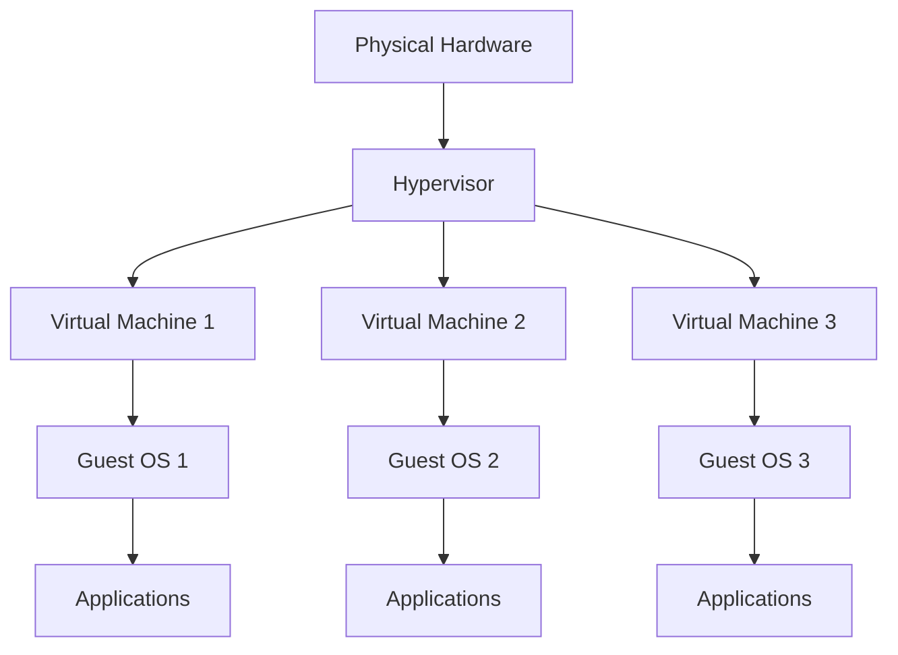

### Types of Virtualization

**1. Full Virtualization**
- Complete simulation of hardware
- Guest OS runs unmodified
- Examples: VMware Workstation, VirtualBox, Hyper-V

Full virtualization provides complete abstraction of the physical hardware. The hypervisor intercepts all privileged instructions from the guest operating system and translates them to work with the actual hardware. This approach allows unmodified operating systems to run as guests, making it highly flexible.

**Advantages:**
- No modification to guest OS required
- High compatibility
- Complete isolation

**Disadvantages:**
- Higher overhead due to translation
- Slightly lower performance compared to para-virtualization

**2. Para-virtualization**
- Guest OS is modified to work with hypervisor
- Better performance than full virtualization
- Example: Xen

In para-virtualization, the guest operating system is modified to be aware it's running in a virtual environment. Instead of simulating hardware, the hypervisor provides APIs (hypercalls) that the guest OS uses directly. This reduces overhead and improves performance.

**Advantages:**
- Better performance than full virtualization
- Lower overhead
- More efficient resource usage

**Disadvantages:**
- Requires guest OS modification
- Limited to open-source operating systems
- Less flexibility

**3. Hardware-assisted Virtualization**
- Uses CPU extensions (Intel VT-x, AMD-V)
- Improves performance
- Required by modern hypervisors

Modern processors include virtualization extensions that allow the hypervisor to run guest code directly on the CPU in a controlled manner. This combines the compatibility of full virtualization with performance approaching para-virtualization.

**Intel VT-x Features:**
- VMX (Virtual Machine Extensions)
- EPT (Extended Page Tables)
- VT-d (I/O virtualization)

**AMD-V Features:**
- SVM (Secure Virtual Machine)
- RVI (Rapid Virtualization Indexing)
- IOMMU (I/O Memory Management Unit)

**4. Operating System-Level Virtualization (Containers)**

While not covered in detail in this unit, it's important to understand how containers differ from traditional VMs:

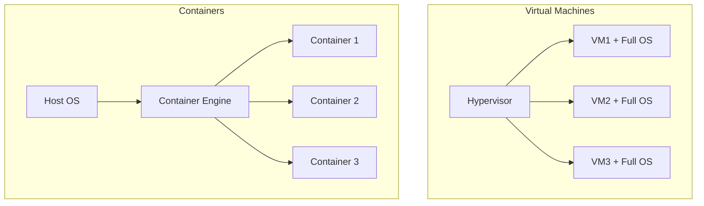

**Differences:**
- **VMs**: Full OS, heavier, complete isolation, slower startup
- **Containers**: Shared OS kernel, lighter, process isolation, faster startup

### Hypervisor Types

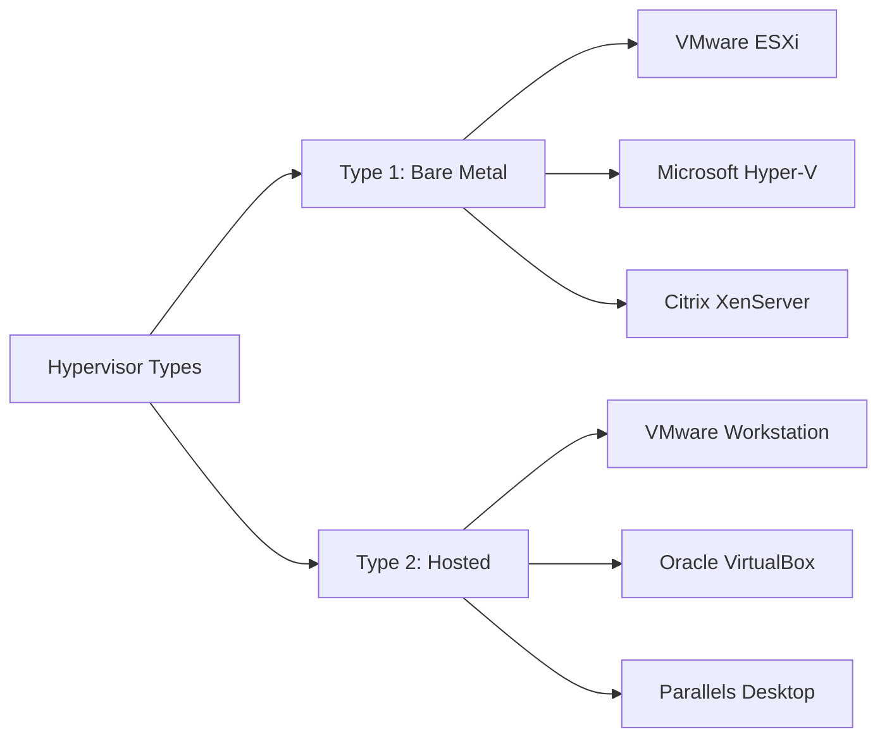

**Type 1 Hypervisor (Bare Metal)**
- Runs directly on hardware
- Better performance and security
- Used in enterprise environments
- Examples: VMware ESXi, Microsoft Hyper-V Server

**Type 2 Hypervisor (Hosted)**
- Runs on top of an existing operating system
- Easier to set up and use
- Suitable for development and testing
- Examples: VMware Workstation, Oracle VirtualBox

### Benefits of Virtualization

1. **Resource Optimization**: Multiple VMs on single hardware
   - **Server Consolidation**: Reduce physical server count from 10-20 servers to 2-3 hosts
   - **Hardware Utilization**: Increase from 10-15% to 60-80% utilization
   - **Reduced Footprint**: Less data center space required
   - **Example**: A company with 20 physical servers running at 15% capacity can consolidate to 3-4 servers running at 70% capacity, saving significant costs

2. **Cost Reduction**: Fewer physical servers needed
   - **Capital Expenses (CapEx)**: Lower hardware purchase costs
   - **Operating Expenses (OpEx)**: Reduced power, cooling, maintenance
   - **Energy Savings**: Modern servers use 300-500W; reducing server count significantly cuts power bills
   - **Cooling Costs**: Typically 1.5x power consumption
   - **Real-world Example**: A medium business saving $50,000+ annually in power and cooling costs alone

3. **Isolation**: Each VM is isolated from others
   - **Security**: Compromised VM doesn't affect others
   - **Stability**: Crashed application in one VM doesn't impact other VMs
   - **Multi-tenancy**: Run production and development environments safely on same hardware
   - **Compliance**: Separate regulated data from general workloads
   - **Example**: A web server compromise cannot access the database server in another VM

4. **Portability**: VMs can be moved between hosts
   - **Live Migration**: Move running VMs between physical hosts with zero downtime
   - **Disaster Recovery**: Copy VMs to remote sites
   - **Load Balancing**: Redistribute VMs based on resource usage
   - **Hardware Maintenance**: Move VMs off a host for repairs without downtime
   - **Cloud Migration**: Move VMs between on-premises and cloud environments

5. **Rapid Deployment**: Quick VM creation and cloning
   - **Template-based Deployment**: Create VMs from templates in minutes
   - **Cloning**: Duplicate existing VMs in seconds
   - **Time Savings**: Physical server setup (hours/days) vs VM deployment (minutes)
   - **Consistency**: Standardized configurations across all VMs
   - **Scaling**: Quickly add capacity during high-demand periods

6. **Disaster Recovery**: Easy backup and restoration
   - **Snapshot Technology**: Point-in-time recovery
   - **Replication**: Automated copying to remote sites
   - **RTO/RPO**: Reduced Recovery Time and Recovery Point Objectives
   - **Testing**: Verify backups without impacting production
   - **Quick Recovery**: Restore entire server in minutes, not hours

7. **Testing Environment**: Safe environment for testing
   - **Sandboxing**: Test patches, updates, or new software safely
   - **Rollback**: Revert to previous state instantly using snapshots
   - **Multiple Environments**: Run different OS versions simultaneously
   - **Development**: Developers can create personal test environments
   - **Training**: Create temporary environments for student labs

8. **Legacy Application Support**
   - Run older applications on outdated operating systems
   - Isolate legacy systems for security
   - Maintain business continuity while planning migrations

9. **Green IT / Environmental Benefits**
   - Reduced power consumption
   - Less electronic waste
   - Lower carbon footprint
   - Improved sustainability metrics

10. **Business Continuity**
    - High Availability (HA): Automatic VM restart on different host
    - Fault Tolerance: Continuous availability during hardware failure
    - Reduced downtime
    - Better SLA compliance

### Virtual Machine Architecture

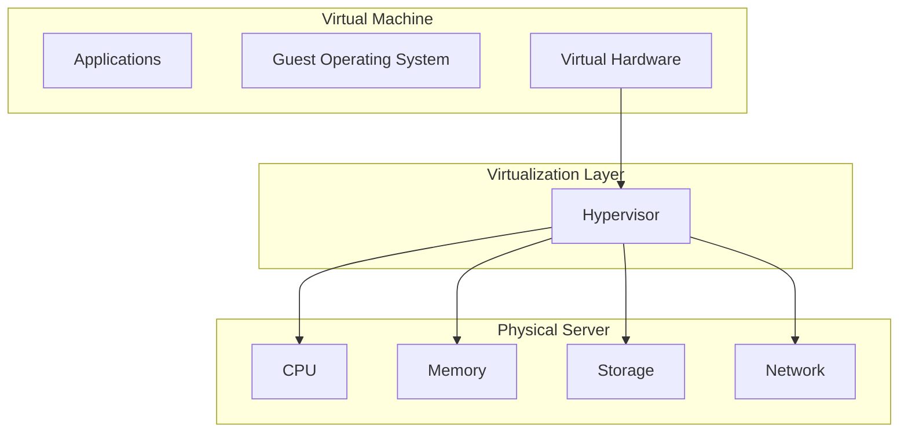

### Virtual Machine Resource Management

**CPU Virtualization:**

The hypervisor allocates physical CPU resources to virtual machines. Understanding CPU allocation is critical for performance:

**vCPU (Virtual CPU):**
- Each VM is assigned one or more vCPUs
- vCPUs are scheduled on physical CPU cores
- Overcommitment is possible but impacts performance

**CPU Scheduling:**
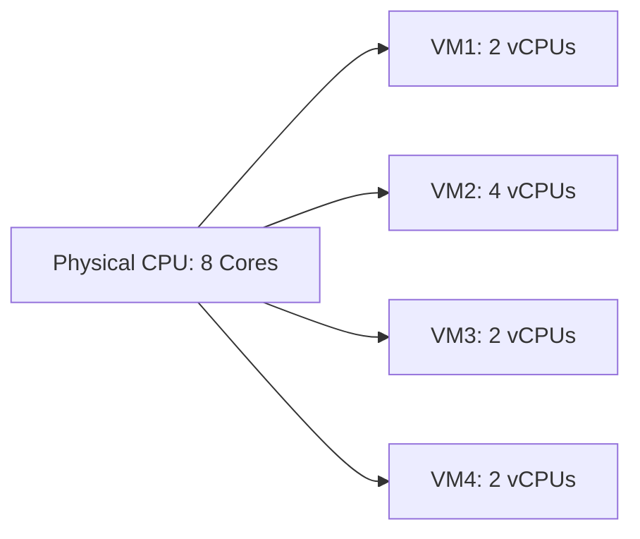

**Best Practices:**
- Don't overallocate vCPUs (1.5:1 to 2:1 ratio maximum)
- Match vCPUs to actual workload needs
- Consider NUMA (Non-Uniform Memory Access) architecture
- Monitor CPU ready time (indicates CPU contention)

**Memory Virtualization:**

Memory management in virtualization is complex and critical for performance:

**Memory Allocation Techniques:**

1. **Static Allocation**: Fixed memory assigned to VM
   - Predictable performance
   - May waste resources
   - Recommended for production databases

2. **Dynamic Memory/Ballooning**: Memory shared between VMs
   - Better resource utilization
   - Hypervisor can reclaim unused memory
   - Slight performance overhead

3. **Memory Overcommitment**: Allocate more memory than physically available
   - Uses techniques like:
     - **Ballooning**: Guest OS releases unused memory
     - **Memory Compression**: Compress inactive memory pages
     - **Memory Swapping**: Use disk for overflow (slowest)

**Memory States:**
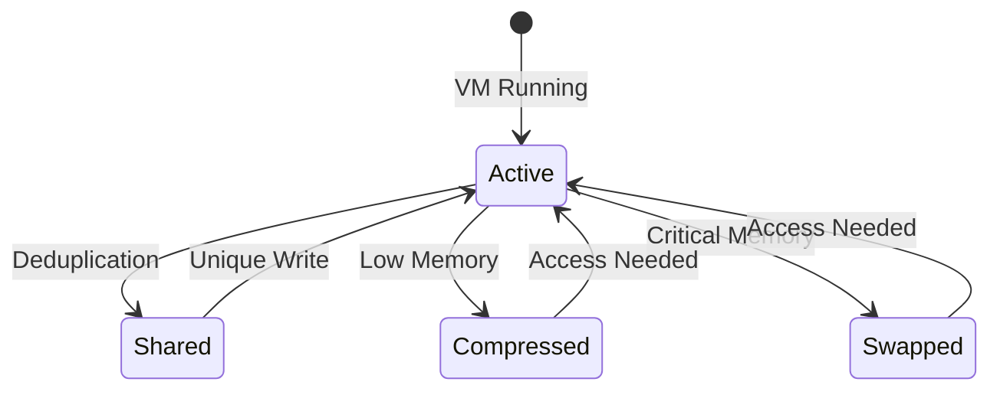

**Storage Virtualization:**

Virtual disks abstract physical storage and provide flexibility:

**Virtual Disk Types:**

1. **Thick Provisioned (Fixed Size)**:
   - Full size allocated immediately
   - Example: 100GB disk uses 100GB physical space immediately
   - Better performance (no expansion overhead)
   - Predictable space usage
   - Use for: Production databases, high-I/O applications

2. **Thin Provisioned (Dynamic)**:
   - Grows as data is written
   - Example: 100GB disk might use only 20GB initially
   - Space efficient
   - Slight performance overhead during growth
   - Risk of overprovisioning
   - Use for: Development, testing, VDI

**Storage Performance Factors:**
- **IOPS** (Input/Output Operations Per Second): Database workloads
- **Throughput**: Video streaming, backups
- **Latency**: Real-time applications

**Storage Technologies:**
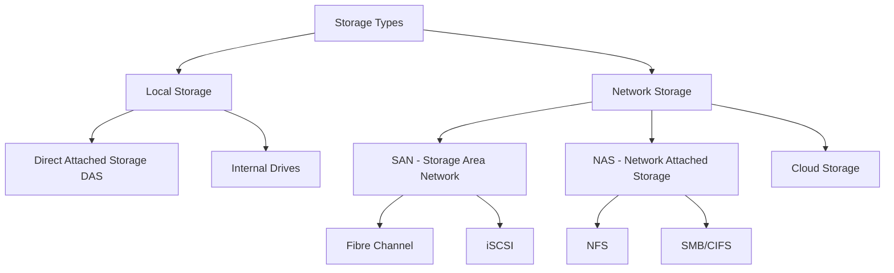

**Network Virtualization:**

Virtual networking connects VMs to each other and external networks:

**Virtual Network Interface Card (vNIC):**
- Software emulation of physical NIC
- Each VM can have multiple vNICs
- Different network types available
- MAC address assigned (real or virtual)

**Network Performance:**
- Bandwidth allocation
- Quality of Service (QoS)
- Traffic shaping
- Network I/O Control (NIOC)

### Virtual Machine Lifecycle

Understanding the complete lifecycle of a VM:

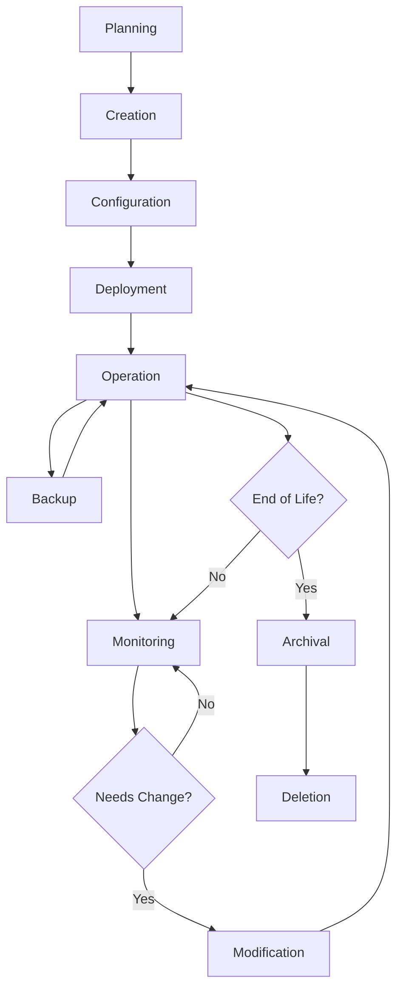

**1. Planning Phase:**
- Define purpose and requirements
- Determine resource needs (CPU, RAM, storage)
- Choose appropriate OS
- Plan network configuration
- Consider security requirements

**2. Creation Phase:**
- Create VM with specifications
- Allocate resources
- Configure virtual hardware
- Attach installation media

**3. Configuration Phase:**
- Install operating system
- Apply updates and patches
- Install required software
- Configure networking
- Set up security policies

**4. Deployment Phase:**
- Move to production environment
- Final testing
- Documentation
- User handoff

**5. Operation Phase:**
- Normal day-to-day running
- User access and usage
- Regular maintenance

**6. Monitoring Phase:**
- Performance monitoring
- Resource utilization tracking
- Security monitoring
- Log analysis
- Capacity planning

**7. Modification Phase:**
- Resize resources as needed
- Software updates
- Configuration changes
- Security patches

**8. Backup Phase:**
- Regular snapshots
- Full backups
- Disaster recovery preparation
- Testing recovery procedures

**9. End of Life:**
- Data archival
- Decommissioning
- Resource reclamation
- Documentation update

### Virtualization Challenges and Solutions

**Challenge 1: VM Sprawl**
- **Problem**: Uncontrolled growth of VMs
- **Impact**: Wasted resources, management complexity
- **Solution**: 
  - Implement VM lifecycle policies
  - Regular audits and cleanup
  - Automated resource reclamation
  - Approval processes for new VMs

**Challenge 2: Performance Issues**
- **Problem**: Resource contention, overcommitment
- **Impact**: Poor application performance
- **Solution**:
  - Proper capacity planning
  - Resource monitoring and alerts
  - Resource reservations for critical VMs
  - Load balancing

**Challenge 3: Security Concerns**
- **Problem**: VM-to-VM attacks, hypervisor vulnerabilities
- **Impact**: Data breaches, compliance violations
- **Solution**:
  - Network segmentation
  - Regular patching
  - Access controls
  - Security monitoring
  - Encrypted storage

**Challenge 4: Backup and Recovery Complexity**
- **Problem**: Large backup sizes, backup windows
- **Impact**: Longer recovery times
- **Solution**:
  - Incremental backups
  - Snapshot-based backups
  - Replication
  - Cloud-based backup

**Challenge 5: Licensing Complexity**
- **Problem**: Different licensing models for virtual environments
- **Impact**: Compliance risks, unexpected costs
- **Solution**:
  - Software asset management
  - License tracking tools
  - Understanding vendor policies
  - Regular audits

### Popular Virtual Workstation Software

| Software | Platform | Type | License | Best For |
|----------|----------|------|---------|----------|
| VMware Workstation Pro | Windows, Linux | Type 2 | Commercial | Professional use |
| VMware Fusion | macOS | Type 2 | Commercial | Mac users |
| Oracle VirtualBox | Windows, macOS, Linux | Type 2 | Open Source | Learning, Testing |
| Parallels Desktop | macOS | Type 2 | Commercial | Mac users |
| Microsoft Hyper-V | Windows | Type 1 | Included with Windows | Windows Server environments |

---

## Practical 1: Setup Virtual Environment {#practical-1-setup-virtual-environment}

### Objective
Install and configure virtual workstation software on your host computer.

### Prerequisites
- Computer with at least 8GB RAM (16GB recommended)
- 50GB+ free disk space
- 64-bit processor with virtualization support
- Administrator/root access

### Part A: Checking Hardware Virtualization Support

#### On Windows:

**Step 1**: Open Task Manager
- Press `Ctrl + Shift + Esc`
- Click on "Performance" tab
- Select "CPU"

**Step 2**: Check Virtualization Status
- Look for "Virtualization: Enabled"
- If it shows "Disabled", you need to enable it in BIOS

**Step 3**: Enable Virtualization in BIOS (if needed)
1. Restart your computer
2. Press `F2`, `F10`, `Del`, or `F12` during startup (depends on manufacturer)
3. Navigate to "Advanced" or "CPU Configuration"
4. Find "Intel Virtualization Technology" or "AMD-V"
5. Set it to "Enabled"
6. Save and exit (usually `F10`)

#### On macOS:

**Step 1**: Check Processor Type
```bash
sysctl -a | grep machdep.cpu.features
```

**Step 2**: Look for VMX flag
- If you see `VMX` in the output, virtualization is supported
- Modern Intel Macs (2010+) support virtualization
- Apple Silicon (M1/M2) has native virtualization support

---

### Part B: Installing VirtualBox (Recommended for Learning)

#### Windows Installation:

**Step 1**: Download VirtualBox
1. Open browser and go to: `https://www.virtualbox.org/`
2. Click "Downloads"
3. Click "Windows hosts" to download the installer
4. Save the file (approximately 100-120 MB)

**Step 2**: Run the Installer
1. Double-click the downloaded `.exe` file
2. Click "Next" at the welcome screen
3. Keep default installation location
4. Click "Next"

**Step 3**: Select Features
1. Keep all default features checked:
   - VirtualBox Application
   - VirtualBox USB Support
   - VirtualBox Networking
   - Python Support
2. Click "Next"

**Step 4**: Warning About Network Interfaces
1. You'll see a warning about network interfaces being reset
2. Click "Yes" to continue
3. This is normal and temporary

**Step 5**: Complete Installation
1. Click "Install"
2. If prompted about device software, click "Install"
3. Click "Finish" to launch VirtualBox

**Step 6**: Verify Installation
1. VirtualBox Manager should open
2. Go to File > Preferences to configure settings

#### macOS Installation:

**Step 1**: Download VirtualBox
1. Visit: `https://www.virtualbox.org/`
2. Click "Downloads"
3. Click "OS X hosts" to download the `.dmg` file
4. Save the file (approximately 100-120 MB)

**Step 2**: Mount the Disk Image
1. Double-click the downloaded `.dmg` file
2. The VirtualBox disk image will mount

**Step 3**: Run the Installer
1. Double-click "VirtualBox.pkg"
2. Click "Continue" at the introduction
3. Click "Continue" at the Read Me
4. Click "Continue" at the License
5. Click "Agree" to accept the license

**Step 4**: Install
1. Click "Install"
2. Enter your Mac password when prompted
3. Click "Install Software"

**Step 5**: Allow Kernel Extension (Important!)
1. If you see "System Extension Blocked" message:
   - Open System Preferences
   - Go to "Security & Privacy"
   - Click the lock and enter password
   - Click "Allow" next to Oracle America, Inc.
2. Restart your Mac if prompted

**Step 6**: Verify Installation
1. Open Launchpad
2. Search for "VirtualBox"
3. Click to launch VirtualBox Manager

---

### Part C: Installing VMware Workstation/Fusion (Alternative)

#### Windows Installation (VMware Workstation):

**Step 1**: Download VMware Workstation
1. Visit VMware website
2. Download VMware Workstation Pro trial or Player (free)
3. Save the installer file

**Step 2**: Run Installer
1. Double-click the installer
2. Click "Next"
3. Accept license agreement
4. Choose installation directory
5. Select installation options:
   - Enhanced Keyboard Driver (recommended)
   - Add to system PATH (recommended)

**Step 3**: Complete Setup
1. Click "Install"
2. Wait for installation to complete
3. Click "Finish"
4. Restart computer if prompted

**Step 4**: First Launch
1. Launch VMware Workstation
2. Enter license key or select trial
3. Complete registration (optional)

#### macOS Installation (VMware Fusion):

**Step 1**: Download VMware Fusion
1. Visit VMware website
2. Download VMware Fusion trial
3. Save the `.dmg` file

**Step 2**: Install
1. Double-click the `.dmg` file
2. Drag VMware Fusion to Applications folder
3. Eject the disk image

**Step 3**: First Launch
1. Open Applications folder
2. Double-click VMware Fusion
3. If prompted, click "Open" to confirm
4. Enter license key or start trial
5. Allow system extensions if prompted

**Step 4**: Grant Permissions
1. Go to System Preferences > Security & Privacy
2. Allow VMware Fusion under "Privacy" tabs:
   - Accessibility
   - Full Disk Access
3. These permissions are required for full functionality

---

### Part D: Post-Installation Configuration

#### Configure VirtualBox Settings:

**Step 1**: Open VirtualBox Preferences
- Windows/Linux: File > Preferences
- macOS: VirtualBox > Preferences

**Step 2**: Configure General Settings
1. Click "General"
2. Set default machine folder (location for VMs)
3. Example: `D:\Virtual Machines` or `~/VirtualMachines`

**Step 3**: Configure Network Settings
1. Click "Network"
2. Note the default Host-only network
3. Click "NAT Networks" tab (if available)
4. You can create custom networks later

**Step 4**: Configure Input Settings
1. Click "Input"
2. Review host key combination (default: Right Ctrl)
3. This key releases mouse from VM

**Step 5**: Configure Extension Pack (Optional but Recommended)
1. Download Extension Pack from VirtualBox website
2. File > Preferences > Extensions
3. Click the add button (folder with green plus)
4. Select downloaded Extension Pack
5. Click "Install"
6. Scroll through license and accept
7. Provides: USB 3.0 support, disk encryption, NVMe, PXE boot

#### Configure VMware Settings:

**Step 1**: Open Preferences
- VMware Workstation: Edit > Preferences
- VMware Fusion: VMware Fusion > Preferences

**Step 2**: Memory Settings
1. Set memory reservation for VMs
2. Recommended: Leave 4GB for host OS

**Step 3**: Default Hardware Settings
1. Set default memory for new VMs (2GB recommended)
2. Set default processors (2 recommended)
3. Configure network settings

---

### Part E: Creating Your First Virtual Machine (Test VM)

We'll create a simple test VM to ensure everything works.

**Step 1**: Click "New" in VirtualBox Manager

**Step 2**: Name and Operating System
- Name: `Test-VM`
- Type: `Linux`
- Version: `Ubuntu (64-bit)` or your choice
- Click "Next"

**Step 3**: Memory Size
- Set to 2048 MB (2GB) for testing
- Slider shows recommended range
- Click "Next"

**Step 4**: Hard Disk
- Select "Create a virtual hard disk now"
- Click "Create"

**Step 5**: Hard Disk File Type
- Select "VDI (VirtualBox Disk Image)"
- Click "Next"

**Step 6**: Storage Type
- Select "Dynamically allocated" (saves disk space)
- Click "Next"

**Step 7**: File Location and Size
- Keep default location
- Set size to 20GB
- Click "Create"

**Step 8**: Verify VM Creation
- Your new VM appears in the list
- It's now ready for OS installation (we'll do this in later units)

---

### Troubleshooting Common Issues

#### Issue 1: VT-x/AMD-V not available
**Solution**:
- Enable virtualization in BIOS/UEFI
- Disable Hyper-V on Windows (if using VirtualBox)
  ```cmd
  bcdedit /set hypervisorlaunchtype off
  ```
- Restart computer

#### Issue 2: Installation fails on macOS
**Solution**:
- Check Security & Privacy settings
- Allow Oracle kernel extension
- Restart Mac after allowing

#### Issue 3: 64-bit options not showing
**Solution**:
- Enable VT-x/AMD-V in BIOS
- Ensure you have 64-bit host OS
- Update VirtualBox to latest version

#### Issue 4: Slow performance
**Solution**:
- Allocate more RAM to VMs
- Enable hardware virtualization
- Install guest additions (after OS installation)
- Use SSD for VM storage

---

## Theory: Windows Server Installation {#theory-windows-server}

### Windows Server Overview

Windows Server is Microsoft's server operating system designed to handle enterprise-level management, data storage, applications, and communications. It serves as the foundation for many organizational IT infrastructures worldwide.

**Evolution of Windows Server:**
- **Windows NT Server** (1993): First true server OS from Microsoft
- **Windows 2000 Server**: Introduced Active Directory
- **Windows Server 2003**: Enhanced security and management
- **Windows Server 2008**: Introduced Hyper-V virtualization
- **Windows Server 2012**: Cloud-optimized, major UI changes
- **Windows Server 2016**: Containers, Nano Server
- **Windows Server 2019**: Hybrid cloud capabilities
- **Windows Server 2022**: Enhanced security, Azure integration

**Key Features Across All Editions:**
- **Active Directory Domain Services (AD DS)**: Centralized user and computer management
- **DNS and DHCP Services**: Network infrastructure
- **File and Storage Services**: Centralized file sharing and storage
- **Hyper-V**: Built-in virtualization platform
- **Remote Desktop Services**: Remote access to applications
- **Windows Server Update Services (WSUS)**: Centralized update management
- **PowerShell**: Advanced automation and scripting

### Windows Server Architecture

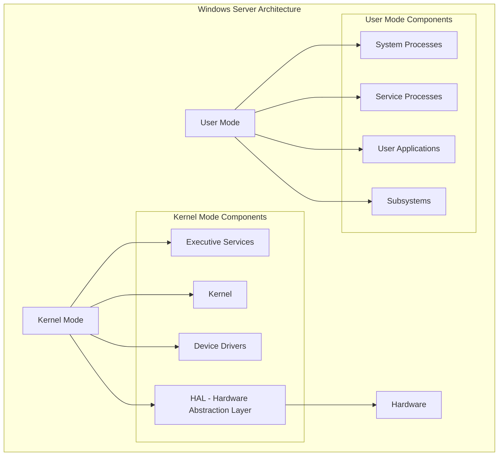

**User Mode vs Kernel Mode:**

**User Mode:**
- Limited access to system resources
- Applications run here
- Protected from system crashes
- Less privileged operations
- If process fails, doesn't crash entire system

**Kernel Mode:**
- Direct hardware access
- Core OS operations
- Device drivers run here
- Higher privileges
- Failure can crash entire system

### Windows Server Editions

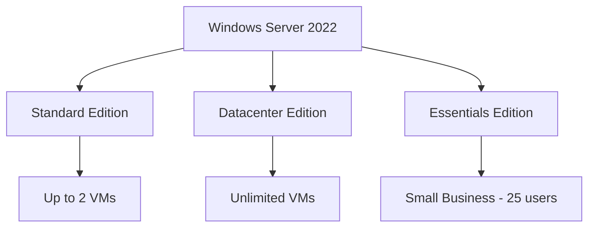

**Standard Edition**
- Suitable for physical or minimally virtualized environments
- Allows 2 Windows Server VMs
- All server roles available

**Detailed Feature Comparison:**

| Feature | Essentials | Standard | Datacenter |
|---------|-----------|----------|------------|
| User Limit | 25 | Unlimited | Unlimited |
| OSE/Hyper-V License | N/A | 2 VMs | Unlimited VMs |
| Failover Clustering | No | Yes | Yes |
| Storage Replica | No | No | Yes |
| Storage Spaces Direct | No | No | Yes |
| Shielded VMs | No | Yes | Yes |
| Software Defined Networking | No | No | Yes |
| Network Controller | No | No | Yes |
| Host Guardian Service | No | No | Yes |
| Price (per core) | Low | Medium | High |

**Licensing Models:**

**Core-based Licensing (Standard & Datacenter):**
- Minimum 16 cores per server
- Minimum 8 cores per processor
- Licensed in 2-core packs
- Example: 2-socket server with 10 cores each = 20 cores = 10 two-core packs needed

**CAL-based Licensing:**
- User CAL: One per user (access from any device)
- Device CAL: One per device (any user can access)
- Required in addition to server license
- Not required for internet-facing websites

**Installation Options:**

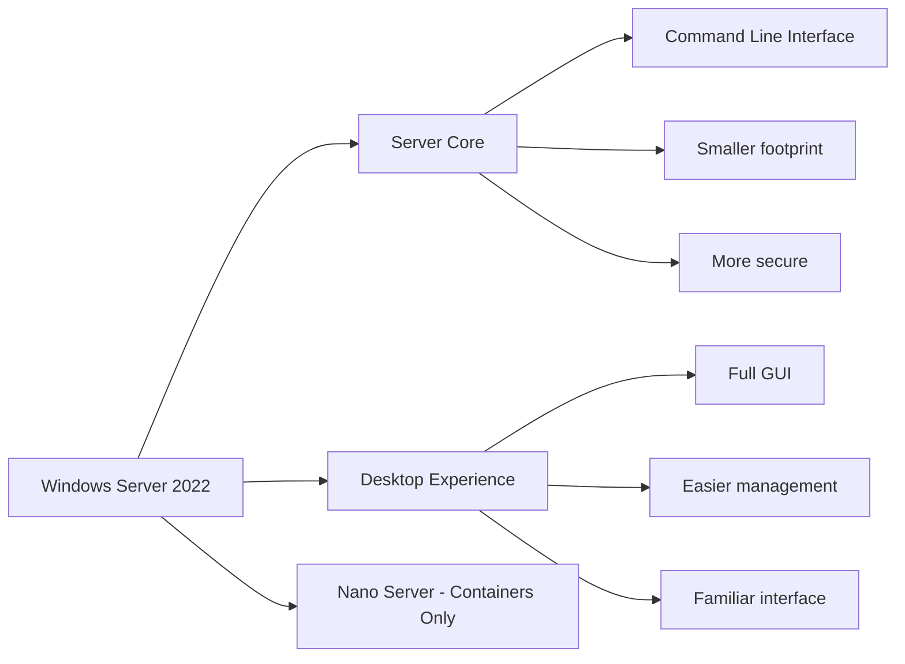

**Server Core:**
- Minimal installation
- No GUI (command line only)
- Smaller attack surface
- Lower resource usage
- Remote management via PowerShell, Server Manager
- Recommended for production environments
- Can be converted to Desktop Experience (and vice versa)

**Desktop Experience:**
- Full graphical interface
- Easier for beginners
- More resource intensive
- Larger attack surface
- Local management with GUI tools
- Better for learning environments

**Nano Server:**
- Ultra-minimal installation
- Cloud-native applications
- Container host
- Extremely small footprint (~500MB)
- Remote management only
- Limited role support

**Datacenter Edition**
- Optimized for highly virtualized environments
- Unlimited Windows Server VMs
- Additional features: Storage Replica, Software Defined Networking

**Advanced Features (Datacenter Only):**

1. **Storage Replica:**
   - Block-level replication
   - Disaster recovery
   - Synchronous and asynchronous
   - Stretch clusters

2. **Storage Spaces Direct:**
   - Software-defined storage
   - Hyper-converged infrastructure
   - Use local storage across multiple servers
   - High availability storage

3. **Software Defined Networking (SDN):**
   - Network virtualization
   - Centralized network management
   - Network policies
   - Load balancing

4. **Shielded Virtual Machines:**
   - Enhanced VM security
   - Protects against malicious administrators
   - Encrypted VMs
   - Requires Host Guardian Service

**Essentials Edition**
- Small businesses (up to 25 users)
- Pre-configured with common features
- Simplified management

**Essentials Features:**
- Simplified dashboard
- Integrated email and calendar
- Remote Web Access
- Client computer backup
- Built-in cloud integration (Microsoft 365)
- Cannot be domain controller in existing domain
- Limited to one instance per organization

### Server Roles and Features

Understanding the difference between Roles and Features is fundamental:

**Server Roles:**
A server role is a primary function or service that a server provides to clients and other servers on the network.

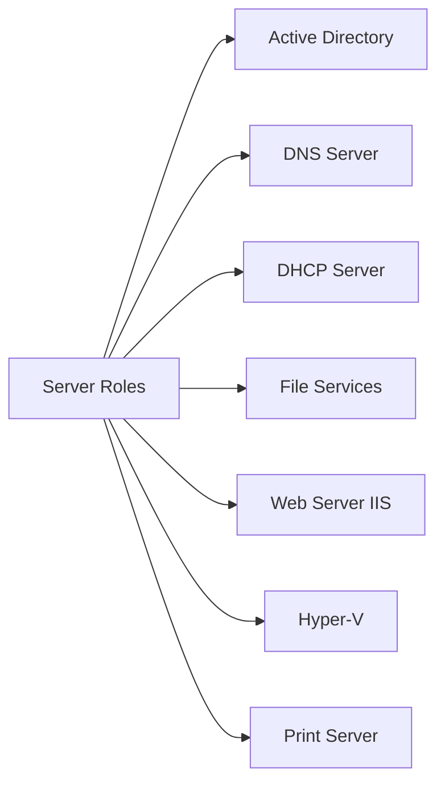

**Common Server Roles Explained:**

**1. Active Directory Domain Services (AD DS):**
- Centralized identity management
- User and computer authentication
- Group Policy management
- Organizational structure (OUs, domains, forests)
- Single sign-on (SSO)

**2. DNS Server:**
- Name resolution (domain names to IP addresses)
- Required for Active Directory
- Forward and reverse lookups
- Zone transfers
- DNSSEC support

**3. DHCP Server:**
- Automatic IP address assignment
- Reduces configuration errors
- Centralized IP management
- Scope and reservation management
- DHCP failover for high availability

**4. File and Storage Services:**
- Centralized file sharing
- DFS (Distributed File System)
- File classification
- Quotas and screening
- iSCSI target
- Data deduplication

**5. Web Server (IIS - Internet Information Services):**
- Host websites and web applications
- ASP.NET support
- FTP server
- WebDAV
- Application pools
- SSL/TLS support

**6. Hyper-V:**
- Server virtualization
- Create and manage VMs
- Virtual switches
- Live migration
- Replica and clustering
- Shielded VMs

**7. Print and Document Services:**
- Centralized print management
- Print server
- Network printing
- Print queue management
- Follow-me printing

**8. Remote Desktop Services (RDS):**
- Virtual Desktop Infrastructure (VDI)
- Remote application access
- Session-based desktops
- Connection Broker
- Web Access

**9. Windows Server Update Services (WSUS):**
- Centralized update management
- Control update deployment
- Test updates before deployment
- Reduce internet bandwidth usage
- Reporting and compliance

**10. Certificate Services (AD CS):**
- Public Key Infrastructure (PKI)
- Issue and manage digital certificates
- Certificate templates
- Certificate revocation
- Web enrollment

**Features:**
Features add functionality to support roles or enhance server capabilities.

**Common Features:**

1. **.NET Framework:** Application development and runtime
2. **BitLocker:** Drive encryption
3. **Failover Clustering:** High availability
4. **Network Load Balancing:** Distribute traffic
5. **PowerShell:** Automation and scripting
6. **Telemetry:** Monitoring and diagnostics
7. **Windows Defender:** Antivirus and antimalware
8. **Windows Server Backup:** Backup and recovery

### Installation Planning Checklist

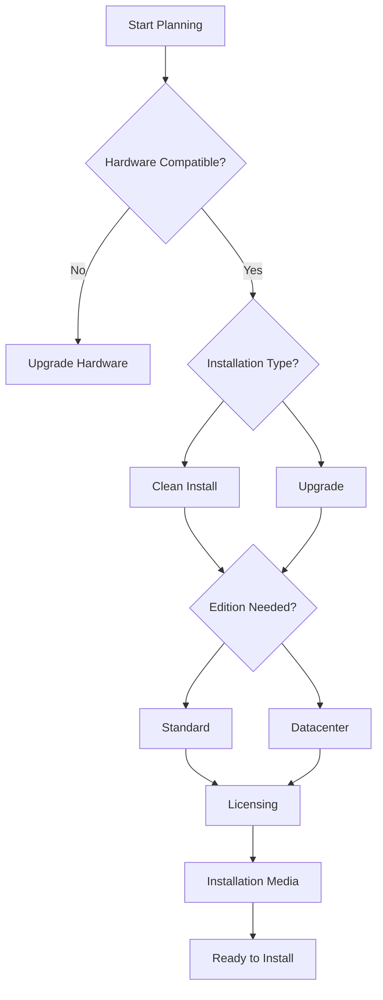

### Hardware Requirements

**Minimum Requirements (Windows Server 2022)**:
- Processor: 1.4 GHz 64-bit
- RAM: 512 MB (2GB for Desktop Experience)
- Disk Space: 32 GB minimum
- Network: Gigabit Ethernet adapter

**These are absolute minimums and not suitable for production use.**

**Recommended for Production**:
- Processor: Multi-core 2.0+ GHz (4+ cores)
- RAM: 8 GB or more (16-32GB typical)
- Disk Space: 100+ GB (depends on role)
- Network: Multiple NICs for redundancy
- RAID configuration for data protection

**Hardware Requirements by Server Role:**

| Server Role | CPU (Cores) | RAM (GB) | Storage (GB) | Network |
|-------------|-------------|----------|--------------|---------|
| Domain Controller | 2-4 | 4-8 | 50-100 | 1 Gbps |
| File Server | 4-8 | 8-16 | 500+ | 1-10 Gbps |
| Database Server | 8-16 | 32-128 | 200+ | 10 Gbps |
| Web Server | 4-8 | 8-16 | 100-200 | 1 Gbps |
| Hyper-V Host | 8-32 | 32-256 | 500+ | 10 Gbps |
| Print Server | 2 | 4 | 50 | 1 Gbps |

**Processor Requirements:**

**64-bit Processor Mandatory:**
- No 32-bit support since Windows Server 2008 R2
- Check: Intel VT-x or AMD-V for Hyper-V role
- Multi-core processors highly recommended
- Server-grade processors (Xeon, EPYC) for production

**Supported Processor Families:**
- Intel: Xeon Scalable, Xeon E, Xeon D
- AMD: EPYC, Ryzen Pro
- ARM64: Limited support (Azure Stack HCI)

**Special Requirements for Features:**

**Hyper-V Requirements:**
- Hardware-assisted virtualization (Intel VT-x or AMD-V)
- Second Level Address Translation (SLAT)
  - Intel EPT (Extended Page Tables)
  - AMD RVI (Rapid Virtualization Indexing)
- Hardware DEP (Data Execution Prevention)
- Minimum 4GB RAM (8GB+ recommended)

**TPM Requirements:**
- TPM 2.0 for Secured-core server
- BitLocker drive encryption
- Measured Boot
- Virtual Secure Mode (VSM)

**Storage Considerations:**

**Disk Types:**
1. **HDD (Hard Disk Drive):**
   - Lower cost per GB
   - Slower performance
   - Use for: Backups, archives, file storage

2. **SSD (Solid State Drive):**
   - Faster performance
   - Higher cost per GB
   - Use for: OS, databases, VMs

3. **NVMe (Non-Volatile Memory Express):**
   - Fastest performance
   - Highest cost per GB
   - Use for: High-performance databases, VDI

**RAID Configurations:**

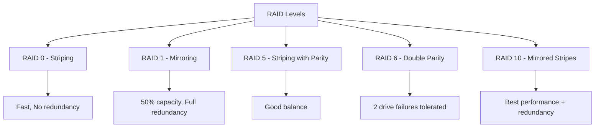

**Network Requirements:**

**Minimum:**
- 1 Gigabit Ethernet adapter
- TCP/IP protocol support

**Recommended for Production:**
- Multiple NICs (NIC teaming/bonding)
- 10 Gbps for file/database/Hyper-V servers
- Separate NICs for:
  - Management traffic
  - Production traffic
  - Backup traffic
  - Cluster/heartbeat traffic

**Network Adapter Features:**
- Jumbo Frames support
- RSS (Receive Side Scaling)
- VMQ (Virtual Machine Queue) for Hyper-V
- SR-IOV (Single Root I/O Virtualization)
- RDMA (Remote Direct Memory Access) for high-performance

**Firmware Requirements:**

**UEFI vs Legacy BIOS:**
- UEFI preferred (required for Secure Boot)
- GPT partition scheme (>2TB disks)
- Faster boot times
- Better security features
- Secure Boot support

### Installation Methods

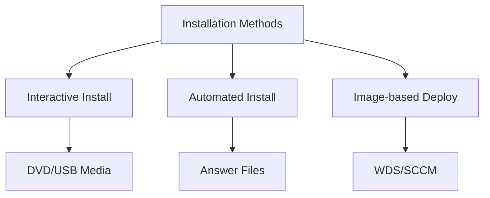

**1. Interactive Installation (Manual):**

**Process:**
- Boot from DVD/USB installation media
- Follow on-screen wizard
- Make configuration choices manually
- Suitable for: Single servers, learning environments

**Advantages:**
- Simple and straightforward
- No preparation required
- Good for beginners
- Flexible during installation

**Disadvantages:**
- Time-consuming for multiple servers
- Prone to human error
- Inconsistent configurations
- Cannot fully automate

**2. Automated Installation (Unattended):**

**Process:**
- Create answer file (unattend.xml)
- Automates responses to setup questions
- Can include post-installation configuration
- Uses Windows System Image Manager (WSIM)

**Answer File Sections:**
- windowsPE: Installation phase settings
- offlineServicing: Drivers and packages
- specialize: Computer-specific settings
- oobeSystem: Out-of-box experience settings

**Advantages:**
- Consistent deployments
- Faster than interactive
- Reduces human error
- Can include all configuration steps

**Disadvantages:**
- Requires answer file creation
- XML knowledge helpful
- Initial setup time investment

**3. Image-based Deployment:**

**Technologies:**
- **WDS** (Windows Deployment Services)
- **SCCM** (System Center Configuration Manager)
- **MDT** (Microsoft Deployment Toolkit)

**Process:**
1. Create reference image (master VM/server)
2. Capture image using DISM or ImageX
3. Store image on deployment server
4. Deploy to target servers via network boot (PXE)

**Advantages:**
- Fastest deployment method
- Include all software and updates
- Consistent configurations
- Suitable for large environments

**Disadvantages:**
- Complex initial setup
- Requires infrastructure (WDS server)
- Images need maintenance
- Larger file sizes

**4. Cloud Deployment:**

**Azure Marketplace:**
- Pre-configured Windows Server images
- Deploy in minutes
- Pay-as-you-go pricing
- Azure Resource Manager templates

**Hybrid Deployment:**
- Azure Arc for on-premises servers
- Azure Stack HCI
- Consistent management experience

### Deployment Planning Considerations

**Pre-Installation Decisions:**

1. **Edition Selection:**
   - Workload requirements
   - Virtualization needs
   - Budget constraints
   - Licensing model

2. **Installation Type:**
   - Clean install vs upgrade
   - Server Core vs Desktop Experience
   - Physical vs virtual

3. **Partitioning Strategy:**
   - System partition (C:)
   - Data partition (D:)
   - Separate backup partition
   - RAID configuration

4. **Network Configuration:**
   - Static vs DHCP
   - IP addressing scheme
   - DNS configuration
   - Domain vs workgroup

5. **Naming Convention:**
   - Computer name scheme
   - Consistent naming policy
   - Example: LOC-ROLE-###
     - NYC-DC-01 (New York Domain Controller 1)
     - LON-FS-02 (London File Server 2)

6. **Time Synchronization:**
   - Time zone
   - NTP server configuration
   - Critical for Active Directory

7. **Security Baseline:**
   - Security policies
   - Firewall rules
   - Update strategy
   - Antivirus/antimalware

8. **Backup Strategy:**
   - Backup software
   - Backup schedule
   - Retention policy
   - Recovery testing

### Installation Process Overview

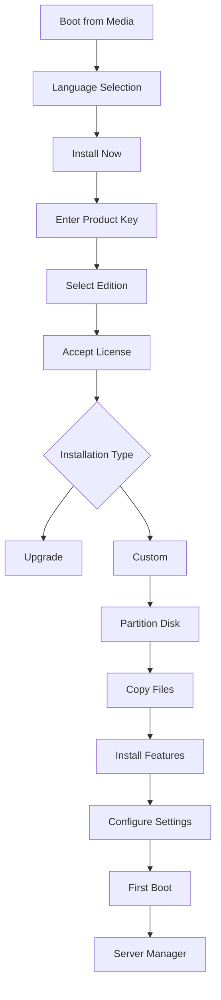

### Post-Installation Tasks

Proper post-installation configuration is critical for security, performance, and manageability. These tasks should be performed in order:

1. **Set Administrator Password**: Strong password for security
   - **Requirements:**
     - Minimum 8 characters (12+ recommended)
     - Uppercase and lowercase letters
     - Numbers
     - Special characters
     - Not based on username or common words
   - **Example Strong Password:** `$erverAdm!n2024#Secure`
   - **Password Policy Best Practices:**
     - Change every 60-90 days
     - Don't reuse last 24 passwords
     - Account lockout after 5 failed attempts
     - Password complexity enforcement

2. **Configure Computer Name**: Descriptive name for identification
   - **Naming Best Practices:**
     - Use consistent naming convention
     - Include location, role, number
     - Maximum 15 characters (for NetBIOS compatibility)
     - Use only letters, numbers, hyphens
     - Avoid spaces and special characters
   - **Examples:**
     - `NYC-DC-01` (Location-Role-Number)
     - `SERVER-WEB-001`
     - `LON-SQL-PROD-01`
   - **Impact of Renaming:**
     - Computer must reboot
     - Certificates may need reissue
     - Update DNS records if necessary
     - Update documentation

3. **Configure Network Settings**: IP address, subnet, gateway, DNS
   
   **Static IP Configuration (Servers):**
   ```
   IP Address: 192.168.1.10
   Subnet Mask: 255.255.255.0
   Default Gateway: 192.168.1.1
   Preferred DNS: 8.8.8.8 (or internal DNS)
   Alternate DNS: 8.8.4.4
   ```
   
   **Why Static IPs for Servers:**
   - Predictable addressing
   - DNS consistency
   - Service dependencies
   - Remote management reliability
   - Certificate binding
   
   **Network Documentation:**
   - Document IP assignments
   - Maintain IP address spreadsheet
   - Note MAC addresses
   - Track VLAN assignments

4. **Activate Windows**: Enter license key and activate
   
   **Activation Methods:**
   - **Online Activation:** Automatic via internet
   - **Phone Activation:** Call Microsoft activation center
   - **KMS Activation:** Volume licensing (enterprise)
   - **MAK Activation:** Multiple Activation Key
   
   **Grace Period:**
   - 180 days for evaluation versions
   - 30 days for retail before entering reduced functionality
   - Server continues running but with limitations
   
   **Volume Licensing:**
   - **KMS (Key Management Service):**
     - Requires KMS host server
     - Minimum 5 servers for Windows Server activation
     - Clients activate automatically
     - Reactivation every 180 days
   - **MAK (Multiple Activation Key):**
     - Each server activates independently
     - Limited number of activations
     - Good for servers without internet access
   
   **Troubleshooting Activation:**
   ```powershell
   # Check activation status
   slmgr /dli
   
   # Detailed activation info
   slmgr /dlv
   
   # Reactivate
   slmgr /ato
   ```

5. **Install Updates**: Windows Update for security patches
   
   **Update Categories:**
   - **Critical Updates:** Security vulnerabilities (install immediately)
   - **Security Updates:** Non-critical security fixes
   - **Feature Updates:** New functionality (twice yearly)
   - **Quality Updates:** Bug fixes (monthly)
   - **Driver Updates:** Hardware drivers
   
   **Update Strategy:**
   - **Phase 1:** Test on non-production server (1-2 days)
   - **Phase 2:** Deploy to production after testing (1 week)
   - **Phase 3:** Monitor for issues
   - **Maintenance Window:** Schedule during low-usage periods
   
   **Update Methods:**
   - **Windows Update:** Direct from Microsoft
   - **WSUS:** Centralized management (recommended for enterprises)
   - **SCCM:** Enterprise update management
   - **Offline Updates:** Air-gapped environments
   
   **Best Practices:**
   - Always backup before major updates
   - Test updates in lab environment
   - Read release notes
   - Monitor update KB articles
   - Keep update documentation
   - Verify system stability after updates

6. **Configure Windows Firewall**: Set appropriate security rules
   
   **Default Firewall Profiles:**
   - **Domain Profile:** Connected to domain network
   - **Private Profile:** Home or work network
   - **Public Profile:** Public networks (most restrictive)
   
   **Default Behavior:**
   - Inbound: Block (unless explicitly allowed)
   - Outbound: Allow (all traffic)
   
   **Common Firewall Rules for Servers:**
   ```
   Remote Desktop (RDP): TCP 3389
   File Sharing (SMB): TCP 445
   DNS: TCP/UDP 53
   DHCP: UDP 67, 68
   HTTP: TCP 80
   HTTPS: TCP 443
   Active Directory: Multiple ports
   SQL Server: TCP 1433
   ```
   
   **Creating Firewall Rules:**
   - Use least privilege principle
   - Limit by IP address when possible
   - Document all custom rules
   - Review rules periodically
   - Use groups for related rules
   
   **Firewall Management:**
   - Group Policy for domain-joined servers
   - PowerShell for automation
   - Windows Firewall with Advanced Security MMC
   - Third-party firewall solutions

7. **Join Domain** (if applicable): Connect to Active Directory
   
   **Pre-requisites:**
   - DNS configured to point to domain controller
   - Network connectivity to domain controller
   - Domain admin credentials
   - Computer name configured
   
   **Domain Join Process:**
   1. Configure DNS to domain controller IP
   2. Test DNS resolution: `nslookup domain.local`
   3. Join domain through System Properties
   4. Enter domain admin credentials
   5. Restart computer
   6. Move computer object to appropriate OU
   7. Apply Group Policies
   
   **Post-Domain Join Tasks:**
   - Verify domain membership
   - Check Group Policy application: `gpresult /r`
   - Configure domain user access
   - Install certificates
   - Configure service accounts
   
   **Workgroup vs Domain:**
   
   | Aspect | Workgroup | Domain |
   |--------|-----------|--------|
   | Management | Decentralized | Centralized |
   | User Accounts | Local to each server | Centralized in AD |
   | Security | Basic | Advanced (GPO, policies) |
   | Scalability | Small (≤10 computers) | Large (thousands) |
   | Use Case | Home, small office | Enterprise |

8. **Install Server Roles**: Add required roles and features
   
   **Planning Role Installation:**
   - Determine primary server purpose
   - List required roles and features
   - Check dependencies
   - Plan resource allocation
   - Document configuration
   
   **Role Installation Methods:**
   - Server Manager GUI
   - PowerShell cmdlets
   - Answer files for automation
   
   **Common Role Combinations:**
   - **Domain Controller:** AD DS, DNS, DHCP
   - **File Server:** File Services, DFS, Deduplication
   - **Web Server:** IIS, .NET Framework
   - **Database Server:** No built-in role (SQL Server separate)
   - **Hyper-V Host:** Hyper-V role only (minimize other roles)
   
   **Role Separation Best Practice:**
   - Don't combine too many roles on one server
   - Separate by function and security requirements
   - Critical roles (DC) should be dedicated
   - Consider virtual machines for role separation

9. **Configure Time Synchronization**
   
   **Why Time Sync Matters:**
   - Kerberos authentication (5-minute tolerance)
   - Certificate validation
   - Event log correlation
   - Distributed applications
   - Compliance requirements
   
   **Time Hierarchy:**
   ```mermaid
   graph TD
       A[External NTP Server] --> B[PDC Emulator]
       B --> C[Other Domain Controllers]
       B --> D[Member Servers]
       B --> E[Workstations]
   ```
   
   **Configure NTP:**
   ```powershell
   # Configure NTP server
   w32tm /config /manualpeerlist:"time.windows.com,0x8" /syncfromflags:manual /reliable:YES /update
   
   # Restart time service
   net stop w32time && net start w32time
   
   # Force sync
   w32tm /resync
   
   # Check status
   w32tm /query /status
   ```

10. **Security Hardening**
    
    **Initial Security Configuration:**
    - Enable Windows Defender
    - Configure Windows Firewall
    - Disable unnecessary services
    - Remove unnecessary features
    - Configure audit policies
    - Enable BitLocker (if applicable)
    
    **Security Baseline Application:**
    - Download Microsoft Security Compliance Toolkit
    - Apply appropriate baseline
    - Test thoroughly
    - Document deviations
    
    **Account Security:**
    - Rename Administrator account
    - Disable Guest account
    - Create separate admin accounts (principle of least privilege)
    - Implement password policies
    - Enable account lockout
    
    **Service Hardening:**
    - Disable unnecessary services
    - Change default ports where possible
    - Use service accounts (not local admin)
    - Configure service recovery options

11. **Configure Remote Management**
    
    **Remote Desktop:**
    - Enable Remote Desktop
    - Configure Network Level Authentication (NLA)
    - Limit RDP users (don't use default)
    - Change RDP port (optional security through obscurity)
    - Use RDP Gateway for external access
    
    **PowerShell Remoting:**
    ```powershell
    # Enable PS Remoting
    Enable-PSRemoting -Force
    
    # Configure trusted hosts (if not domain-joined)
    Set-Item WSMan:\localhost\Client\TrustedHosts -Value "ServerName"
    
    # Test connection
    Test-WSMan -ComputerName ServerName
    ```
    
    **Windows Admin Center:**
    - Modern web-based management
    - Manage multiple servers
    - No agent required
    - Hyper-V management
    - Certificate-based security

12. **Backup Configuration**
    
    **What to Backup:**
    - System State
    - System Reserved partition
    - C: drive (OS)
    - Data drives
    - Application data
    - Configuration files
    
    **Backup Methods:**
    - **Full Backup:** Complete backup of everything
    - **Incremental:** Only changes since last backup
    - **Differential:** Changes since last full backup
    
    **Backup Schedule Example:**
    - Full backup: Weekly (Sunday)
    - Incremental backup: Daily (Monday-Saturday)
    - Retention: 4 weeks
    
    **Backup Testing:**
    - Regular restore tests (monthly)
    - Document restore procedures
    - Verify backup integrity
    - Test disaster recovery scenarios

13. **Documentation**
    
    **Server Documentation Should Include:**
    - Server name and location
    - Hardware specifications
    - IP configuration
    - Installed roles and features
    - Service accounts used
    - Backup schedule and retention
    - Maintenance schedule
    - Change history
    - Known issues
    - Emergency contacts
    
    **Documentation Tools:**
    - SharePoint or wiki
    - Configuration Management Database (CMDB)
    - Excel spreadsheets
    - Automated documentation tools
    - Network diagrams (Visio, Draw.io)

14. **Monitoring and Alerting**
    
    **Configure Monitoring For:**
    - CPU usage
    - Memory usage
    - Disk space
    - Network bandwidth
    - Service status
    - Security events
    - Application errors
    
    **Monitoring Tools:**
    - Performance Monitor (built-in)
    - Event Viewer
    - Server Manager
    - System Center Operations Manager (SCOM)
    - Third-party tools (Nagios, PRTG, Zabbix)
    
    **Alert Configuration:**
    - Critical alerts: Email/SMS immediately
    - Warning alerts: Email during business hours
    - Information: Log only
    - Configure alert thresholds appropriately
    - Avoid alert fatigue

15. **Performance Baseline**
    
    **Establish Baseline Metrics:**
    - CPU usage during normal operations
    - Memory utilization
    - Disk I/O
    - Network throughput
    - Response times
    
    **Why Baselines Matter:**
    - Identify performance degradation
    - Capacity planning
    - Troubleshooting reference
    - Justify hardware upgrades
    
    **Baseline Collection:**
    - Collect data for 1-2 weeks
    - Include peak and off-peak hours
    - Document seasonal variations
    - Review quarterly
    - Update after major changes

---

## Practical 2: Installing Windows Server {#practical-2-installing-windows-server}

### Objective
Install Windows Server in a virtual machine and perform basic configuration.

### Prerequisites
- Completed Practical 1 (Virtual environment setup)
- Windows Server ISO file (evaluation version available from Microsoft)
- At least 60GB free disk space
- 4GB+ RAM available for VM

---

### Part A: Obtaining Windows Server ISO

#### For Both Windows and macOS:

**Step 1**: Visit Microsoft Evaluation Center
1. Open browser
2. Go to: `https://www.microsoft.com/en-us/evalcenter/`
3. Search for "Windows Server 2022" or latest version

**Step 2**: Download ISO
1. Click on Windows Server evaluation
2. Register or sign in with Microsoft account (free)
3. Select ISO download option
4. Choose language
5. Click "Download" (approximately 5-6 GB)
6. Save to accessible location

**Step 3**: Verify Download
- Check file size matches expected size
- File should be around 5-6 GB
- Extension: `.iso`

---

### Part B: Creating Windows Server Virtual Machine

#### Using VirtualBox (Windows and macOS):

**Step 1**: Open VirtualBox Manager
- Launch VirtualBox
- Click "New" button (or Machine > New)

**Step 2**: Name and Operating System
- Name: `WindowsServer2022`
- Type: `Microsoft Windows`
- Version: `Windows 2022 (64-bit)` or `Other Windows (64-bit)`
- Click "Next"

**Step 3**: Memory Size
- Recommended: 4096 MB (4 GB) minimum
- Production use: 8192 MB (8 GB) or more
- Use slider or type value
- Click "Next"

**Step 4**: Hard Disk
- Select "Create a virtual hard disk now"
- Click "Create"

**Step 5**: Hard Disk File Type
- Select "VDI (VirtualBox Disk Image)"
- Click "Next"

**Step 6**: Storage on Physical Hard Disk
- Select "Dynamically allocated"
  - Grows as needed
  - Saves initial disk space
- Alternative: "Fixed size" (better performance)
- Click "Next"

**Step 7**: File Location and Size
- Keep default location or change if needed
- Size: 60 GB minimum (100 GB recommended)
- Click "Create"

**Step 8**: Configure VM Settings
1. Select your VM and click "Settings"

2. **System Settings**:
   - General > Advanced:
     - Shared Clipboard: Bidirectional
     - Drag'n'Drop: Bidirectional
   - System > Motherboard:
     - Boot Order: Optical, Hard Disk
     - Extended Features: Enable EFI (for modern systems)
   - System > Processor:
     - Processors: 2 CPUs minimum
     - Extended Features: Enable PAE/NX

3. **Display Settings**:
   - Video Memory: 128 MB
   - Graphics Controller: VBoxSVGA
   - Extended Features: Enable 3D Acceleration (if supported)

4. **Storage Settings**:
   - Click on "Empty" under Controller: IDE
   - Click disk icon on right
   - Choose "Choose a disk file"
   - Select your Windows Server ISO
   - Click "OK"

5. **Network Settings**:
   - Adapter 1: Attached to NAT (default - for internet)
   - Advanced: Accept default settings

6. **Click "OK"** to save all settings

#### Using VMware Workstation (Windows):

**Step 1**: Create New Virtual Machine
1. Open VMware Workstation
2. Click "Create a New Virtual Machine"
3. Select "Typical (recommended)"
4. Click "Next"

**Step 2**: Select Installation Source
1. Choose "Installer disc image file (iso)"
2. Click "Browse"
3. Select your Windows Server ISO
4. Click "Next"

**Step 3**: Guest Operating System
1. Select "Microsoft Windows"
2. Version: "Windows Server 2022" or "Windows Server 2019"
3. Click "Next"

**Step 4**: Name the Virtual Machine
1. Name: `WindowsServer2022`
2. Location: Choose suitable location
3. Click "Next"

**Step 5**: Specify Disk Capacity
1. Maximum disk size: 60 GB minimum
2. Select "Store virtual disk as a single file" (better performance)
3. Click "Next"

**Step 6**: Review and Customize
1. Review settings
2. Click "Customize Hardware"
   - Memory: 4096 MB minimum
   - Processors: 2 cores
   - Network: NAT
3. Click "Close"
4. Click "Finish"

#### Using VMware Fusion (macOS):

**Step 1**: Create New Virtual Machine
1. Open VMware Fusion
2. Click "+" and select "New"
3. Click "Create a custom virtual machine"
4. Click "Continue"

**Step 2**: Choose Operating System
1. Select "Microsoft Windows"
2. Select "Windows Server 2022" or appropriate version
3. Click "Continue"

**Step 3**: Choose Firmware Type
1. Select "UEFI" (recommended)
2. Click "Continue"

**Step 4**: Select Installation Media
1. Click "Use another disc or disc image"
2. Click "Choose another disc or disc image"
3. Select your Windows Server ISO
4. Click "Continue"

**Step 5**: Finish Setup
1. Click "Finish"
2. Click "Customize Settings"
3. Name: `WindowsServer2022`
4. Save in desired location

**Step 6**: Customize Hardware
1. Processors & Memory:
   - 2 processor cores
   - 4096 MB RAM
2. Hard Disk: 60 GB
3. Network: NAT
4. Close settings window

---

### Part C: Installing Windows Server

**Step 1**: Start the Virtual Machine
- VirtualBox: Select VM and click "Start"
- VMware: Select VM and click "Power On"
- VM will boot from ISO

**Step 2**: Windows Setup - Language Selection
1. Wait for "Windows Setup" screen
2. Verify settings:
   - Language to install: English (or your preference)
   - Time and currency format: Your location
   - Keyboard: Your keyboard layout
3. Click "Next"

**Step 3**: Install Now
- Click "Install now" button
- Setup will begin loading

**Step 4**: Product Key
1. You'll see "Activate Windows" screen
2. Options:
   - Enter product key if you have one
   - Click "I don't have a product key" for evaluation
3. Click "Next"

**Step 5**: Select Operating System
1. Choose the edition:
   - **Windows Server 2022 Standard Evaluation (Desktop Experience)** - Recommended for learning
   - or Standard Evaluation (Server Core) - command line only
2. Desktop Experience provides GUI
3. Click "Next"

**Step 6**: Accept License Terms
1. Read the license terms
2. Check "I accept the license terms"
3. Click "Next"

**Step 7**: Installation Type
1. You'll see two options:
   - **Upgrade**: Not available (fresh install)
   - **Custom: Install Windows only (advanced)** - Select this
2. Click "Custom: Install Windows only (advanced)"

**Step 8**: Disk Partitioning
1. You'll see your virtual hard disk (60 GB unallocated space)
2. Select "Drive 0 Unallocated Space"
3. Click "Next" (Windows will create partitions automatically)
   - Alternative: Click "New" to customize partition size

**Step 9**: Installing Windows
- Setup will now install Windows Server
- Progress stages:
  1. Copying Windows files
  2. Getting files ready for installation
  3. Installing features
  4. Installing updates
  5. Finishing up
- This takes 15-30 minutes
- VM will restart automatically

**Step 10**: After Restart
- System will continue setup
- Wait for "Customize settings" screen

**Step 11**: Set Administrator Password
1. You must set a password for the Administrator account
2. Enter a strong password:
   - Minimum 8 characters
   - Include uppercase, lowercase, numbers, symbols
   - Example format: `Server@2024Admin!`
3. Re-enter password to confirm
4. Press "Finish"

**Step 12**: Login Screen
1. Press `Ctrl+Alt+Del` to unlock
   - VirtualBox: Press `Right Ctrl + Del` or use Input > Keyboard > Insert Ctrl+Alt+Del
   - VMware: Press `Ctrl+Alt+Insert` or use VM menu
2. Enter your Administrator password
3. Press "Enter"

**Step 13**: First Login - Server Manager
- Server Manager opens automatically
- This is the central management interface
- Initial setup is complete!

---

### Part D: Initial Server Configuration

**Step 1**: Set Computer Name

1. In Server Manager, click "Local Server" in left pane
2. Find "Computer name" property
3. Click on the current name (e.g., "WIN-XXXXXXXXXX")
4. Click "Change" button
5. Enter new name: `SERVER2022` or your choice
6. Click "OK"
7. Click "OK" to restart prompt
8. Click "Close"
9. Click "Restart Now"
10. Wait for server to restart and login again

**Step 2**: Configure Network Settings

1. In Server Manager, click "Local Server"
2. Find "Ethernet" (or network adapter name)
3. Click on "IPv4 address assigned by DHCP"
4. Network Connections window opens
5. Right-click your adapter
6. Select "Properties"
7. Double-click "Internet Protocol Version 4 (TCP/IPv4)"
8. Configure settings:
   - For lab use, can keep DHCP
   - For production:
     - Select "Use the following IP address"
     - IP address: `192.168.1.100` (example)
     - Subnet mask: `255.255.255.0`
     - Default gateway: `192.168.1.1` (your router)
     - Preferred DNS: `8.8.8.8` (Google DNS)
     - Alternate DNS: `8.8.4.4`
9. Click "OK" and close all windows

**Step 3**: Install VMware Tools / VirtualBox Guest Additions

#### VirtualBox Guest Additions:
1. In VM menu: Devices > Insert Guest Additions CD image
2. Open File Explorer
3. Open CD Drive (VirtualBox Guest Additions)
4. Run `VBoxWindowsAdditions-amd64.exe`
5. Click "Next" through wizard
6. Click "Install"
7. Select "Reboot now"
8. Benefits: Better performance, shared clipboard, shared folders

#### VMware Tools:
1. In VM menu: VM > Install VMware Tools
2. Open File Explorer
3. Open DVD Drive
4. Run `setup64.exe`
5. Click "Next" through wizard
6. Select "Typical"
7. Click "Install"
8. Restart when prompted

**Step 4**: Windows Updates

1. Open Settings (Start > Settings)
2. Click "Windows Update"
3. Click "Check for updates"
4. Download and install all available updates
5. Restart if required
6. Repeat until no more updates available

**Step 5**: Configure Windows Firewall

1. Open Server Manager
2. Click "Tools" menu
3. Select "Windows Defender Firewall with Advanced Security"
4. Review current settings
5. For lab environment:
   - Domain Profile: Default settings OK
   - Private Profile: Default settings OK
   - Public Profile: Default settings OK
6. We'll configure specific rules when adding server roles

**Step 6**: Activate Windows (if you have a key)

1. Open Settings
2. Click "System"
3. Click "Activation"
4. Click "Change product key"
5. Enter your product key
6. Click "Next"
7. Windows will activate online

---

### Part E: Server Manager Overview

**Understanding Server Manager Interface**:

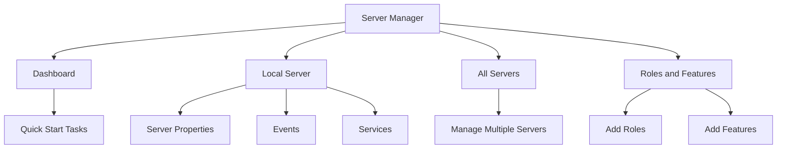

**Dashboard Components**:
1. **Welcome tile**: Quick start tasks
2. **Roles and Server Groups**: Shows installed roles
3. **Events**: System events and alerts
4. **Services**: Running services status
5. **Best Practices Analyzer**: Security and configuration checks
6. **Performance**: CPU, memory monitoring

**Local Server Page**:
- Computer name
- Domain/Workgroup
- Windows Firewall
- Remote Desktop
- NIC teaming
- Network connections
- Windows Update

---

### Part F: Creating Server Snapshots

#### VirtualBox Snapshots:

**Step 1**: Create Baseline Snapshot
1. In VirtualBox Manager, select your VM
2. Click "Snapshots" button (top right)
3. Click "Take" button (camera icon)
4. Name: `Fresh Install - Configured`
5. Description: `Clean Windows Server 2022 installation with updates`
6. Click "OK"

**Step 2**: Using Snapshots
- To restore: Right-click snapshot > Restore
- To delete: Right-click snapshot > Delete
- Create snapshots before major changes

#### VMware Snapshots:

**Step 1**: Create Snapshot
1. Select your VM
2. VM menu > Snapshot > Take Snapshot
3. Name: `Fresh Install - Configured`
4. Description: Add details
5. Click "Take Snapshot"

**Step 2**: Managing Snapshots
- VM > Snapshot > Snapshot Manager
- Restore, delete, or view snapshots

---

## Review Questions

### Conceptual Questions

1. What is the difference between Type 1 and Type 2 hypervisors? Give examples of each.

2. Explain the benefits of using virtualization in a server environment.

3. What are the minimum hardware requirements for Windows Server 2022?

4. Describe the difference between Windows Server Standard and Datacenter editions.

5. Why is it important to enable hardware virtualization (VT-x/AMD-V) in BIOS?

6. What is the purpose of Guest Additions/VMware Tools?

7. Explain the difference between "Desktop Experience" and "Server Core" installations.

8. What is a snapshot and when should you use it?

9. Why should you set a strong Administrator password during installation?

10. What are the main components of Server Manager?

### Practical Tasks

1. Create a checklist for pre-installation planning of Windows Server.

2. Demonstrate the process of checking if your computer supports hardware virtualization.

3. Create a new virtual machine and configure it with 2 CPUs and 4GB RAM.

4. Install Windows Server 2022 and set the computer name to "LABSERVER01".

5. Configure a static IP address on your Windows Server VM.

6. Create a snapshot of your server after fresh installation.

7. List the steps to install VirtualBox Guest Additions.

8. Document the post-installation tasks that should be performed on a new Windows Server.

---

## Lab Exercises

### Exercise 1: Virtual Environment Setup
**Time: 1 hour**

Tasks:
1. Install VirtualBox or VMware on your computer
2. Configure default settings for VM storage location
3. Create a test Linux VM (Ubuntu or CentOS)
4. Verify virtualization is working correctly

### Exercise 2: Windows Server Installation
**Time: 2 hours**

Tasks:
1. Download Windows Server 2022 Evaluation ISO
2. Create a new VM with proper specifications
3. Install Windows Server with Desktop Experience
4. Set computer name and configure network
5. Install Guest Additions/VMware Tools
6. Create a snapshot named "Baseline"

### Exercise 3: Server Manager Exploration
**Time: 30 minutes**

Tasks:
1. Explore all sections of Server Manager
2. View system events and services
3. Check current server roles and features
4. Document server properties
5. Run Best Practices Analyzer

---

## Additional Resources

### Documentation
- Microsoft Windows Server Documentation: https://docs.microsoft.com/windows-server/
- VirtualBox Manual: https://www.virtualbox.org/manual/
- VMware Workstation Documentation: https://docs.vmware.com/

### Video Tutorials
- Search for "Windows Server 2022 Installation Tutorial"
- Search for "VirtualBox Beginner Guide"
- Search for "VMware Workstation Tutorial"

### Practice Labs
- Microsoft Virtual Labs (free)
- Windows Server Evaluation (180-day trial)

---

## Key Takeaways

1. ✅ Virtualization allows running multiple operating systems on single hardware
2. ✅ VirtualBox is free and suitable for learning server administration
3. ✅ Hardware virtualization must be enabled in BIOS for 64-bit VMs
4. ✅ Windows Server requires careful planning before installation
5. ✅ Post-installation configuration includes naming, networking, and updates
6. ✅ Server Manager is the central administration tool
7. ✅ Snapshots are essential for safe experimentation
8. ✅ Guest Additions improve VM performance and usability

---

## Next Unit Preview

In **Unit 2**, we will cover:
- Configuring network infrastructure
- Setting up network cabling concepts
- Configuring network interface cards
- Implementing IP addressing
- Setting up DHCP and DNS services

---

*End of Unit 1*
