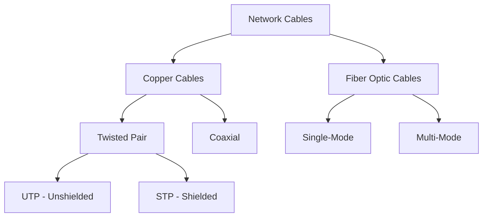
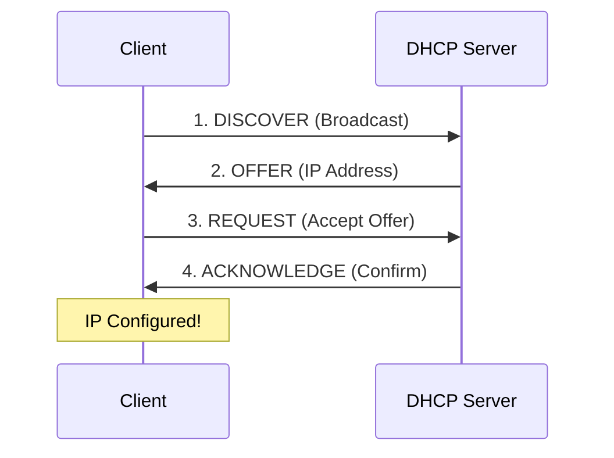
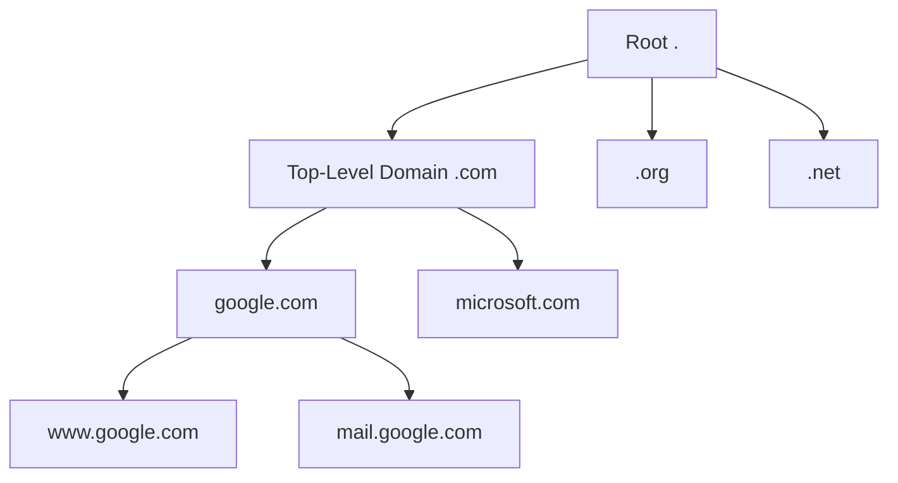
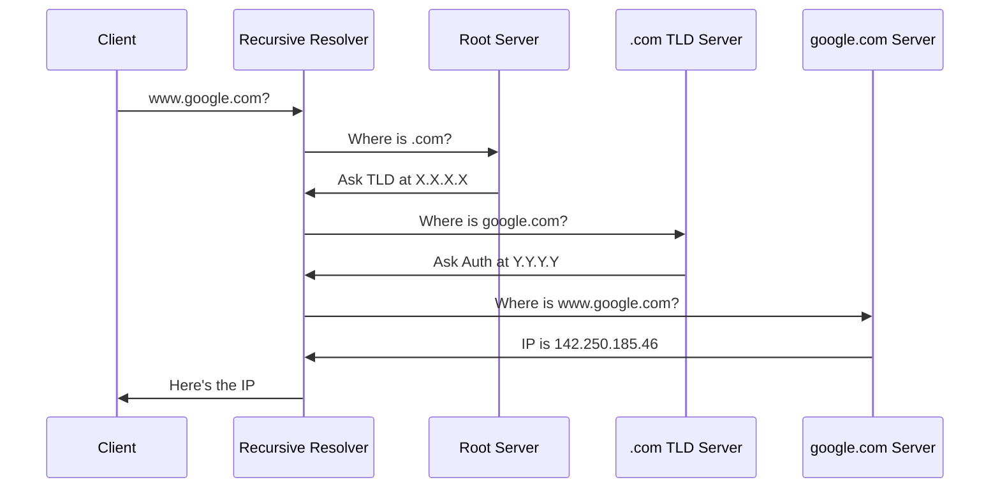

# Unit 2: Configuring Network Infrastructure

## Course Information
- **Course Code**: INT249 - System Administration  
- **Credits**: 3 (L:2 T:0 P:2)
- **Session**: 2023-24

---

## Learning Objectives

After completing this unit, you will be able to:
- Understand network cabling standards, types, and best practices
- Configure and optimize network interface cards (NICs)  
- Implement TCP/IP addressing and subnetting schemes
- Deploy and manage DHCP services for dynamic IP assignment
- Configure DNS services for name resolution
- Troubleshoot network connectivity and performance issues
- Apply network security best practices

---

## Table of Contents
1. [Theory: Network Cabling](#theory-network-cabling)
2. [Theory: Network Interface Cards](#theory-network-interface-cards)
3. [Practical 1: Configure NICs in Windows Server](#practical-1-configure-nics)
4. [Theory: TCP/IP and IP Addressing](#theory-ip-addressing)
5. [Practical 2: Implement IP Addressing](#practical-2-implement-ip-addressing)
6. [Theory: DHCP Services](#theory-dhcp-services)
7. [Practical 3: Configure DHCP Server](#practical-3-configure-dhcp)
8. [Theory: DNS Services](#theory-dns-services)
9. [Practical 4: Configure DNS Server](#practical-4-configure-dns)
10. [Review Questions](#review-questions)

---

## Theory: Network Cabling {#theory-network-cabling}

### Introduction to Network Cabling

Network cabling forms the physical foundation of network infrastructure. Understanding cabling is essential for proper network design, implementation, and troubleshooting.

**Why Cabling Matters:**
- Determines maximum network speed
- Affects signal quality and reliability
- Defines distance limitations
- Impacts installation cost and complexity
- Critical for long-term network performance
- Represents significant investment (should last 10-15 years)

### Types of Network Cables



### Twisted Pair Cables

**Why Twist the Wires?**
- Reduces electromagnetic interference (EMI)
- Minimizes crosstalk between pairs
- Each twist creates opposing magnetic fields that cancel out interference
- Different twist rates for each pair prevent resonance

**UTP Cable Categories:**

| Category | Speed | Frequency | Max Distance | Use Case |
|----------|-------|-----------|--------------|----------|
| Cat5e | 1 Gbps | 100 MHz | 100m | Minimum standard |
| Cat6 | 1-10 Gbps | 250 MHz | 100m (55m for 10G) | Current standard |
| Cat6a | 10 Gbps | 500 MHz | 100m | Professional/Data center |
| Cat7 | 10 Gbps | 600 MHz | 100m | Specialized (always shielded) |
| Cat8 | 25-40 Gbps | 2000 MHz | 30m | Data center only |

**Wiring Standards:**

**T568B (Most Common):**
```
Pin 1: White/Orange
Pin 2: Orange  
Pin 3: White/Green
Pin 4: Blue
Pin 5: White/Blue
Pin 6: Green
Pin 7: White/Brown
Pin 8: Brown
```

**Cable Types:**
- **Straight-Through**: Both ends T568B (connects different devices)
- **Crossover**: One end T568A, other T568B (connects similar devices)
- **Note**: Modern equipment has Auto-MDIX, making crossover cables rarely needed

### Fiber Optic Cables

**Single-Mode Fiber (SMF):**
- Core: 8-10 microns
- Distance: 10km - 100km+
- Use: Long-distance, campus backbone
- Color: Yellow jacket
- Light source: Laser
- Cost: Higher

**Multi-Mode Fiber (MMF):**
- Core: 50-62.5 microns  
- Distance: 300m - 2km
- Use: Building backbone, data centers
- Color: Orange (OM1/2) or Aqua (OM3/4/5)
- Light source: LED
- Cost: Lower than SMF

**Fiber Connectors:**
- **LC**: Small form factor, most common today
- **SC**: Larger, push-pull, telco standard
- **ST**: Round, bayonet twist, legacy
- **MTP/MPO**: 12-24 fibers, high-density data centers

### Cable Installation Best Practices

**Maximum Pull Tension:**
- UTP: 25 lbs (11.3 kg)
- Exceeding damages internal structure

**Bend Radius:**
- Minimum: 4x cable diameter
- Never create sharp bends

**Separation from Interference:**
- Fluorescent lights: 12" minimum
- Power cables: 5-6" minimum parallel
- Motors/transformers: 40" minimum

**Untwisting Pairs:**
- Maximum 0.5" (13mm) untwist at termination
- Critical for Gigabit and higher speeds

**Cable Testing:**
- Basic tester: Continuity, wiremap, opens, shorts
- Certifier: Full performance testing, generates compliance reports
- Test after installation and termination

---

## Theory: Network Interface Cards {#theory-network-interface-cards}

### What is a NIC?

A Network Interface Card (NIC) is the hardware component that connects a computer to a network, handling data transmission and reception.

**NIC Functions:**
- Physical network connection
- Data encoding/decoding
- MAC address assignment
- Error detection
- Buffer management

### MAC Address

**Format**: 48-bit address (6 bytes)
- Example: `00:1A:2B:3C:4D:5E`
- First 24 bits: OUI (Organizationally Unique Identifier) - manufacturer
- Last 24 bits: Device-specific identifier

**Types:**
- Unicast: Single device
- Multicast: Group of devices
- Broadcast: All devices (FF:FF:FF:FF:FF:FF)

### NIC Speeds and Standards

| Speed | Standard | Cable Required | Use Case |
|-------|----------|----------------|----------|
| 100 Mbps | Fast Ethernet | Cat5 | Legacy |
| 1 Gbps | Gigabit Ethernet | Cat5e/6 | Standard desktop/server |
| 2.5/5 Gbps | Multi-Gig | Cat5e/6 | Modern desktop |
| 10 Gbps | 10 Gigabit | Cat6a/Fiber | Server/Storage |
| 25/40/100 Gbps | High-speed | Fiber/Cat8 | Data center |

### Advanced NIC Features

**1. Jumbo Frames:**
- Increases MTU from 1500 to 9000 bytes
- Reduces overhead, improves throughput
- All devices must support same MTU

**2. NIC Teaming/Bonding:**
- Combines multiple NICs for bandwidth or redundancy
- Modes: Active-passive, round-robin, LACP (802.3ad)

**3. Receive Side Scaling (RSS):**
- Distributes network processing across CPU cores
- Improves multi-core performance

**4. TCP/IP Offload:**
- Checksum offload
- Large Send Offload (LSO)
- Reduces CPU usage

**5. Wake-on-LAN (WoL):**
- Powers on computer remotely via magic packet
- Requires BIOS support and configuration

**6. SR-IOV:**
- Single Root I/O Virtualization
- VMs directly access NIC hardware
- Better VM network performance

---

## Practical 1: Configure NICs in Windows Server {#practical-1-configure-nics}

### Objective
Configure network interface settings including speed, duplex, advanced properties, and troubleshoot common issues.

### Prerequisites
- Windows Server 2022 VM
- Administrative access

---

### Part A: View Network Adapter Information

#### Method 1: Using Network Connections (GUI)

**Step 1**: Open Network Connections
```
Windows + R → ncpa.cpl → Enter
```

**Step 2**: View Adapter Status
1. Right-click adapter → "Status"
2. Note: Speed, Duration, Bytes sent/received

**Step 3**: View Details
1. Click "Details" button
2. Note MAC address (Physical Address)
3. Note IP configuration

#### Method 2: Using PowerShell

**Open PowerShell as Administrator**

**View all adapters:**
```powershell
Get-NetAdapter
```

**View detailed information:**
```powershell
Get-NetAdapter | Format-List *
```

**View IP configuration:**
```powershell
Get-NetIPConfiguration
```

**View adapter statistics:**
```powershell
Get-NetAdapterStatistics
```

---

### Part B: Configure Speed and Duplex

#### Using GUI

**Step 1**: Open Adapter Properties
1. Network Connections → Right-click adapter → Properties
2. Click "Configure" button
3. Click "Advanced" tab

**Step 2**: Locate Speed & Duplex
1. Find "Speed & Duplex" in property list
2. Available options:
   - Auto Negotiation (Recommended)
   - 10 Mbps Half/Full Duplex
   - 100 Mbps Half/Full Duplex
   - 1.0 Gbps Full Duplex
   - 10.0 Gbps Full Duplex (if supported)

**Step 3**: Configure Setting
1. Select desired option
2. Click "OK"
3. Adapter resets briefly

**Recommendation**: Leave on Auto Negotiation unless troubleshooting duplex mismatch

#### Using PowerShell

```powershell
# View current speed settings
Get-NetAdapter | Select-Object Name, LinkSpeed, FullDuplex

# Set to Auto (recommended)
Set-NetAdapterAdvancedProperty -Name "Ethernet" -DisplayName "Speed & Duplex" -DisplayValue "Auto Negotiation"
```

---

### Part C: Configure Advanced Properties

**Important Properties:**

**1. Large Send Offload V2 (IPv4)**
- Offloads TCP segmentation to NIC
- Setting: Enabled
- Reduces CPU usage

```powershell
Set-NetAdapterAdvancedProperty -Name "Ethernet" -DisplayName "Large Send Offload V2 (IPv4)" -DisplayValue "Enabled"
```

**2. Receive Side Scaling**
- Distributes processing across CPU cores
- Setting: Enabled (for multi-core systems)

```powershell
Set-NetAdapterAdvancedProperty -Name "Ethernet" -DisplayName "Receive Side Scaling" -DisplayValue "Enabled"
```

**3. Jumbo Packet**
- Increases frame size to 9000 bytes
- Setting: 9014 Bytes (if needed)
- **Warning**: All devices must support

```powershell
Set-NetAdapterAdvancedProperty -Name "Ethernet" -DisplayName "Jumbo Packet" -DisplayValue "9014 Bytes"
```

**4. Flow Control**
- Prevents packet loss from buffer overflow
- Setting: Rx & Tx Enabled

**5. Interrupt Moderation**
- Reduces CPU interrupts
- Setting: Enabled

---

### Part D: Configure Power Management

**For Servers - Disable Power Saving:**

#### Using GUI

1. Adapter Properties → Configure → Power Management tab
2. **Uncheck**: "Allow the computer to turn off this device to save power"
3. Click "OK"

#### Using PowerShell

```powershell
# Disable power management (servers)
Set-NetAdapterPowerManagement -Name "Ethernet" -AllowComputerToTurnOffDevice Disabled

# Verify
Get-NetAdapterPowerManagement -Name "Ethernet"
```

---

### Part E: Rename Network Adapter

#### Using GUI
1. Network Connections
2. Right-click adapter → "Rename"
3. Type new name: `LAN-Primary`

#### Using PowerShell
```powershell
Rename-NetAdapter -Name "Ethernet" -NewName "LAN-Primary"
```

---

### Part F: View Network Statistics

**Using PowerShell:**
```powershell
# View statistics
Get-NetAdapterStatistics -Name "LAN-Primary"

# Monitor in real-time (updates every 2 seconds)
while($true) {
    Clear-Host
    Get-NetAdapterStatistics -Name "LAN-Primary" | Format-Table -AutoSize
    Start-Sleep -Seconds 2
}
# Press Ctrl+C to stop
```

---

### Part G: Troubleshooting Common NIC Issues

**Issue 1: Network cable unplugged**

**Troubleshooting:**
1. Check physical connection
2. Try different cable
3. Try different switch port
4. Check NIC LEDs (should be lit when connected)

**Solution in PowerShell:**
```powershell
# Disable and re-enable adapter
Disable-NetAdapter -Name "LAN-Primary" -Confirm:$false
Start-Sleep -Seconds 5
Enable-NetAdapter -Name "LAN-Primary" -Confirm:$false
```

**Issue 2: Slow network speed**

**Check link speed:**
```powershell
Get-NetAdapter -Name "LAN-Primary" | Select-Object Name, LinkSpeed, FullDuplex
```

Should show:
- LinkSpeed: 1 Gbps (not 100 Mbps)
- FullDuplex: True

**Check for errors:**
```powershell
Get-NetAdapterStatistics -Name "LAN-Primary" | Select-Object Name, *Error*
```

Errors should be 0.

**Issue 3: Driver problems**

**Update drivers:**
1. Device Manager → Network adapters
2. Right-click adapter → Update driver
3. Or download from manufacturer website

**View driver version:**
```powershell
Get-NetAdapter -Name "LAN-Primary" | Select-Object Name, DriverVersion, DriverDate
```

---

## Theory: TCP/IP and IP Addressing {#theory-ip-addressing}

### IPv4 Address Structure

IPv4 uses 32-bit addresses divided into 4 octets:

**Format**: `192.168.1.100`
- Each octet: 0-255 (8 bits)
- Total: 2^32 = ~4.3 billion addresses

**Binary representation:**
```
192.168.1.100
11000000.10101000.00000001.01100100
```

### IP Address Classes (Historical)

| Class | Range | Default Mask | Networks | Hosts/Network |
|-------|-------|--------------|----------|---------------|
| A | 1.0.0.0 - 126.255.255.255 | 255.0.0.0 (/8) | 126 | 16,777,214 |
| B | 128.0.0.0 - 191.255.255.255 | 255.255.0.0 (/16) | 16,384 | 65,534 |
| C | 192.0.0.0 - 223.255.255.255 | 255.255.255.0 (/24) | 2,097,152 | 254 |

### Private IP Ranges (RFC 1918)

| Class | Range | CIDR | Use Case |
|-------|-------|------|----------|
| A | 10.0.0.0 - 10.255.255.255 | 10.0.0.0/8 | Large enterprises |
| B | 172.16.0.0 - 172.31.255.255 | 172.16.0.0/12 | Medium businesses |
| C | 192.168.0.0 - 192.168.255.255 | 192.168.0.0/16 | Home/small office |

**Characteristics:**
- Not routable on Internet
- Require NAT for Internet access
- Can be reused by different organizations

### Subnet Masks

Subnet mask divides IP address into network and host portions.

**Common Subnet Masks:**

| CIDR | Subnet Mask | Usable Hosts | Common Use |
|------|-------------|--------------|------------|
| /24 | 255.255.255.0 | 254 | Standard small network |
| /25 | 255.255.255.128 | 126 | Half of /24 |
| /26 | 255.255.255.192 | 62 | Quarter of /24 |
| /27 | 255.255.255.224 | 30 | Small subnet |
| /28 | 255.255.255.240 | 14 | Very small subnet |
| /30 | 255.255.255.252 | 2 | Point-to-point links |

**Calculating Usable Hosts:**
- Formula: 2^(host bits) - 2
- Subtract 2 for network address and broadcast address

**Example: 192.168.1.0/24**
- Host bits: 32 - 24 = 8
- Total: 2^8 = 256
- Usable: 256 - 2 = 254
- Network: 192.168.1.0
- Broadcast: 192.168.1.255
- Range: 192.168.1.1 - 192.168.1.254

### Subnetting Example

**Divide 192.168.1.0/24 into 4 subnets:**

Need 2 bits for 4 subnets (2^2 = 4)
New mask: /26 (24 + 2)

**Subnets:**
```
Subnet 1: 192.168.1.0/26
  Range: .1 - .62
  Broadcast: .63

Subnet 2: 192.168.1.64/26
  Range: .65 - .126
  Broadcast: .127

Subnet 3: 192.168.1.128/26
  Range: .129 - .190
  Broadcast: .191

Subnet 4: 192.168.1.192/26
  Range: .193 - .254
  Broadcast: .255
```

### Default Gateway and DNS

**Default Gateway:**
- Router connecting local network to other networks
- Must be on same subnet
- Typically .1 or .254
- Example: 192.168.1.1

**DNS (Domain Name System):**
- Translates domain names to IP addresses
- Example: google.com → 142.250.185.46

**Common Public DNS Servers:**
- Google: 8.8.8.8, 8.8.4.4
- Cloudflare: 1.1.1.1, 1.0.0.1
- Quad9: 9.9.9.9

### Static vs Dynamic IP

**Static IP:**
- Manually configured
- Never changes
- Use for: Servers, printers, network devices

**Dynamic IP (DHCP):**
- Automatically assigned
- Can change
- Use for: Client computers, mobile devices

---

## Practical 2: Implement IP Addressing {#practical-2-implement-ip-addressing}

### Objective
Configure static and dynamic IP addresses, test connectivity, and troubleshoot network issues.

---

### Part A: Configure Static IP Address

#### Method 1: Using Network Connections

**Step 1**: Open IPv4 Properties
1. `Windows + R` → `ncpa.cpl`
2. Right-click adapter → Properties
3. Select "Internet Protocol Version 4 (TCP/IPv4)"
4. Click "Properties"

**Step 2**: Configure Static IP
1. Select "Use the following IP address"
2. Enter configuration:
   ```
   IP address: 192.168.1.10
   Subnet mask: 255.255.255.0
   Default gateway: 192.168.1.1
   ```

**Step 3**: Configure DNS
1. Select "Use the following DNS server addresses"
2. Enter:
   ```
   Preferred DNS: 8.8.8.8
   Alternate DNS: 8.8.4.4
   ```

**Step 4**: Click OK to apply

#### Method 2: Using PowerShell

```powershell
# Remove existing IP (if changing from DHCP)
Remove-NetIPAddress -InterfaceAlias "Ethernet" -Confirm:$false
Remove-NetRoute -InterfaceAlias "Ethernet" -Confirm:$false

# Set new static IP
New-NetIPAddress -InterfaceAlias "Ethernet" `
                 -IPAddress 192.168.1.10 `
                 -PrefixLength 24 `
                 -DefaultGateway 192.168.1.1

# Set DNS servers
Set-DnsClientServerAddress -InterfaceAlias "Ethernet" `
                           -ServerAddresses 8.8.8.8,8.8.4.4

# Verify configuration
Get-NetIPConfiguration -InterfaceAlias "Ethernet"
```

---

### Part B: Configure Multiple IP Addresses

#### Using GUI

**Step 1**: Open Advanced TCP/IP Settings
1. IPv4 Properties → Click "Advanced"

**Step 2**: Add Additional IP
1. Under "IP addresses" → Click "Add"
2. Enter:
   ```
   IP address: 192.168.1.11
   Subnet mask: 255.255.255.0
   ```
3. Click "Add"
4. Repeat for more IPs

#### Using PowerShell

```powershell
# Add secondary IP (skip as source)
New-NetIPAddress -InterfaceAlias "Ethernet" `
                 -IPAddress 192.168.1.11 `
                 -PrefixLength 24 `
                 -SkipAsSource $true

# Add another IP
New-NetIPAddress -InterfaceAlias "Ethernet" `
                 -IPAddress 192.168.1.12 `
                 -PrefixLength 24 `
                 -SkipAsSource $true

# View all IPs
Get-NetIPAddress -InterfaceAlias "Ethernet" -AddressFamily IPv4

# Remove secondary IP
Remove-NetIPAddress -IPAddress 192.168.1.11 -Confirm:$false
```

---

### Part C: Configure DHCP Client

#### Using GUI

1. IPv4 Properties
2. Select "Obtain an IP address automatically"
3. Select "Obtain DNS server address automatically"
4. Click OK

**Renew DHCP lease:**
```cmd
ipconfig /release
ipconfig /renew
```

#### Using PowerShell

```powershell
# Enable DHCP
Set-NetIPInterface -InterfaceAlias "Ethernet" -Dhcp Enabled

# Set DNS to automatic
Set-DnsClientServerAddress -InterfaceAlias "Ethernet" -ResetServerAddresses

# Release and renew
ipconfig /release
ipconfig /renew
```

---

### Part D: Test Network Connectivity

**Systematic Testing Approach:**

**Test 1: Ping Loopback (Tests TCP/IP stack)**
```powershell
ping 127.0.0.1
```

**Test 2: Ping Own IP (Tests NIC)**
```powershell
ping 192.168.1.10
```

**Test 3: Ping Default Gateway (Tests local network)**
```powershell
ping 192.168.1.1
```

**Test 4: Ping External IP (Tests Internet connectivity)**
```powershell
ping 8.8.8.8
```

**Test 5: Ping Domain Name (Tests DNS)**
```powershell
ping google.com
```

**Advanced Testing:**

**Trace Route:**
```powershell
tracert google.com
```

**DNS Lookup:**
```powershell
nslookup google.com
nslookup google.com 8.8.8.8  # Test specific DNS server
```

**Advanced Connection Test:**
```powershell
Test-NetConnection -ComputerName google.com -InformationLevel Detailed

# Test specific port
Test-NetConnection -ComputerName google.com -Port 443
```

---

### Part E: Troubleshooting Network Issues

**Problem: No Internet Connectivity**

**Step-by-step diagnosis:**

1. **Check physical connection:**
```powershell
Get-NetAdapter | Select-Object Name, Status, LinkSpeed
```
Status should be "Up"

2. **Check IP configuration:**
```powershell
Get-NetIPAddress -InterfaceAlias "Ethernet" -AddressFamily IPv4
```
Should show valid IP (not 169.254.x.x)

3. **Ping tests (layered approach):**
```powershell
ping 127.0.0.1      # Loopback
ping 192.168.1.10   # Own IP
ping 192.168.1.1    # Gateway
ping 8.8.8.8        # External IP
ping google.com     # DNS
```

4. **Identify failure point:**
- Loopback fails → TCP/IP stack issue
- Own IP fails → NIC issue
- Gateway fails → Local network issue
- External IP fails → Gateway/routing issue
- DNS fails → DNS configuration issue

**Problem: APIPA Address (169.254.x.x)**

**Cause**: DHCP server not reachable

**Solution:**
```powershell
# Try manual IP
Remove-NetIPAddress -InterfaceAlias "Ethernet" -Confirm:$false
New-NetIPAddress -InterfaceAlias "Ethernet" `
                 -IPAddress 192.168.1.50 `
                 -PrefixLength 24 `
                 -DefaultGateway 192.168.1.1
```

**Problem: DNS Not Responding**

**Solution:**
```powershell
# Test DNS servers
Test-NetConnection -ComputerName 8.8.8.8 -Port 53

# Change DNS
Set-DnsClientServerAddress -InterfaceAlias "Ethernet" -ServerAddresses 8.8.8.8,1.1.1.1

# Flush DNS cache
Clear-DnsClientCache

# Test resolution
Resolve-DnsName google.com
```

**Problem: Slow Network**

**Diagnose:**
```powershell
# Check link speed (should be 1 Gbps, not 100 Mbps)
Get-NetAdapter | Select-Object Name, LinkSpeed, FullDuplex

# Check for errors (should be 0)
Get-NetAdapterStatistics | Select-Object Name, *Error*, *Discard*
```

**Problem: IP Conflict**

**Symptoms**: "IP address conflict" error

**Solution:**
```powershell
# Change to different IP
Set-NetIPAddress -InterfaceAlias "Ethernet" -IPAddress 192.168.1.11
```

---

## Theory: DHCP Services {#theory-dhcp-services}

### What is DHCP?

DHCP (Dynamic Host Configuration Protocol) automatically assigns IP addresses and network configuration to devices.

### DHCP Process (DORA)



**DORA Process:**
1. **Discover**: Client broadcasts request for IP
2. **Offer**: Server offers available IP with lease time
3. **Request**: Client requests offered IP
4. **Acknowledge**: Server confirms assignment and sends configuration

### DHCP Components

**DHCP Server:**
- Manages IP address pool
- Assigns IPs to clients
- Tracks leases

**DHCP Scope:**
- Range of IP addresses to assign
- Example: 192.168.1.100 - 192.168.1.200

**Lease:**
- Time period IP is assigned
- Typical: 8 days
- Client must renew before expiration

**Exclusions:**
- IPs within scope not to assign
- Used for static devices (servers, printers)

**Reservations:**
- Specific IP always assigned to specific MAC address
- Device always gets same IP via DHCP

**Options:**
- Additional configuration:
  - Router (default gateway)
  - DNS servers
  - Domain name
  - NTP servers
  - WINS servers

### Benefits of DHCP

1. **Centralized Management**: Single point of IP administration
2. **Reduced Errors**: No manual configuration mistakes
3. **Automatic Reconfiguration**: Easy network changes
4. **Efficient IP Use**: IPs reused when devices leave
5. **Mobility**: Devices automatically configure when moved

### DHCP Lease Renewal

**Lease Timeline:**
- **50% of lease**: Client attempts renewal (unicast to server)
- **87.5% of lease**: Client attempts rebinding (broadcast)
- **100% of lease**: If not renewed, IP released

**Example with 8-day lease:**
- Day 4 (50%): Renewal attempt
- Day 7 (87.5%): Rebinding attempt
- Day 8: IP released if not renewed

---

## Practical 3: Configure DHCP Server {#practical-3-configure-dhcp}

### Objective
Install DHCP server role, create scopes, configure options, and manage IP assignments.

### Prerequisites
- Windows Server 2022 with static IP
- Administrative access

---

### Part A: Install DHCP Server Role

#### Using Server Manager

**Step 1**: Add Roles and Features
1. Server Manager → Manage → "Add Roles and Features"
2. Click "Next" until "Server Roles"

**Step 2**: Select DHCP Server
1. Check "DHCP Server"
2. Click "Add Features" when prompted
3. Click "Next" through wizard
4. Click "Install"
5. Wait for installation to complete
6. Click "Close"

#### Using PowerShell

```powershell
# Install DHCP Server role
Install-WindowsFeature -Name DHCP -IncludeManagementTools

# Verify installation
Get-WindowsFeature -Name DHCP
```

---

### Part B: Post-Installation Configuration

**Step 1**: Complete DHCP Configuration
1. Server Manager → Click notification flag (yellow)
2. Click "Complete DHCP configuration"
3. Click "Next"
4. Use current credentials
5. Click "Commit"
6. Click "Close"

#### Using PowerShell

```powershell
# Create security groups
netsh dhcp add securitygroups

# Restart DHCP service
Restart-Service DHCPServer
```

---

### Part C: Create DHCP Scope

**Step 1**: Open DHCP Management Console
1. Server Manager → Tools → DHCP
2. Or run: `dhcpmgmt.msc`

**Step 2**: Create New Scope
1. Expand server name
2. Right-click "IPv4" → "New Scope"
3. Click "Next"

**Step 3**: Scope Name
```
Name: Lab Network
Description: DHCP scope for lab computers
```
Click "Next"

**Step 4**: IP Address Range
```
Start IP: 192.168.1.100
End IP: 192.168.1.200
Length: 24
Subnet mask: 255.255.255.0
```
Click "Next"

**Step 5**: Add Exclusions (Optional)
```
Start: 192.168.1.100
End: 192.168.1.110
```
Click "Add" → "Next"

**Step 6**: Lease Duration
```
Set to: 1 Days (for testing)
Production: 8 Days
```
Click "Next"

**Step 7**: Configure DHCP Options
1. Select "Yes, I want to configure these options now"
2. Click "Next"

**Step 8**: Router (Default Gateway)
```
IP address: 192.168.1.1
```
Click "Add" → "Next"

**Step 9**: DNS Servers
```
IP: 8.8.8.8 → Click "Add"
IP: 8.8.4.4 → Click "Add"
```
Click "Next"

**Step 10**: WINS Servers
- Leave blank (not needed)
- Click "Next"

**Step 11**: Activate Scope
1. Select "Yes, I want to activate this scope now"
2. Click "Next"
3. Click "Finish"

#### Using PowerShell to Create Scope

```powershell
# Create DHCP scope
Add-DhcpServerv4Scope -Name "Lab Network" `
    -StartRange 192.168.1.100 `
    -EndRange 192.168.1.200 `
    -SubnetMask 255.255.255.0 `
    -Description "DHCP scope for lab" `
    -State Active

# Add exclusion range
Add-DhcpServerv4ExclusionRange -ScopeId 192.168.1.0 `
    -StartRange 192.168.1.100 `
    -EndRange 192.168.1.110

# Set scope options (gateway and DNS)
Set-DhcpServerv4OptionValue -ScopeId 192.168.1.0 `
    -Router 192.168.1.1 `
    -DnsServer 8.8.8.8,8.8.4.4

# Set lease duration (1 day for testing)
Set-DhcpServerv4Scope -ScopeId 192.168.1.0 -LeaseDuration 1.00:00:00

# View scope
Get-DhcpServerv4Scope
```

---

### Part D: Configure DHCP Reservations

**Purpose**: Ensure device always gets same IP via DHCP

**Step 1**: Get Client MAC Address
- On client: `ipconfig /all`
- Note Physical Address

**Step 2**: Create Reservation
1. DHCP console → Expand scope
2. Right-click "Reservations" → "New Reservation"

**Step 3**: Reservation Details
```
Name: Print-Server
IP address: 192.168.1.50
MAC address: 00-15-5D-01-02-03
Description: Network printer
```
Click "Add" → "Close"

#### Using PowerShell

```powershell
# Create reservation
Add-DhcpServerv4Reservation -ScopeId 192.168.1.0 `
    -IPAddress 192.168.1.50 `
    -ClientId "00-15-5D-01-02-03" `
    -Description "Network Printer" `
    -Name "Print-Server"

# View reservations
Get-DhcpServerv4Reservation -ScopeId 192.168.1.0
```

---

### Part E: Monitor DHCP

**View Active Leases:**
1. DHCP console → Expand scope
2. Click "Address Leases"
3. See all active assignments

**View Statistics:**
1. Right-click scope → "Display Statistics"
2. Shows: Total addresses, In use, Available

**Using PowerShell:**
```powershell
# View all leases
Get-DhcpServerv4Lease -ScopeId 192.168.1.0

# View scope statistics
Get-DhcpServerv4ScopeStatistics

# View server statistics
Get-DhcpServerv4Statistics
```

---

### Part F: Configure DHCP Failover (Optional - Advanced)

**Purpose**: Redundant DHCP servers for high availability

**Requirements:**
- Two DHCP servers
- Both on same network

**Configuration:**
1. DHCP console → Right-click scope
2. "Configure Failover"
3. Select partner server
4. Choose mode:
   - Load Balance: Both servers active
   - Hot Standby: One primary, one backup
5. Complete wizard

---

## Theory: DNS Services {#theory-dns-services}

### What is DNS?

DNS (Domain Name System) translates human-readable domain names into IP addresses.

**Example**: `www.google.com` → `142.250.185.46`

### DNS Hierarchy



**Levels:**
1. **Root**: Represented by "."
2. **Top-Level Domain (TLD)**: .com, .org, .net, .edu, .gov
3. **Second-Level Domain**: google, microsoft, example
4. **Subdomain**: www, mail, ftp

### DNS Query Process



**Process:**
1. Client queries recursive resolver
2. Resolver queries root server for TLD
3. Resolver queries TLD server for authoritative server
4. Resolver queries authoritative server for IP
5. Resolver returns IP to client

### DNS Record Types

**A Record (Address):**
- Maps hostname to IPv4 address
- Example: `www.example.com` → `93.184.216.34`

**AAAA Record:**
- Maps hostname to IPv6 address
- Example: `www.example.com` → `2001:db8::1`

**CNAME (Canonical Name):**
- Alias to another hostname
- Example: `blog.example.com` → `www.example.com`

**MX (Mail Exchange):**
- Specifies mail server
- Has priority (lower = higher priority)
- Example: `example.com` → `mail.example.com` (priority 10)

**PTR (Pointer):**
- Reverse DNS (IP to name)
- Used in reverse lookup zones
- Example: `34.216.184.93.in-addr.arpa` → `www.example.com`

**NS (Name Server):**
- Delegates domain to nameservers
- Example: `example.com` → `ns1.example.com`

**TXT (Text):**
- Arbitrary text data
- Uses: SPF, DKIM, domain verification
- Example: `v=spf1 include:_spf.google.com ~all`

**SOA (Start of Authority):**
- Zone metadata
- Serial number, refresh times, TTL

### DNS Zones

**Forward Lookup Zone:**
- Name → IP resolution
- Contains A, AAAA, CNAME, MX records

**Reverse Lookup Zone:**
- IP → Name resolution
- Contains PTR records

**Zone Types:**
- **Primary**: Read-write master copy
- **Secondary**: Read-only copy (for redundancy)
- **Stub**: Contains only NS records

### DNS Caching

**Purpose**: Improve performance, reduce queries

**TTL (Time to Live):**
- How long to cache record
- Set by authoritative server
- Typical: 300-86400 seconds (5 min - 24 hours)

**Cache Levels:**
1. Browser cache
2. Operating system cache
3. Recursive resolver cache

---

## Practical 4: Configure DNS Server {#practical-4-configure-dns}

### Objective
Install DNS server role, create zones, configure records, and test resolution.

---

### Part A: Install DNS Server Role

#### Using Server Manager

**Step 1**: Add Roles and Features
1. Server Manager → Manage → "Add Roles and Features"
2. Click "Next" until "Server Roles"

**Step 2**: Select DNS Server
1. Check "DNS Server"
2. Click "Add Features"
3. Click "Next" through wizard
4. Click "Install"
5. Wait for completion
6. Click "Close"

#### Using PowerShell

```powershell
# Install DNS Server role
Install-WindowsFeature -Name DNS -IncludeManagementTools

# Verify installation
Get-WindowsFeature -Name DNS

# Start DNS service
Start-Service DNS
```

---

### Part B: Create Forward Lookup Zone

**Step 1**: Open DNS Manager
1. Server Manager → Tools → DNS
2. Or run: `dnsmgmt.msc`

**Step 2**: Create New Zone
1. Expand server name
2. Right-click "Forward Lookup Zones"
3. Select "New Zone"
4. Click "Next"

**Step 3**: Zone Type
1. Select "Primary zone"
2. Uncheck "Store zone in Active Directory" (if not domain-joined)
3. Click "Next"

**Step 4**: Zone Name
```
Zone name: lab.local
```
Click "Next"

**Step 5**: Zone File
```
Create new file: lab.local.dns
```
Click "Next"

**Step 6**: Dynamic Update
1. Select "Do not allow dynamic updates"
2. Click "Next"
3. Click "Finish"

#### Using PowerShell

```powershell
# Create forward lookup zone
Add-DnsServerPrimaryZone -Name "lab.local" -ZoneFile "lab.local.dns"

# View zones
Get-DnsServerZone
```

---

### Part C: Create DNS Records

**Create A Record (Host):**

**Step 1**: In DNS Manager
1. Expand "Forward Lookup Zones"
2. Click "lab.local"
3. Right-click in right pane → "New Host (A or AAAA)"

**Step 2**: Configure A Record
```
Name: webserver
FQDN: webserver.lab.local
IP address: 192.168.1.50
☑ Create associated PTR record
```
Click "Add Host" → "OK" → "Done"

**Create CNAME Record (Alias):**

1. Right-click zone → "New Alias (CNAME)"
2. Configure:
   ```
   Alias name: www
   FQDN: www.lab.local
   Target: webserver.lab.local
   ```
3. Click "OK"

**Create MX Record (Mail):**

1. Right-click zone → "New Mail Exchanger (MX)"
2. Configure:
   ```
   Host: (leave blank for zone)
   Mail server: mail.lab.local
   Priority: 10
   ```
3. Click "OK"

#### Using PowerShell

```powershell
# Create A record
Add-DnsServerResourceRecordA -Name "webserver" `
    -ZoneName "lab.local" `
    -IPv4Address "192.168.1.50"

# Create CNAME record
Add-DnsServerResourceRecordCName -Name "www" `
    -ZoneName "lab.local" `
    -HostNameAlias "webserver.lab.local"

# Create MX record
Add-DnsServerResourceRecordMX -Name "." `
    -ZoneName "lab.local" `
    -MailExchange "mail.lab.local" `
    -Preference 10

# View all records
Get-DnsServerResourceRecord -ZoneName "lab.local"
```

---

### Part D: Create Reverse Lookup Zone

**Step 1**: New Reverse Lookup Zone
1. Right-click "Reverse Lookup Zones"
2. Select "New Zone"
3. Click "Next"

**Step 2**: Zone Type
1. Select "Primary zone"
2. Click "Next"

**Step 3**: Reverse Lookup Zone Name
1. Select "IPv4 Reverse Lookup Zone"
2. Click "Next"

**Step 4**: Network ID
```
Network ID: 192.168.1
Zone name: 1.168.192.in-addr.arpa
```
Click "Next"

**Step 5**: Zone File
- Create new file
- Click "Next"

**Step 6**: Dynamic Update
- Do not allow
- Click "Next" → "Finish"

#### Using PowerShell

```powershell
# Create reverse lookup zone
Add-DnsServerPrimaryZone -NetworkID "192.168.1.0/24" `
    -ZoneFile "1.168.192.in-addr.arpa.dns"
```

---

### Part E: Configure DNS Forwarders

**Purpose**: Forward queries for external domains to other DNS servers

**Step 1**: Open Server Properties
1. Right-click server name
2. Select "Properties"

**Step 2**: Forwarders Tab
1. Click "Forwarders" tab
2. Click "Edit"

**Step 3**: Add Forwarders
```
8.8.8.8
8.8.4.4
```
Click "OK" → "Apply" → "OK"

#### Using PowerShell

```powershell
# Add forwarders
Add-DnsServerForwarder -IPAddress "8.8.8.8","8.8.4.4"

# View forwarders
Get-DnsServerForwarder
```

---

### Part F: Test DNS Resolution

**Using nslookup:**

```cmd
# Query A record
nslookup webserver.lab.local

# Query specific DNS server
nslookup webserver.lab.local 192.168.1.10

# Query MX records
nslookup -type=MX lab.local
```

**Using PowerShell:**

```powershell
# Resolve DNS name
Resolve-DnsName webserver.lab.local

# Query specific server
Resolve-DnsName webserver.lab.local -Server 192.168.1.10

# Query MX records
Resolve-DnsName lab.local -Type MX

# Verify reverse lookup
Resolve-DnsName 192.168.1.50
```

---

### Part G: DNS Monitoring and Troubleshooting

**Clear DNS Cache:**

**Server cache:**
```powershell
Clear-DnsServerCache
```

**Client cache:**
```powershell
ipconfig /flushdns
```

**View Cache:**

**Server:**
```powershell
Show-DnsServerCache
```

**Client:**
```powershell
ipconfig /displaydns
```

**Enable Debug Logging:**

1. DNS Manager → Right-click server → Properties
2. "Debug Logging" tab
3. Check "Log packets for debugging"
4. Configure options
5. Check file path

**View DNS Events:**
1. Event Viewer
2. Applications and Services Logs → DNS Server

**Common DNS Issues:**

**Issue 1: Name not resolving**
- Check record exists
- Check zone is loaded
- Test with nslookup
- Clear cache

**Issue 2: Reverse lookup fails**
- Check PTR record created
- Check reverse zone configured
- Verify network ID correct

**Issue 3: Forwarders not working**
- Test forwarder connectivity
- Check firewall (port 53)
- Verify forwarder IPs correct

---

## Review Questions

### Conceptual Questions

1. What is the difference between UTP and STP cables? When would you use each?

2. Explain the maximum cable length for Cat6 and Cat6a at 10 Gbps.

3. What is the difference between single-mode and multi-mode fiber?

4. Describe the DORA process in DHCP.

5. What is the purpose of a subnet mask?

6. Explain the difference between an A record and a CNAME record in DNS.

7. What is the difference between a forward lookup zone and a reverse lookup zone?

8. Why should servers have static IP addresses?

9. What is the purpose of DHCP reservations?

10. Explain how DNS forwarders work.

### Practical Questions

1. Calculate the usable host range for network 192.168.10.0/26.

2. How many usable IP addresses are in a /27 subnet?

3. Given IP 172.16.50.100 with subnet mask 255.255.248.0, what is the network address?

4. Why might you create a DHCP reservation instead of configuring a static IP?

5. What is the purpose of DHCP exclusions?

6. How would you troubleshoot a "DNS server not responding" error?

7. If clients can ping 8.8.8.8 but cannot browse websites, what's likely the problem?

8. What PowerShell command would you use to view all IP addresses on an adapter?

---

## Lab Exercises

### Exercise 1: Network Configuration
**Time: 1.5 hours**

Tasks:
1. Configure Windows Server with static IP 192.168.1.10/24
2. Set gateway to 192.168.1.1
3. Configure DNS to 8.8.8.8 and 8.8.4.4
4. Test connectivity with ping and tracert
5. Document configuration

### Exercise 2: DHCP Setup
**Time: 2 hours**

Tasks:
1. Install DHCP Server role
2. Create scope: 192.168.1.100-200
3. Configure gateway and DNS options
4. Create exclusion: 192.168.1.100-110
5. Create reservation for specific MAC
6. Test DHCP client assignment
7. Monitor and verify leases

### Exercise 3: DNS Configuration
**Time: 2 hours**

Tasks:
1. Install DNS Server role
2. Create forward zone: yourdomain.local
3. Create A records: web, mail, ftp
4. Create CNAME: www → web
5. Create MX record for mail
6. Create reverse lookup zone
7. Configure forwarders
8. Test all records with nslookup

### Exercise 4: Integrated Configuration
**Time: 2 hours**

Tasks:
1. Configure DHCP to use your DNS server
2. Configure DNS with your domain
3. Create complete network infrastructure:
   - DHCP scope
   - DNS zone with multiple records
   - Reservations for servers
4. Test end-to-end functionality
5. Create complete documentation

---

## Troubleshooting Scenarios

### Scenario 1: DHCP Not Working

**Symptoms**: Clients not getting IP addresses (169.254.x.x)

**Troubleshooting Checklist:**
- [ ] Is DHCP service running?
- [ ] Is scope activated?
- [ ] Are addresses available in scope?
- [ ] Is server authorized (if domain-joined)?
- [ ] Can clients reach DHCP server?
- [ ] Check firewall rules
- [ ] Verify network connectivity

**PowerShell Diagnostics:**
```powershell
Get-Service DHCPServer
Get-DhcpServerv4Scope
Get-DhcpServerv4ScopeStatistics
```

### Scenario 2: DNS Resolution Fails

**Symptoms**: Cannot resolve domain names

**Troubleshooting Checklist:**
- [ ] Is DNS service running?
- [ ] Are forwarders configured correctly?
- [ ] Can server reach external DNS (8.8.8.8)?
- [ ] Are zones created and loaded?
- [ ] Check firewall (port 53)
- [ ] Test with nslookup

**PowerShell Diagnostics:**
```powershell
Get-Service DNS
Get-DnsServerZone
Test-DnsServer
nslookup google.com
```

### Scenario 3: IP Conflict

**Symptoms**: "IP address conflict" warnings

**Solutions:**
1. Add conflicting IP to DHCP exclusions
2. Find device using IP (ARP scan)
3. Change device to different IP
4. Clear ARP cache on all devices

---

## Key Takeaways

1. ✅ Cat6 or Cat6a is standard for modern networks
2. ✅ Fiber optic is used for long distances and high bandwidth
3. ✅ NICs should typically be configured with Auto-negotiation
4. ✅ Servers require static IP addresses
5. ✅ DHCP automates IP management for clients
6. ✅ DNS translates names to IP addresses
7. ✅ Proper network configuration is critical for all services
8. ✅ Systematic troubleshooting is key to resolving network issues
9. ✅ Documentation is essential for network management
10. ✅ PowerShell provides powerful network management capabilities

---

## Next Unit Preview

In **Unit 3**, we will cover:
- Performing basic server configuration
- Configuring server roles
- Setting up IP addressing service roles
- Administering the server
- Implementing storage solutions

---

*End of Unit 2*
