# Unit 3: Creating a Virtual Environment

## Learning Objectives

After completing this unit, you will be able to:
- Create and configure virtual servers
- Create and manage virtual switches
- Configure virtual network settings
- Understand virtual networking concepts
- Troubleshoot virtual environment issues

---

## Table of Contents
1. [Theory: Virtual Servers](#theory-virtual-servers)
2. [Practical 1: Create Virtual Machines](#practical-1-create-vms)
3. [Theory: Virtual Switches](#theory-virtual-switches)
4. [Practical 2: Configure Virtual Switches](#practical-2-configure-switches)
5. [Practical 3: Advanced VM Configuration](#practical-3-advanced-vm-config)
6. [Review Questions](#review-questions)

---

## Theory: Virtual Servers {#theory-virtual-servers}

### Virtual Machine Architecture

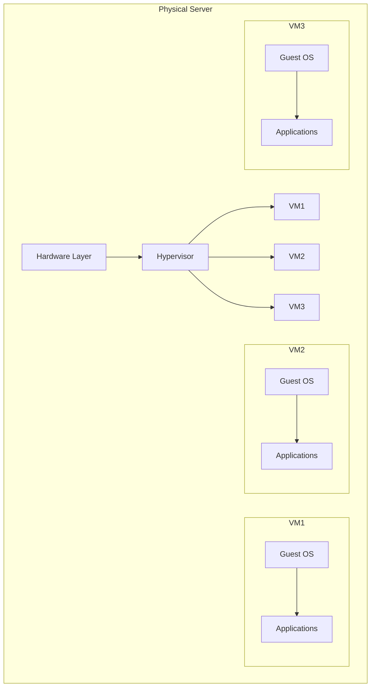

### Virtual Hardware Components

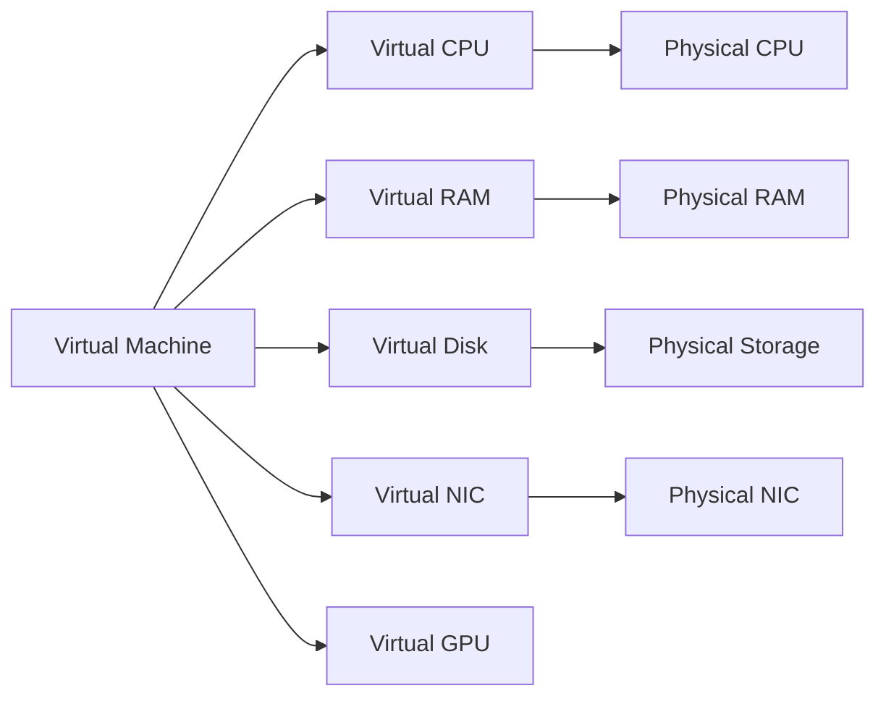

### Types of Virtual Disks

**VirtualBox Formats**:
- **VDI** (VirtualBox Disk Image): Native format
- **VMDK** (Virtual Machine Disk): VMware compatible
- **VHD** (Virtual Hard Disk): Microsoft Hyper-V compatible
- **VHDX**: Modern Hyper-V format

**Allocation Methods**:

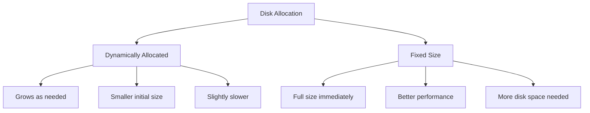

### VM States

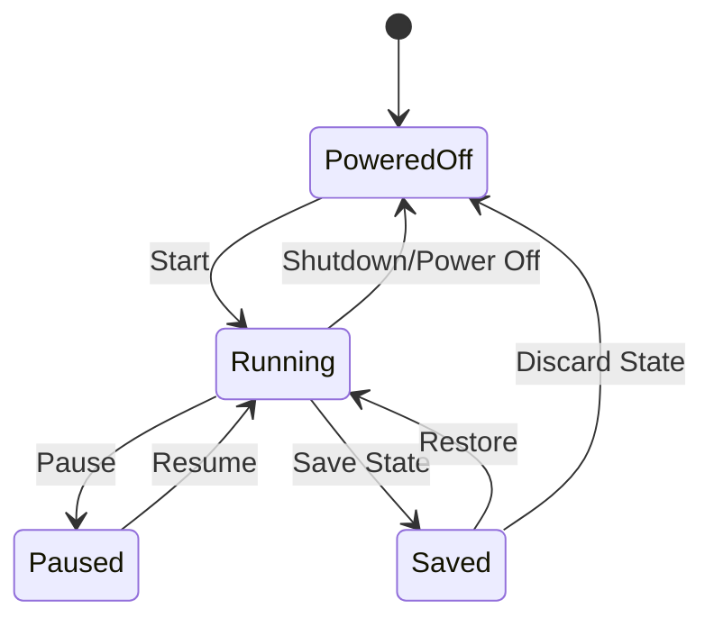

### Snapshots vs Clones

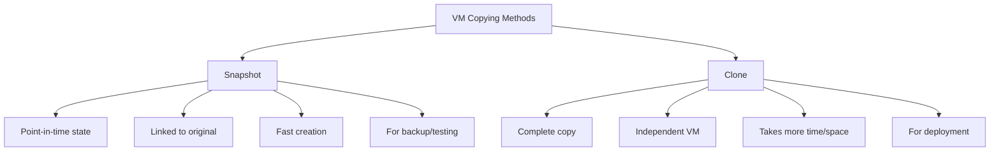

---

## Practical 1: Create Virtual Machines {#practical-1-create-vms}

### Objective
Create and configure multiple virtual machines with different configurations.

### Prerequisites
- Completed Unit 1
- VirtualBox or VMware installed
- Sufficient disk space (100GB+)
- System RAM (8GB+)

---

### Part A: Create Ubuntu Server VM

#### Windows/macOS - Using VirtualBox:

**Step 1**: Download Ubuntu Server ISO
1. Visit: `https://ubuntu.com/download/server`
2. Download latest LTS version (e.g., 22.04 LTS)
3. File size: ~1.5GB

**Step 2**: Create New Virtual Machine
1. Open VirtualBox Manager
2. Click "New" (or Machine > New)
3. Click "Expert Mode" for all options at once

**Step 3**: Configure VM Settings
```
Name: Ubuntu-Server
Folder: Default or choose location
Type: Linux
Version: Ubuntu (64-bit)
Memory: 2048 MB (2GB)
```

**Step 4**: Hard Disk
```
Create a virtual hard disk now
File location: Default
File size: 20 GB
Hard disk file type: VDI
Storage: Dynamically allocated
```

**Step 5**: Click "Create"

**Step 6**: Additional Settings
1. Select the VM
2. Click "Settings"

**Step 7**: System Settings
- Motherboard tab:
  - Boot Order: Optical, Hard Disk
  - Extended Features: Enable I/O APIC
- Processor tab:
  - Processors: 2 CPUs
  - Extended Features: Enable PAE/NX

**Step 8**: Storage Settings
1. Click "Storage"
2. Click "Empty" under Controller: IDE
3. Click disk icon (right side)
4. "Choose a disk file"
5. Select Ubuntu Server ISO
6. Click "OK"

**Step 9**: Network Settings
1. Click "Network"
2. Adapter 1: NAT (default)
3. Advanced: Allow All for Promiscuous Mode (if needed)
4. Click "OK"

**Step 10**: Start VM and Install Ubuntu
1. Select VM
2. Click "Start"
3. Follow Ubuntu installation:
   - Language: English
   - Keyboard: Your layout
   - Network: DHCP (default)
   - Proxy: Leave blank
   - Mirror: Default
   - Guided storage: Use entire disk
   - Storage configuration: Done
   - Profile setup:
     ```
     Your name: Your Name
     Server name: ubuntu-server
     Username: ubuntu
     Password: [strong password]
     ```
   - SSH Setup: Install OpenSSH server (check box)
   - Featured snaps: None needed for now
4. Wait for installation
5. Reboot when prompted
6. Remove installation media when prompted

---

### Part B: Create Windows Client VM

**Step 1**: Download Windows 10/11 ISO
1. Visit Microsoft website
2. Download Windows 10/11 Media Creation Tool
3. Or download evaluation ISO
4. File size: ~4-5GB

**Step 2**: Create VM in VirtualBox
```
Name: Windows10-Client
Type: Microsoft Windows
Version: Windows 10 (64-bit)
Memory: 4096 MB (4GB)
Hard Disk: Create virtual hard disk
```

**Step 3**: Hard Disk Configuration
```
File size: 50 GB
Type: VDI
Storage: Dynamically allocated
```

**Step 4**: System Settings
- Enable EFI (modern Windows requirement)
- Processors: 2 CPUs
- Video Memory: 128 MB
- Enable 3D Acceleration

**Step 5**: Attach Windows ISO
1. Settings > Storage
2. Empty (under IDE Controller)
3. Select Windows ISO

**Step 6**: Install Windows
1. Start VM
2. Follow Windows installation
3. Choose "Custom Install"
4. Select virtual disk
5. Wait for installation
6. Complete Windows setup (OOBE)

---

### Part C: Create CentOS/Rocky Linux VM

**Step 1**: Download ISO
- CentOS Stream: `https://www.centos.org/download/`
- Rocky Linux: `https://rockylinux.org/download`

**Step 2**: Create VM
```
Name: CentOS-Server
Type: Linux
Version: Red Hat (64-bit)
Memory: 2048 MB
Hard Disk: 25 GB, VDI, Dynamic
```

**Step 3**: Configure and Install
- Attach ISO
- Start VM
- Select "Install CentOS"/"Install Rocky Linux"
- Follow installation wizard
- Configure:
  - Installation Destination: Automatic
  - Network: Enable ethernet
  - Root password
  - Create user account

---

### Part D: VM Management Tasks

#### Taking Snapshots

**VirtualBox**:
```
1. Select VM (powered off or running)
2. Click "Snapshots" button (top right)
3. Click "Take" (camera icon)
4. Name: "Fresh Install"
5. Description: Add notes
6. Click "OK"
```

**Purpose**:
- Before major changes
- Before updates
- Before testing
- For recovery points

#### Restoring Snapshots

**VirtualBox**:
```
1. Snapshots view
2. Right-click snapshot
3. Select "Restore Snapshot"
4. Confirm
5. VM reverts to that state
```

#### Cloning VMs

**VirtualBox**:
```
1. Right-click VM
2. Select "Clone"
3. New machine name: "Ubuntu-Server-Clone"
4. Clone type:
   - Full clone (recommended)
   - Linked clone (saves space)
5. Snapshots:
   - Current machine state
   - Everything
6. Click "Clone"
```

#### Deleting VMs

**VirtualBox**:
```
1. Right-click VM
2. Select "Remove"
3. Options:
   - Remove only (keeps files)
   - Delete all files (complete removal)
4. Choose based on need
```

---

## Theory: Virtual Switches {#theory-virtual-switches}

### Virtual Network Architecture

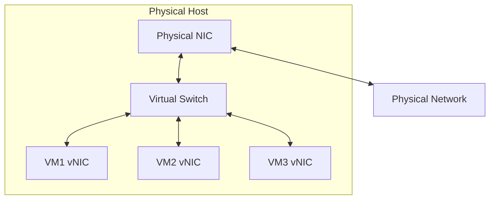

### VirtualBox Network Modes

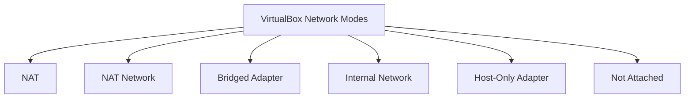

### 1. NAT (Network Address Translation)

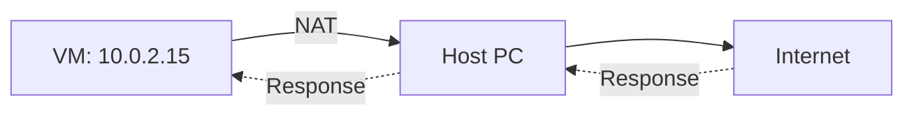

**Characteristics**:
- Default mode
- VM can access internet
- VM cannot be accessed from outside
- Each VM has separate NAT
- IP range: 10.0.2.0/24
- VM IP: Usually 10.0.2.15

**Use Cases**:
- Basic internet access
- Isolated testing
- Learning environments

### 2. NAT Network

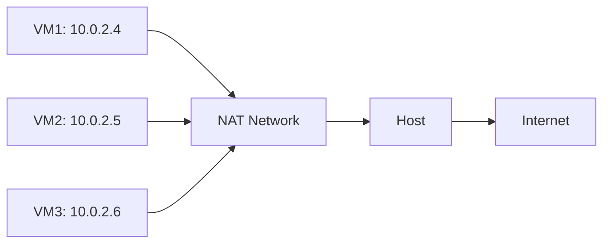

**Characteristics**:
- Multiple VMs share one NAT
- VMs can communicate with each other
- VMs can access internet
- Cannot be accessed from outside
- Must be created first

**Use Cases**:
- VM-to-VM communication
- Private network with internet
- Multi-tier applications

### 3. Bridged Adapter

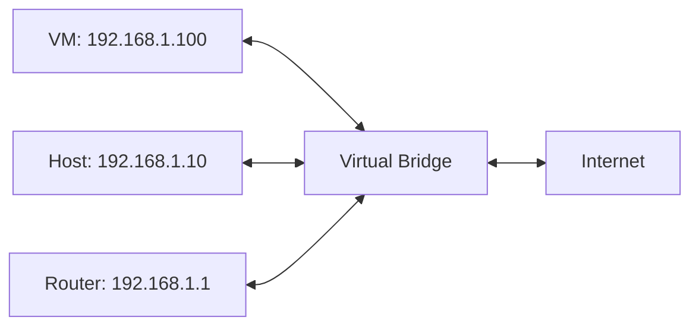

**Characteristics**:
- VM appears as a separate machine on the physical network
- Gets its own IP from the network's DHCP (e.g., router)
- Host and VM are peers on the same network
- VM is fully accessible from other network devices

**Use Cases**:
- Testing network applications
- Simulating real network scenarios
- Development and production testing

### 4. Internal Network

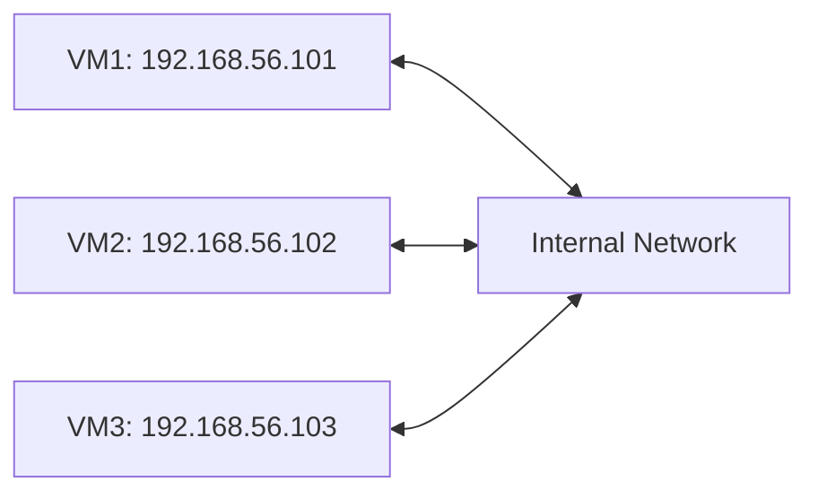

**Characteristics**:
- VMs can only talk to each other
- No connection to host or internet
- Completely isolated network
- You must manually assign IPs or set up DHCP among VMs

**Use Cases**:
- Isolated lab environments
- Security testing
- Network simulation without external access

### 5. Host-Only Adapter

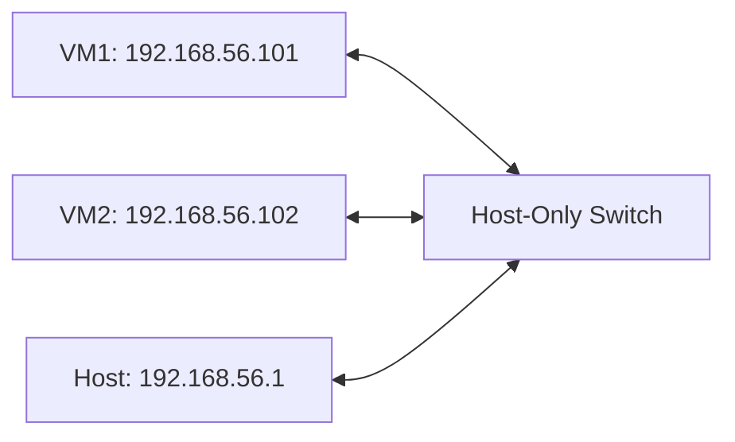

**Characteristics**:
- VMs can communicate with each other
- VMs can communicate with the host
- No internet access (unless combined with NAT)
- Host gets a virtual adapter (e.g., VirtualBox Host-Only Adapter)
- Default IP range: 192.168.56.0/24

**Use Cases**:
- SSH/RDP from host into VM
- Development and testing
- Combined with NAT for internet + host access

### Network Mode Comparison Table

| Mode | VM ↔ Internet | VM ↔ Host | VM ↔ VM | Use Case |
|------|:---:|:---:|:---:|----------|
| NAT | ✅ | ❌ | ❌ | Basic internet |
| NAT Network | ✅ | ❌ | ✅ | Multi-VM with internet |
| Bridged | ✅ | ✅ | ✅ | Real network simulation |
| Internal | ❌ | ❌ | ✅ | Isolated labs |
| Host-Only | ❌ | ✅ | ✅ | Host-VM communication |

### Virtual Switch Architecture

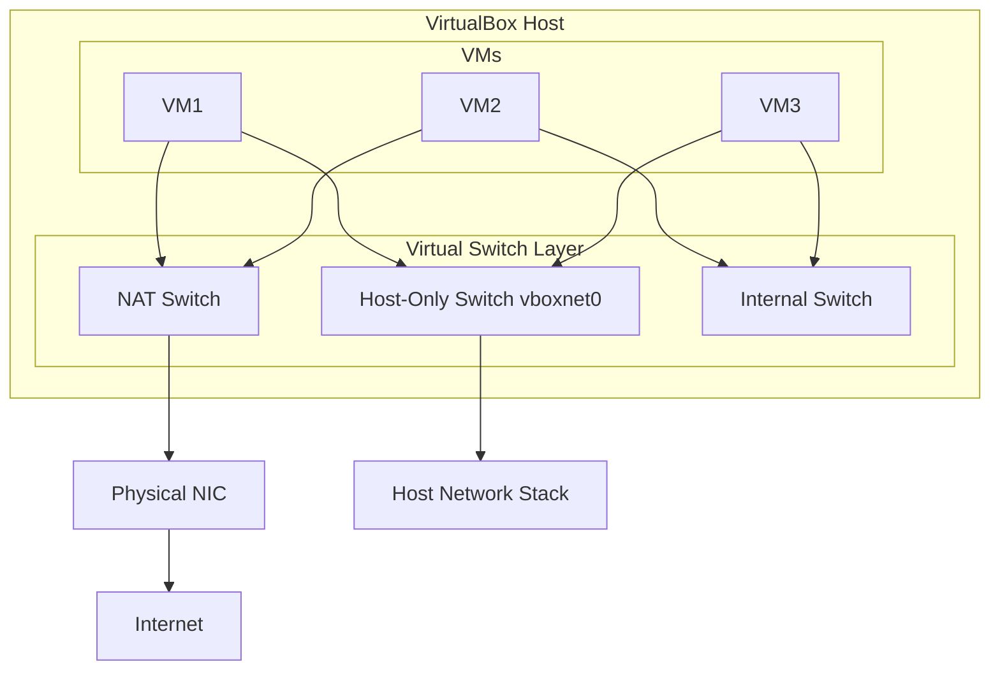

**Key Points**:
- Each VM can have up to 4 network adapters
- Each adapter can be connected to a different virtual switch
- Virtual switches are created automatically or manually
- Multiple VMs can share the same virtual switch

### Port Forwarding

Port forwarding allows access to VM services from the host when using NAT mode.

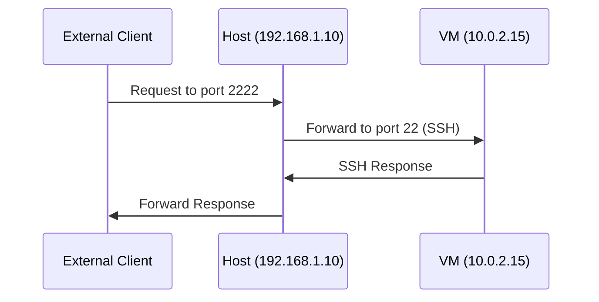

**Common Port Forwarding Rules**:

| Service | Host Port | Guest Port | Protocol |
|---------|-----------|------------|----------|
| SSH | 2222 | 22 | TCP |
| HTTP | 8080 | 80 | TCP |
| HTTPS | 8443 | 443 | TCP |
| RDP | 3389 | 3389 | TCP |

---

## Practical 2: Configure Virtual Switches {#practical-2-configure-switches}

### Objective
Create and configure different virtual network modes and test connectivity between VMs.

### Prerequisites
- VirtualBox installed (from Unit 1)
- At least 2 VMs created (from Practical 1)
- Windows Server 2022 VM
- Ubuntu Server VM

---

### Part A: Configure NAT Network (Shared)

#### Step 1: Create a NAT Network

**On Windows:**
1. Open VirtualBox Manager
2. Click **File** menu → **Preferences** (or **Tools** → **Preferences**)
3. Click **Networking** (left panel)
4. Click the **+** icon (Add NAT Network)
5. Configure:
   ```
   Name: LabNATNetwork
   Network CIDR: 10.0.2.0/24
   Enable DHCP: ☑ (checked)
   Enable Internet Connection: ☑ (checked)
   ```
6. Click **OK**

**On macOS:**
1. Open VirtualBox Manager
2. Click **File** → **Preferences**
3. Click **Networking**
4. Click **+** to add
5. Configure same as above
6. Click **OK**

#### Step 2: Assign NAT Network to VMs

**For Windows Server VM:**
1. Select Windows Server VM
2. Click **Settings**
3. Click **Network**
4. Adapter 1:
   - Enable Network Adapter: ☑
   - Attached to: **NAT Network**
   - Name: **LabNATNetwork**
5. Click **OK**

**For Ubuntu Server VM:**
1. Repeat same steps for Ubuntu VM
2. Attach to same **LabNATNetwork**

#### Step 3: Test NAT Network Connectivity

**On Windows Server VM:**
```powershell
# Check IP (should be 10.0.2.x)
ipconfig /all

# Ping Ubuntu VM
ping 10.0.2.x   # Replace with Ubuntu's IP

# Test internet
ping 8.8.8.8
```

**On Ubuntu Server VM:**
```bash
# Check IP
ip addr show

# Ping Windows Server
ping 10.0.2.x   # Replace with Windows Server IP

# Test internet
ping 8.8.8.8
```

---

### Part B: Configure Host-Only Adapter

#### Step 1: Create Host-Only Network

**On Windows:**
1. Open VirtualBox Manager
2. Click **File** → **Preferences** (or use **Tools** → **Network Manager**)
3. Click **Host-Only Networks** tab
4. Click **Create** (or **+** icon)
5. A new adapter is created (e.g., **vboxnet0**)
6. Configure:
   ```
   IPv4 Address: 192.168.56.1
   IPv4 Network Mask: 255.255.255.0
   ```
7. Click **DHCP Server** tab:
   ```
   Enable Server: ☑
   Server Address: 192.168.56.100
   Subnet Mask: 255.255.255.0
   Lower Bound: 192.168.56.101
   Upper Bound: 192.168.56.254
   ```
8. Click **Apply**

**On macOS:**
1. Open VirtualBox Manager
2. Go to **File** → **Preferences** → **Networking**
3. Click **Host-Only Networks** tab
4. Click **+** to create new
5. Configure same settings as above
6. Click **OK**

#### Step 2: Assign Host-Only Adapter to VMs

**For each VM:**
1. Select VM → **Settings** → **Network**
2. Go to **Adapter 2** tab
3. Enable Network Adapter: ☑
4. Attached to: **Host-Only Adapter**
5. Name: **vboxnet0** (or your created adapter)
6. Click **OK**

> **Note**: Keep Adapter 1 as NAT or NAT Network for internet access. Adapter 2 as Host-Only gives you a private network for host-VM communication.

#### Step 3: Verify Host-Only Network on Host

**On Windows Host:**
```powershell
# View VirtualBox adapter
ipconfig /all
# Look for "VirtualBox Host-Only Ethernet Adapter"
# Should show 192.168.56.1
```

**On macOS Host:**
```bash
# View VirtualBox adapter
ifconfig
# Look for vboxnet0
# Should show 192.168.56.1
```

#### Step 4: Test Host-Only Connectivity

**From Host to VM (Windows Host):**
```powershell
# Ping VM on Host-Only network
ping 192.168.56.101

# SSH into Ubuntu VM (if SSH installed)
ssh ubuntu@192.168.56.101
```

**From Host to VM (macOS Host):**
```bash
# Ping VM
ping 192.168.56.101

# SSH into Ubuntu VM
ssh ubuntu@192.168.56.101
```

**From VM to Host:**
```powershell
# On Windows Server VM
ping 192.168.56.1   # Host IP on Host-Only network
```

```bash
# On Ubuntu Server VM
ping 192.168.56.1
```

---

### Part C: Configure Bridged Adapter

#### Step 1: Assign Bridged Adapter

1. Select your VM → **Settings** → **Network**
2. Adapter 1:
   - Attached to: **Bridged Adapter**
   - Name: Select your **physical** network adapter
     - Windows: e.g., "Intel(R) Wi-Fi 6..." or "Realtek PCIe..."
     - macOS: e.g., "en0" (Wi-Fi) or "en1" (Ethernet)
3. Click **OK**

#### Step 2: Start VM and Check IP

**On Windows Server VM:**
```powershell
ipconfig /all
# Should get IP from your home/office network
# e.g., 192.168.1.xxx (same subnet as host)
```

**On Ubuntu Server VM:**
```bash
ip addr show
# Should show IP in same range as host network
```

#### Step 3: Test Bridged Connectivity

```powershell
# From host - ping VM (using its new IP)
ping 192.168.1.xxx

# From VM - ping host
ping 192.168.1.10   # Your host IP

# From VM - ping router
ping 192.168.1.1

# Test internet
ping google.com
```

> **Important**: Bridged mode exposes the VM to the network. Use only in trusted environments (home/lab networks).

---

### Part D: Configure Internal Network

#### Step 1: Set Up Internal Network

1. Select VM → **Settings** → **Network**
2. Adapter 1 (or Adapter 2):
   - Attached to: **Internal Network**
   - Name: `LabInternal`
     - (Type a name — VirtualBox creates the network automatically)
3. Click **OK**
4. Repeat for all VMs that should be on this internal network

#### Step 2: Manually Assign IPs (No DHCP in Internal Mode)

**On Windows Server VM:**
```powershell
# Configure static IP on the internal adapter
New-NetIPAddress -InterfaceAlias "Ethernet 2" -IPAddress 10.10.10.1 -PrefixLength 24
```

Or via GUI:
1. Open Network Connections
2. Find the adapter connected to Internal Network
3. Assign static IP: `10.10.10.1/24`

**On Ubuntu Server VM:**
```bash
# Edit netplan config
sudo nano /etc/netplan/00-installer-config.yaml

# Add:
# network:
#   version: 2
#   ethernets:
#     enp0s8:
#       addresses: [10.10.10.2/24]

sudo netplan apply
```

#### Step 3: Test Internal Network

```powershell
# From Windows Server
ping 10.10.10.2   # Ubuntu's IP

# From Ubuntu
ping 10.10.10.1   # Windows Server's IP

# Internet should NOT work
ping 8.8.8.8      # Should fail (timeout)
```

---

### Part E: Configure Port Forwarding (NAT Mode)

#### Step 1: Open Port Forwarding Rules

1. Select VM → **Settings** → **Network**
2. Adapter 1 set to **NAT**
3. Click **Advanced** (expand)
4. Click **Port Forwarding** button

#### Step 2: Add SSH Port Forward

1. Click **+** (Add Rule)
2. Configure:
   ```
   Name: SSH
   Protocol: TCP
   Host IP: 127.0.0.1
   Host Port: 2222
   Guest IP: 10.0.2.15
   Guest Port: 22
   ```
3. Click **OK**

#### Step 3: Add HTTP Port Forward

1. Click **+** again
2. Configure:
   ```
   Name: HTTP
   Protocol: TCP
   Host IP: 127.0.0.1
   Host Port: 8080
   Guest IP: 10.0.2.15
   Guest Port: 80
   ```
3. Click **OK**

#### Step 4: Test Port Forwarding

**SSH into Ubuntu VM (from host):**

*Windows Host:*
```powershell
# Using PowerShell/Terminal
ssh ubuntu@127.0.0.1 -p 2222
```

*macOS Host:*
```bash
ssh ubuntu@127.0.0.1 -p 2222
```

**Test HTTP (if web server running):**
- Open browser on host
- Navigate to: `http://127.0.0.1:8080`

#### Using PowerShell to Add Port Forwarding Rules:
```powershell
# Add SSH rule via command (VBoxManage)
VBoxManage modifyvm "Ubuntu-Server" --natpf1 "SSH,tcp,127.0.0.1,2222,,22"

# Add HTTP rule
VBoxManage modifyvm "Ubuntu-Server" --natpf1 "HTTP,tcp,127.0.0.1,8080,,80"

# List all rules
VBoxManage showvminfo "Ubuntu-Server" | grep -i "NATPortForwarding"
```

---

## Practical 3: Advanced VM Configuration {#practical-3-advanced-vm-config}

### Objective
Configure advanced VM settings including multi-adapter setups, resource allocation, and shared folders.

### Prerequisites
- VirtualBox installed
- At least one VM created and running
- Windows Server 2022 VM

---

### Part A: Multi-Adapter Network Setup

This is a common real-world configuration: one adapter for internet, one for internal communication.

#### Configuration Plan

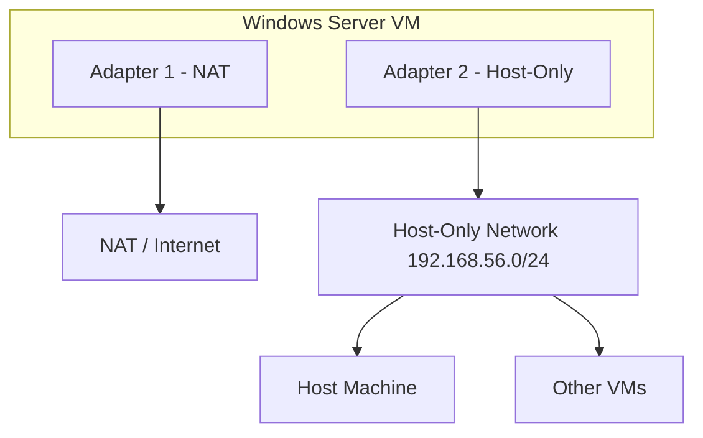

#### Step 1: Configure Adapter 1 (Internet)
1. VM Settings → Network → Adapter 1
2. Attached to: **NAT**
3. Click **OK**

#### Step 2: Configure Adapter 2 (Private)
1. VM Settings → Network → Adapter 2
2. Enable Network Adapter: ☑
3. Attached to: **Host-Only Adapter**
4. Name: **vboxnet0**
5. Click **OK**

#### Step 3: Verify Inside VM

**Windows Server:**
```powershell
# Should show two adapters
ipconfig /all

# Adapter 1 (NAT): 10.0.2.15 — internet
# Adapter 2 (Host-Only): 192.168.56.xxx — private
```

**Ubuntu Server:**
```bash
ip addr show
# eth0 or enp0s3: NAT IP (10.0.2.x)
# eth1 or enp0s8: Host-Only IP (192.168.56.x)
```

---

### Part B: Adjust VM Resource Allocation

#### CPU Allocation

1. VM Settings → **System** → **Processor** tab
2. Set CPUs: 1–4 (do not exceed green zone)
3. Enable PAE/NX: ☑
4. Click **OK**

> **Rule**: Do not allocate more CPUs than the number of physical cores on your host. Stay in the green zone of the slider.

#### RAM Allocation

1. VM Settings → **System** → **Motherboard** tab
2. Adjust Memory slider
3. Recommended:
   - Windows Server: 2048–4096 MB
   - Ubuntu/Linux Server: 1024–2048 MB
   - Windows Client: 4096 MB

> **Rule**: Do not allocate more than 50% of host RAM across all VMs combined. Stay in the green zone.

#### Video Memory & Display

1. VM Settings → **Display** → **Screen** tab
2. Video Memory: 64–128 MB
3. Enable 3D Acceleration: ☑ (if needed for graphics)
4. Monitor Count: 1 (default)

---

### Part C: Configure Shared Folders

Shared folders allow file transfer between host and VM without network setup.

#### Step 1: Set Up Shared Folder (VirtualBox)

1. Select VM → **Settings** → **Shared Folders**
2. Click **+** (Add)
3. Configure:
   ```
   Folder Path: Browse to folder on host
     (e.g., C:\Users\YourName\SharedVM on Windows)
     (e.g., /Users/YourName/SharedVM on macOS)
   Folder Name: SharedData
   Read Only: ☐ (unchecked for read-write)
   Auto-mount: ☑ (checked)
   Mount point: /media/sf_SharedData (Linux)
   ```
4. Click **OK**

#### Step 2: Access Shared Folder on Windows Server VM

1. Start the VM
2. Install VirtualBox Guest Additions (if not already):
   - Devices menu → Insert Guest Additions CD image
   - Run the installer inside VM
   - Restart VM
3. Open File Explorer
4. Navigate to: **This PC**
5. You'll see: **\\?\sf_SharedData**
   - Or open Network → \\vboxsvr\SharedData

#### Step 3: Access Shared Folder on Ubuntu/Linux VM

```bash
# The folder auto-mounts at /media/sf_SharedData
ls /media/sf_SharedData

# If permission denied, add user to vboxsf group
sudo usermod -aG vboxsf ubuntu

# Log out and back in, then try again
ls /media/sf_SharedData
```

#### Step 4: Test File Transfer

**From Host → VM:**
1. On host, create a test file in SharedData folder
2. Inside VM, navigate to shared folder
3. Verify the file appears

**From VM → Host:**
1. Inside VM, copy a file to the shared folder
2. On host, check SharedData folder
3. Verify the file appears

---

### Part D: Install and Configure Guest Additions

Guest Additions improves VM performance and integration.

#### Step 1: Install Guest Additions

**On Windows Server VM:**
1. Start the VM
2. In VirtualBox menu bar: **Devices** → **Insert Guest Additions CD image...**
3. Windows may auto-run the installer
4. If not: Open File Explorer → This PC → VirtualBox Guest Additions CD Drive
5. Run: `VBoxWindowsAdditions.exe`
6. Follow the installer
7. Restart VM when prompted

**On Ubuntu/Linux VM:**
```bash
# Update system first
sudo apt update && sudo apt upgrade -y

# Install required packages
sudo apt install -y build-essential dkms linux-headers-$(uname -r)

# Mount Guest Additions CD
# (Devices → Insert Guest Additions CD image in VirtualBox menu)

# Mount and run
sudo mkdir /mnt/cdrom
sudo mount /dev/sr0 /mnt/cdrom
sudo /mnt/cdrom/VBoxLinuxAdditions.run

# Restart
sudo reboot
```

#### Step 2: Verify Guest Additions

**Benefits after installation:**
- Automatic screen resizing
- Shared clipboard (copy-paste between host and VM)
- Shared folders work properly
- Better mouse integration
- Improved video performance
- Time synchronization

**Verify on Windows:**
```powershell
# Check VirtualBox services
Get-Service | Where-Object {$_.Name -like "*VBox*"}
```

**Verify on Linux:**
```bash
# Check kernel modules
lsmod | grep vbox
# Should see: vboxguest, vboxsf, vboxvideo
```

---

### Part E: VM Performance Tuning

#### Enable Hardware Virtualization (Host BIOS)

Before anything else, ensure virtualization is enabled in your host BIOS/UEFI:

**On Windows Host:**
```powershell
# Check if virtualization is enabled
systeminfo | findstr "Hyper-V"
# Or check Task Manager → Performance → CPU → Virtualization: Enabled
```

**Steps:**
1. Restart computer
2. Enter BIOS/UEFI (usually **F2**, **F10**, **Del**, or **Esc** at boot)
3. Find: **Intel Virtualization Technology** or **AMD-V** (SVM)
4. Enable it
5. Save and Exit

#### VirtualBox Performance Tips

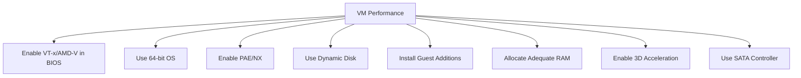

---

## Troubleshooting Scenarios

### Scenario 1: VMs Cannot Communicate

**Symptoms**: Ping between VMs fails

**Diagnostic Steps:**
```powershell
# On each VM, check IP
ipconfig /all          # Windows
ip addr show           # Linux

# Verify both are on same network/switch
# Check network mode in VirtualBox settings

# Try pinging
ping <other-vm-ip>
```

**Checklist:**
- Are both VMs on the same virtual switch/network?
- Are IPs in the same subnet?
- Is the firewall blocking ICMP?
- Is the network adapter enabled inside the VM?

**Solutions:**
- Switch both VMs to the same NAT Network or Host-Only network
- Disable Windows Defender firewall temporarily for testing
- Verify subnet masks match

### Scenario 2: VM Has No Internet Access

**Symptoms**: Cannot ping 8.8.8.8 or access websites

**Diagnostic Steps:**
```powershell
# Check adapter mode
# In VirtualBox: Settings > Network > check "Attached to"

# Inside VM:
ipconfig /all          # Check if IP was assigned
ping 127.0.0.1         # Test TCP/IP stack
ping <gateway>         # Test local connectivity
ping 8.8.8.8           # Test internet
```

**Checklist:**
- Is adapter set to NAT or Bridged (not Internal or Host-Only)?
- Did VM get an IP address?
- Is VirtualBox network service running on host?

**Solutions:**
- Change adapter to NAT mode
- Restart VirtualBox Host Network service
- Release and renew IP inside VM

### Scenario 3: Cannot SSH into VM from Host

**Symptoms**: SSH connection refused or timeout

**Checklist:**
- Is SSH service running inside VM?
  ```bash
  sudo systemctl status sshd    # Linux
  ```
- Is the VM on Host-Only or Bridged network?
- Is port forwarding configured (if using NAT)?
- Is firewall blocking port 22?

**Solutions:**
```bash
# Start SSH service
sudo systemctl start sshd
sudo systemctl enable sshd

# Open firewall for SSH
sudo ufw allow ssh          # Ubuntu
sudo firewall-cmd --add-service=ssh --permanent  # CentOS/Rocky
```

### Scenario 4: Shared Folder Not Mounting

**Symptoms**: Shared folder not visible in VM

**Checklist:**
- Are Guest Additions installed and up to date?
- Is the shared folder path correct on host?
- Does the folder exist on host?
- Is the user in the vboxsf group (Linux)?

**Solutions:**
```bash
# Re-install Guest Additions
# Add user to group
sudo usermod -aG vboxsf <username>

# Manual mount (Linux)
sudo mount -t vboxsf SharedData /mnt/shared
```

---

## Review Questions

### Conceptual Questions

1. Explain the difference between NAT and NAT Network modes in VirtualBox. When would you use each?

2. What is the purpose of a Host-Only adapter? How does it differ from Bridged mode?

3. Describe the differences between a Full Clone and a Linked Clone. What are the advantages and disadvantages of each?

4. Why is it important to enable hardware virtualization (VT-x/AMD-V) in the host BIOS?

5. What is the purpose of VirtualBox Guest Additions? Name four features it provides.

6. Explain how port forwarding works in NAT mode. Why is it necessary?

7. What is the difference between a dynamically allocated disk and a fixed-size disk?

8. In what scenario would you use an Internal Network instead of Host-Only?

9. Why should you take snapshots before making major changes to a VM?

10. Explain the role of a virtual NIC and how it connects to a virtual switch.

### Practical Questions

1. You have three VMs that need to communicate with each other and access the internet, but should not be accessible from outside. Which network mode should you use?

2. A student wants to SSH into their Ubuntu VM from their laptop. The VM is set to NAT mode. What steps are needed?

3. You need to transfer files between your host machine and a Linux VM without using the network. What feature should you use and how do you set it up?

4. Your VM is running slowly. List five things you can check or change to improve performance.

5. Two VMs on Host-Only network cannot ping each other. What are the possible causes and solutions?

6. Configure a VM with two adapters: one for internet access and one for private communication with other VMs. Which modes should each adapter use?

7. What happens if you allocate more RAM to VMs than your host has available? How do you avoid this?

8. Explain why a VM connected to Internal Network cannot access the internet, even if the host can.

---

## Lab Exercises

### Exercise 1: Multi-VM Network Setup
**Time: 2 hours**

Tasks:
1. Create two VMs: Windows Server and Ubuntu Server
2. Configure both on a NAT Network called "LabNetwork"
3. Verify VM-to-VM communication (ping)
4. Verify internet access from both VMs
5. Take snapshots of both VMs
6. Document all IP addresses and configurations

### Exercise 2: Host-Only Network Lab
**Time: 1.5 hours**

Tasks:
1. Create a Host-Only network (192.168.56.0/24)
2. Add Host-Only adapter (Adapter 2) to both VMs
3. SSH into Ubuntu VM from the host machine
4. Transfer a file using shared folders
5. Test connectivity: Host ↔ VM1 ↔ VM2
6. Document the network topology

### Exercise 3: Network Isolation Testing
**Time: 1.5 hours**

Tasks:
1. Create an Internal Network called "IsolatedLab"
2. Connect two VMs to the Internal Network
3. Manually assign static IPs to both VMs
4. Verify VMs can communicate
5. Verify neither VM can access the internet
6. Document results and explain why internet is unavailable

### Exercise 4: Port Forwarding and Access
**Time: 1.5 hours**

Tasks:
1. Set Ubuntu VM to NAT mode
2. Install and start a web server (nginx) on Ubuntu
3. Configure port forwarding: Host 8080 → Guest 80
4. Access the web page from the host browser
5. Configure SSH port forwarding
6. SSH into the VM from host
7. Document all port forwarding rules

---

## Key Takeaways

1. ✅ NAT mode gives internet access but isolates VMs from the host and each other
2. ✅ NAT Network allows VMs to communicate with each other while sharing internet
3. ✅ Bridged mode makes the VM a peer on the physical network
4. ✅ Host-Only mode creates a private network between host and VMs
5. ✅ Internal Network provides complete isolation between VMs only
6. ✅ Port forwarding is essential for accessing NAT-mode VM services
7. ✅ Multi-adapter setups combine network modes for flexibility
8. ✅ Guest Additions significantly improve VM performance and integration
9. ✅ Snapshots provide safe recovery points before changes
10. ✅ Always enable hardware virtualization in BIOS for best performance

---

## Next Unit Preview

In **Unit 4: Performing Basic Server Configuration**, we will cover:
- Configuring local server properties
- Configuring server roles
- Setting up IP addressing service roles
- Windows Server Manager administration

---

*End of Unit 3*
