# Unit 4: Performing Basic Server Configuration

## Learning Objectives

After completing this unit, you will be able to:
- Configure local server properties in Windows Server 2022
- Install and configure server roles and features
- Set up IP addressing service roles (DHCP and DNS integration)
- Use Server Manager effectively for administration
- Monitor and manage basic server health
- Troubleshoot common server configuration issues

---

## Table of Contents
1. [Theory: Server Manager Overview](#theory-server-manager)
2. [Practical 1: Configure Local Server Properties](#practical-1-local-server)
3. [Theory: Server Roles and Features](#theory-server-roles)
4. [Practical 2: Install and Configure Server Roles](#practical-2-server-roles)
5. [Theory: IP Addressing Service Roles](#theory-ip-service-roles)
6. [Practical 3: Set Up IP Addressing Service Roles](#practical-3-ip-service-roles)
7. [Practical 4: Server Monitoring and Management](#practical-4-monitoring)
8. [Review Questions](#review-questions)

---

## Theory: Server Manager Overview {#theory-server-manager}

### What is Server Manager?

Server Manager is the primary built-in administration tool in Windows Server. It provides a centralized dashboard for managing the local server and remote servers from a single interface.

### Server Manager Architecture


### Server Manager Dashboard Layout


### Key Server Manager Features

- **Dashboard**: Real-time overview of server health
- **Local Server**: Quick access to all local server properties
- **Manage Menu**: Install/remove roles and features
- **Tools Menu**: Access to administrative consoles (MMC snap-ins)
- **Event Viewer Integration**: View critical events directly
- **BPA (Best Practices Analyzer)**: Scans for configuration issues
- **Windows Update**: Manage updates from within Server Manager

---

## Practical 1: Configure Local Server Properties {#practical-1-local-server}

### Objective
Configure essential local server properties including computer name, time zone, workgroup/domain, Windows Update, and other basic settings.

### Prerequisites
- Windows Server 2022 VM (from Unit 1)
- Administrative access
- VirtualBox Guest Additions installed

---

### Part A: Access Local Server Properties

**Step 1**: Open Server Manager
1. Click the **Server Manager** icon in the taskbar
2. Or click **Start** → type `servermanager` → press Enter
3. Server Manager opens to the Dashboard

**Step 2**: Navigate to Local Server
1. Click **Local Server** in the left pane
2. You will see all server properties displayed
3. Each property value is a clickable link

**Step 3**: Review Current Properties
- Note the following current values:
  - Computer Name
  - Workgroup
  - IP Address(es)
  - Internet Connection
  - Windows Update
  - Windows Defender
  - Time Zone
  - Last Updated

---

### Part B: Change Computer Name

The computer name identifies your server on the network. Choose a meaningful name.

**Step 1**: Click on Computer Name
1. In Local Server view
2. Click the current computer name (e.g., "WIN-ABC123DEF")
3. System Properties dialog opens

**Step 2**: Change Name
1. Click **Change...** button
2. Under "Computer name":
   - Clear the current name
   - Type new name: `WINSERVER2022`
3. Under "Member of":
   - Keep **Workgroup** selected (for now)
   - Workgroup: `WORKGROUP`
4. Click **OK**

**Step 3**: Restart
1. A dialog says: "Changing the computer name requires a restart"
2. Click **OK**
3. Click **OK** on System Properties
4. Click **Restart Now** (or restart later)

#### Using PowerShell:
```powershell
# View current name
Hostname

# Change computer name (requires restart)
Rename-Computer -NewName "WINSERVER2022" -Restart
```

---

### Part C: Configure Time Zone

Correct time is critical for authentication, logging, and certificate validation.

**Step 1**: Click on Time Zone
1. In Local Server, click the current time zone value
2. Date and Time dialog opens

**Step 2**: Change Time Zone
1. Click **Change time zone...** button
2. Select your time zone from the dropdown
   - Example: **(UTC+05:30) Chennai, Kolkata, Mumbai, New Delhi**
3. Click **OK**

**Step 3**: Synchronize Time
1. Click **Internet Time** tab
2. Click **Change settings...**
3. Check: **Automatically synchronize Internet time**
4. Server: `time.windows.com`
5. Click **Update Now**
6. Click **OK**

#### Using PowerShell:
```powershell
# View current time zone
Get-TimeZone

# List all available time zones
Get-TimeZone -ListAvailable

# Set time zone (example: India Standard Time)
Set-TimeZone -Id "India Standard Time"

# Force time sync
w32tm /resync /force
```

---

### Part D: Configure Windows Update

**Step 1**: Click on Windows Update
1. In Local Server, click the Windows Update link
2. Windows Update settings open

**Step 2**: Check for Updates
1. Click **Check for updates**
2. Wait for the scan to complete
3. Install any available updates

**Step 3**: Configure Update Settings
1. Click **Advanced options**
2. **Delivery Optimization**: Allow downloads from other PCs (optional)
3. Click **Back**

> **Note for Lab**: In a VM without internet, updates will not download. This is normal — focus on understanding the interface.

#### Using PowerShell:
```powershell
# Check for updates (requires PSWindowsUpdate module or built-in)
# Using built-in Windows Update cmdlets:
Import-Module WindowsUpdate -ErrorAction SilentlyContinue

# Check update status via command
sfc /scannow   # System File Checker (related maintenance)
```

---

### Part E: Configure Windows Defender

**Step 1**: Click on Windows Defender
1. In Local Server, click Windows Defender link
2. Windows Security opens

**Step 2**: Review Virus & Threat Protection
1. Click **Virus & threat protection**
2. Review current protection status
3. Check: **Protection updates** — ensure definitions are current

**Step 3**: Review Firewall Settings
1. Click **Firewall & network protection**
2. View: Domain network, Private network, Public network
3. Each shows firewall status (On/Off)

**Step 4**: Quick Scan
1. Go back to **Virus & threat protection**
2. Click **Quick scan** under Scan options
3. Wait for scan to complete

---

### Part F: Configure Remote Management (WinRM)

Remote management allows administrators to manage the server remotely using PowerShell and other tools.

**Step 1**: Enable Windows Remote Management
1. In Local Server, find **Remote Management**
2. Click the current value (Enabled/Disabled)
3. If disabled, click **Enable**

**Step 2**: Verify via PowerShell
```powershell
# Check WinRM status
Get-Service WinRM

# Enable WinRM (if not already)
Enable-PSRemoting -Force

# Test remote connectivity to self
Enter-PSSession -ComputerName localhost
# Type: exit
```

---

### Part G: Configure NIC Teaming (Overview)

NIC Teaming combines multiple network adapters for redundancy or increased bandwidth.

**Step 1**: Access NIC Teaming
1. In Local Server, click **NIC Teaming**
2. NIC Teaming dialog opens

**Step 2**: View Current Configuration
- **Adapters**: List of available NICs
- **Teams**: Currently configured teams (none initially)

> **Note**: NIC Teaming requires at least 2 physical/virtual NICs. We will configure this if your VM has multiple adapters. Otherwise, review the interface only.

---

## Theory: Server Roles and Features {#theory-server-roles}

### What Are Server Roles?

A **server role** is a set of related services that perform a specific function on a network. Roles are the primary workload components of Windows Server.


### Roles vs Features


| | Server Roles | Features |
|---|---|---|
| **Purpose** | Primary network services | Supporting/supplementary |
| **Examples** | DNS, DHCP, IIS, AD DS, Hyper-V | PowerShell, Backup, .NET Framework |
| **Dependency** | May require features | May be required by roles |
| **Visibility** | Server Manager > Roles | Server Manager > Features |

### Common Server Roles


### Role Installation Workflow

```mermaid
flowchart TD
    A[Start] --> B[Open Server Manager]
    B --> C[Manage → Add Roles & Features]
    C --> D[Select Installation Type]
    D --> E{Role-based or App-based?}
    E -->|Role-based| F[Select Server]
    E -->|App-based| G[Select Virtual Machine]
    F --> H[Select Roles]
    H --> I[Add Required Features]
    I --> J[Review & Install]
    J --> K[Installation Complete]
    K --> L{Post-Install Config?}
    L -->|Yes| M[Complete Configuration]
    L -->|No| N[Done]
```



### Role Dependencies

Some roles automatically pull in required features when installed:


---

## Practical 2: Install and Configure Server Roles {#practical-2-server-roles}

### Objective
Install multiple server roles, understand role dependencies, and configure basic role settings.

### Prerequisites
- Windows Server 2022 VM
- Administrative access
- Network configured (from Unit 2)

---

### Part A: Install Web Server (IIS) Role

#### Using Server Manager (GUI):

**Step 1**: Open Add Roles and Features Wizard
1. Server Manager → **Manage** → **Add Roles and Features**
2. Click **Next** at "Before You Begin"

**Step 2**: Installation Type
1. Select: **Role-based or feature-based installation**
2. Click **Next**

**Step 3**: Server Selection
1. Select: **A server from the server pool**
2. Select your server (WINSERVER2022)
3. Click **Next**

**Step 4**: Select Server Roles
1. Check: **Web Server (IIS)**
2. A dialog may appear: "Add features required for Web Server (IIS)?"
3. Click **Add Features**
4. Click **Next**

**Step 5**: Features
1. Keep defaults (PowerShell etc. already installed)
2. Click **Next**

**Step 6**: Web Server (IIS) — Overview
1. Read the information about IIS
2. Click **Next**

**Step 7**: Role Services
1. Review default role services selected:
   - Common HTTP Features (Default Document, HTTP Errors, Static Content)
   - Health and Diagnostics (HTTP Logging)
   - Performance (Dynamic Response Compression)
   - Security (Request Filtering)
   - Management Tools (IIS Management Console)
2. Click **Next**

**Step 8**: Confirmation
1. Review all selections
2. Check: **Restart if required** (optional)
3. Click **Install**

**Step 9**: Installation Complete
1. Wait for installation to finish
2. Click **Close**
3. Verify: IIS tile now appears in Server Manager Dashboard

#### Using PowerShell:
```powershell
# Install Web Server (IIS) with management tools
Install-WindowsFeature -Name Web-Server -IncludeManagementTools

# Install specific IIS role services
Install-WindowsFeature -Name Web-Asp-Net45, Web-Http-Logging, Web-Scripting-Tools

# Verify installation
Get-WindowsFeature -Name Web-*
```

---

### Part B: Install File and Storage Services Role

**Step 1**: Add Roles and Features
1. Server Manager → Manage → Add Roles and Features
2. Next → Role-based → Select server → Next

**Step 2**: Select Role
1. Check: **File and Storage Services**
2. Expand to see sub-roles:
   - ☑ **File Server** (select this)
   - ☐ iSCSI Target Server
   - ☐ Work Folder
3. Click **Next**

**Step 3**: Install
1. Review and click **Install**
2. Wait for completion
3. Click **Close**

#### Using PowerShell:
```powershell
# Install File Server role
Install-WindowsFeature -Name FileServer -IncludeManagementTools

# Verify
Get-WindowsFeature -Name FileServer
```

---

### Part C: Install Remote Access Role

**Step 1**: Add Role
1. Server Manager → Manage → Add Roles and Features
2. Select: **Remote Access**
3. Sub-roles available:
   - ☑ **DirectAccess and VPN (RAS)** — select this
   - ☐ Routing
   - ☐ Web Application Proxy
4. Click **Next** through the wizard

**Step 2**: Install and Complete
1. Click **Install**
2. After installation, click the **flag icon** in Server Manager
3. Click: **Open the getting started wizard**
4. Review the Remote Access setup options

#### Using PowerShell:
```powershell
# Install Remote Access (DirectAccess and VPN)
Install-WindowsFeature -Name RemoteAccess -IncludeManagementTools

# Verify
Get-WindowsFeature -Name RemoteAccess
```

---

### Part D: View and Manage Installed Roles

**Step 1**: View All Installed Roles
1. Server Manager → Click **Roles** in left pane
2. You'll see tiles for each installed role:
   - Web Server (IIS)
   - File and Storage Services
   - Remote Access

**Step 2**: Access Role-Specific Tools
1. Each role tile has links to:
   - **Events**: View role-specific events
   - **Services**: Manage role services
   - **Performance**: Monitor role performance
   - **Tools**: Role management console

**Step 3**: Remove a Role (Demo — optional)
1. Server Manager → Manage → **Remove Roles and Features**
2. Select server → Next
3. Uncheck the role to remove
4. Follow the wizard
5. Click **Remove**

#### Using PowerShell:
```powershell
# List all installed roles
Get-WindowsFeature | Where-Object {$_.InstallState -eq "Installed"} | Select-Object Name, DisplayName

# List only roles (not features)
Get-WindowsFeature | Where-Object {$_.InstallState -eq "Installed" -and $_.FeatureType -eq "Role"}

# Remove a role (example: remove IIS)
Uninstall-WindowsFeature -Name Web-Server
```

---

### Part E: Run Best Practices Analyzer (BPA)

BPA scans installed roles and identifies configuration issues.

**Step 1**: Run BPA
1. In Server Manager, click on a role tile (e.g., **Web Server**)
2. Click **BPA** tile
3. Click **Run BPA**

**Step 2**: Review Results
1. BPA categorizes findings:
   - 🔴 **Errors**: Critical issues to fix
   - 🟡 **Warnings**: Potential issues
   - 🔵 **Information**: Advisory notes
2. Click each result for details and recommended actions

**Step 3**: Resolve Issues
- Follow the recommended actions for each finding
- Re-run BPA after making changes

---

## Theory: IP Addressing Service Roles {#theory-ip-service-roles}

### Overview of IP Addressing Services

IP addressing service roles provide automatic and centralized management of IP addresses and name resolution on the network. The two primary services are **DHCP** and **DNS** — both covered in Unit 2's theory. This unit focuses on **integrating** these roles on the same server and configuring them to work together seamlessly.

### DHCP-DNS Integration

In many server environments, DHCP and DNS run on the same server. When a client gets an IP via DHCP, the DHCP server can **automatically update DNS** with the new hostname-to-IP mapping. This is called **Dynamic DNS (DDNS)**.


### Service Role Architecture


### IP Addressing Planning

Before configuring, plan your IP addressing scheme:


**Recommended IP Address Layout:**

| Range | Purpose |
|-------|---------|
| .1 | Default Gateway (Router) |
| .2-.10 | Servers (DHCP, DNS, Web, File) |
| .11-.30 | Reserved (Printers, AP, other devices) |
| .31-.99 | Excluded from DHCP (manual devices) |
| .100-.200 | DHCP Pool (client computers) |
| .201-.254 | Reserved/Future expansion |
| .0 | Network Address |
| .255 | Broadcast Address |

### Service Level Considerations


---

## Practical 3: Set Up IP Addressing Service Roles {#practical-3-ip-service-roles}

### Objective
Install DHCP and DNS roles on the same server, configure them to work together with Dynamic DNS updates, and verify the integrated setup.

### Prerequisites
- Windows Server 2022 VM with static IP configured
- Static IP: `192.168.1.10/24`
- Default Gateway: `192.168.1.1`
- Administrative access

> **Note**: DHCP and DNS roles were individually installed and configured in Unit 2. This practical focuses on installing both roles together on a fresh or existing server and configuring **Dynamic DNS integration**.

---

### Part A: Verify Prerequisites and Static IP

**Step 1**: Confirm Static IP
```powershell
# Verify current IP configuration
Get-NetIPAddress -InterfaceAlias "Ethernet" | Where-Object {$_.AddressFamily -eq "IPv4"}

# Expected output:
# IPAddress: 192.168.1.10
# PrefixLength: 24
```

**Step 2**: If IP is not static, configure it:
```powershell
# Remove existing IP
Remove-NetIPAddress -InterfaceAlias "Ethernet" -Confirm:$false
Remove-NetRoute -InterfaceAlias "Ethernet" -Confirm:$false

# Set static IP
New-NetIPAddress -InterfaceAlias "Ethernet" -IPAddress 192.168.1.10 -PrefixLength 24 -DefaultGateway 192.168.1.1

# Set DNS (temporary — pointing to public)
Set-DnsClientServerAddress -InterfaceAlias "Ethernet" -ServerAddresses 8.8.8.8
```

---

### Part B: Install Both DHCP and DNS Roles Together

#### Using Server Manager:

**Step 1**: Open Add Roles and Features
1. Server Manager → **Manage** → **Add Roles and Features**
2. Click **Next**

**Step 2**: Installation Type
1. Select: **Role-based or feature-based installation**
2. Click **Next**

**Step 3**: Server Selection
1. Select your server
2. Click **Next**

**Step 4**: Select Both Roles
1. Check: **DHCP Server**
   - Click **Add Features** when prompted
2. Check: **DNS Server**
   - Click **Add Features** when prompted
3. Click **Next**

**Step 5**: Features
1. Keep defaults
2. Click **Next**

**Step 6**: DHCP Server Information
1. Read the overview
2. Click **Next**

**Step 7**: DNS Server Information
1. Read the overview
2. Click **Next**

**Step 8**: Confirmation
1. Review: Both DHCP Server and DNS Server listed
2. Check: **Restart if required**
3. Click **Install**

**Step 9**: Wait for Installation
1. Both roles install together
2. Click **Close** when complete

#### Using PowerShell:
```powershell
# Install both DHCP and DNS in one command
Install-WindowsFeature -Name DHCP, DNS -IncludeManagementTools

# Verify both are installed
Get-WindowsFeature -Name DHCP, DNS
```

---

### Part C: Post-Installation Configuration for DHCP

**Step 1**: Complete DHCP Post-Install
1. In Server Manager, click the **flag icon** (yellow warning)
2. Click: **Complete DHCP configuration**

**Step 2**: DHCP Authorization
1. Click **Next** at Description
2. Authorization credentials: Use current user (Administrator)
3. Click **Commit**

**Step 3**: Summary
1. Click **Close**

---

### Part D: Create DNS Forward and Reverse Zones

**Step 1**: Open DNS Manager
1. Server Manager → **Tools** → **DNS**
2. Or Run: `dnsmgmt.msc`

**Step 2**: Create Forward Lookup Zone
1. Right-click **Forward Lookup Zones**
2. Select **New Zone**
3. Zone Type: **Primary zone**
4. Zone Name: `lab.local`
5. Zone File: Create new file → `lab.local.dns`
6. Dynamic Update: **Allow both nonsecure and secure dynamic updates**
   > This is important for DDNS integration
7. Click **Finish**

**Step 3**: Create Reverse Lookup Zone
1. Right-click **Reverse Lookup Zones**
2. Select **New Zone**
3. Zone Type: **Primary zone**
4. Select: **IPv4 Reverse Lookup Zone**
5. Network ID: `192.168.1`
6. Zone File: Create new file
7. Dynamic Update: **Allow both nonsecure and secure dynamic updates**
8. Click **Finish**

**Step 4**: Add Server's Own A Record
1. Expand **Forward Lookup Zones** → click **lab.local**
2. Right-click in right pane → **New Host (A or AAAA)**
3. Configure:
   ```
   Name: WINSERVER2022
   IP address: 192.168.1.10
   ☑ Create associated PTR record
   ```
4. Click **Add Host** → **OK** → **Done**

**Step 5**: Configure Forwarders
1. Right-click server name → **Properties**
2. Click **Forwarders** tab → **Edit**
3. Add: `8.8.8.8` and `8.8.4.4`
4. Click **OK** → **OK**

#### Using PowerShell:
```powershell
# Create forward lookup zone with dynamic updates
Add-DnsServerPrimaryZone -Name "lab.local" -ZoneFile "lab.local.dns" -DynamicUpdate "NonsecureAndSecure"

# Create reverse lookup zone with dynamic updates
Add-DnsServerPrimaryZone -NetworkID "192.168.1.0/24" -ZoneFile "1.168.192.in-addr.arpa.dns" -DynamicUpdate "NonsecureAndSecure"

# Add A record for the server itself
Add-DnsServerResourceRecordA -Name "WINSERVER2022" -ZoneName "lab.local" -IPv4Address "192.168.1.10"

# Add PTR record
Add-DnsServerResourceRecordPTR -Name "10" -ZoneName "1.168.192.in-addr.arpa" -PTRDomainName "WINSERVER2022.lab.local"

# Add forwarders
Add-DnsServerForwarder -IPAddress "8.8.8.8","8.8.4.4"
```

---

### Part E: Update Server's DNS to Point to Itself

Now that the DNS server is running with the lab.local zone, point the server's own DNS client to itself.

**Step 1**: Using PowerShell
```powershell
# Point DNS to local server
Set-DnsClientServerAddress -InterfaceAlias "Ethernet" -ServerAddresses 192.168.1.10

# Verify
Get-DnsClientServerAddress -InterfaceAlias "Ethernet"
```

**Step 2**: Verify DNS Resolution
```powershell
# Test local resolution
nslookup WINSERVER2022.lab.local

# Test forwarder (internet DNS)
nslookup google.com
```

---

### Part F: Create DHCP Scope with DNS Integration

**Step 1**: Open DHCP Management Console
1. Server Manager → **Tools** → **DHCP**
2. Or Run: `dhcpmgmt.msc`

**Step 2**: Create New Scope
1. Expand your server → Right-click **IPv4**
2. Select **New Scope**
3. Click **Next**

**Step 3**: Scope Name
```
Name: Lab Network Scope
Description: DHCP scope for lab.local domain
```

**Step 4**: IP Address Range
```
Start IP address: 192.168.1.100
End IP address:   192.168.1.200
Subnet mask:      255.255.255.0
```

**Step 5**: Exclusions
1. Add exclusion range:
   ```
   Start: 192.168.1.100
   End:   192.168.1.110
   ```
   > Reserve .100-.110 for any static devices within the pool range
2. Click **Add**
3. Click **Next**

**Step 6**: Lease Duration
- Set to: `1 Days` (suitable for lab)
- Click **Next**

**Step 7**: Configure DHCP Options
1. Select: **Yes, I want to configure these options now**
2. Click **Next**

**Step 8**: Router (Default Gateway)
```
IP address: 192.168.1.1
```
1. Click **Add**
2. Click **Next**

**Step 9**: Domain Name and DNS Servers
```
Parent domain: lab.local
Server name:   WINSERVER2022
IP address:    192.168.1.10   ← Point to OUR DNS server
```
1. Click **Add** (to add the DNS server)
2. Click **Next**

**Step 10**: WINS Servers
1. Not required — click **Next**

**Step 11**: Activate Scope
1. Select: **Yes, I want to activate this scope now**
2. Click **Next**

**Step 12**: Complete
1. Click **Finish**

#### Using PowerShell:
```powershell
# Create scope
Add-DhcpServerv4Scope -Name "Lab Network Scope" `
    -StartRange 192.168.1.100 `
    -EndRange 192.168.1.200 `
    -SubnetMask 255.255.255.0 `
    -Description "DHCP scope for lab.local domain" `
    -State Active

# Add exclusion
Add-DhcpServerv4ExclusionRange -ScopeId 192.168.1.0 `
    -StartRange 192.168.1.100 `
    -EndRange 192.168.1.110

# Set scope options (gateway + DNS pointing to our server)
Set-DhcpServerv4OptionValue -ScopeId 192.168.1.0 `
    -Router 192.168.1.1 `
    -DnsServer 192.168.1.10 `
    -DomainName "lab.local"

# Set lease duration to 1 day
Set-DhcpServerv4Scope -ScopeId 192.168.1.0 -LeaseDuration 1.00:00:00
```

---

### Part G: Configure Dynamic DNS Updates

This step tells the DHCP server to automatically update the DNS server when leases are assigned.

**Step 1**: Open DHCP Scope Properties
1. In DHCP console, right-click your scope (**Lab Network Scope**)
2. Select **Properties**

**Step 2**: DNS tab
1. Click the **DNS** tab
2. Select: **Enable DNS dynamic update support** ☑
3. Select: **Always dynamically update DNS records**
   - This updates both A (forward) and PTR (reverse) records
4. Click **OK**

#### Using PowerShell:
```powershell
# Enable dynamic DNS updates on the scope
Set-DhcpServerv4Scope -ScopeId 192.168.1.0 `
    -DnsUpdateType "Always"

# Verify the setting
Get-DhcpServerv4Scope -ScopeId 192.168.1.0 | Select-Object Name, DnsUpdateType, State
```

---

### Part H: Verify the Integrated Setup

**Step 1**: Verify DHCP Service
```powershell
# Check DHCP service status
Get-Service DHCPServer

# View scope details
Get-DhcpServerv4Scope

# View scope statistics
Get-DhcpServerv4ScopeStatistics -ScopeId 192.168.1.0
```

**Step 2**: Verify DNS Service
```powershell
# Check DNS service status
Get-Service DNS

# View all zones
Get-DnsServerZone

# View records in lab.local zone
Get-DnsServerResourceRecord -ZoneName "lab.local"

# Verify forwarders
Get-DnsServerForwarder
```

**Step 3**: Test with a Client VM
1. Start your Windows Client or Ubuntu VM (from Unit 3)
2. Set its network adapter to the same network as the server
3. Verify it receives an IP from the DHCP scope (192.168.1.100-200)
4. Verify DNS resolution works:
   ```powershell
   # On the client VM:
   ipconfig /all       # Check IP, DNS server
   nslookup WINSERVER2022.lab.local   # Should resolve to 192.168.1.10
   ping WINSERVER2022.lab.local       # Should ping successfully
   ```

**Step 4**: Verify Dynamic DNS Update (on the server)
```powershell
# After client gets a DHCP lease, check if DNS was updated
Get-DnsServerResourceRecord -ZoneName "lab.local"
# Look for a new A record for the client's hostname

# Also check reverse zone
Get-DnsServerResourceRecord -ZoneName "1.168.192.in-addr.arpa"
# Look for a new PTR record
```

---

## Practical 4: Server Monitoring and Management {#practical-4-monitoring}

### Objective
Monitor server health, review event logs, manage services, and perform routine server maintenance tasks.

### Prerequisites
- Windows Server 2022 VM with roles installed
- Administrative access

---

### Part A: Monitor Server Health via Server Manager

**Step 1**: Open Dashboard
1. Server Manager → **Dashboard**
2. Review all tiles:
   - **Events**: Any critical/error events?
   - **Services**: All services running?
   - **Performance**: Any alerts?
   - **Roles**: All roles healthy?
   - **BPA**: Any issues found?

**Step 2**: View Events
1. Click the **Events** tile
2. Review any events shown
3. Click **View All Events** for full list
4. Filter by: Severity (Critical, Error, Warning)

**Step 3**: Check Services
1. Click the **Services** tile
2. View any services that are **Not Running**
3. Click on a service to investigate

---

### Part B: Event Viewer — Detailed Log Review

**Step 1**: Open Event Viewer
1. Server Manager → **Tools** → **Event Viewer**
2. Or Run: `eventvwr.msc`

**Step 2**: Navigate Windows Logs
1. Expand **Windows Logs**:
   - **Application**: Application-specific events
   - **Security**: Security-related events (logons, policy changes)
   - **System**: OS and hardware events
   - **Setup**: Installation events

**Step 3**: Review System Logs
1. Click **System**
2. Look for:
   - 🔴 **Critical**: System failures
   - 🔴 **Error**: Component failures
   - 🟡 **Warning**: Potential problems
   - 🔵 **Information**: Normal operations

**Step 4**: Filter Events
1. Right-click **System** → **Filter Current View**
2. Select event levels: **Critical**, **Error**
3. Click **OK**
4. Review filtered results

**Step 5**: Review Application Logs
1. Click **Application**
2. Look for errors from installed roles (IIS, DHCP, DNS)

#### Using PowerShell:
```powershell
# View recent System errors
Get-WinEvent -FilterHashtable @{LogName="System"; Level=2} -MaxEvents 20

# View recent Security events
Get-WinEvent -FilterHashtable @{LogName="Security"; Level=2,3} -MaxEvents 10

# View DHCP server events
Get-WinEvent -FilterHashtable @{LogName="DhcpServerv4"; Level=1,2,3} -MaxEvents 10

# View DNS server events
Get-WinEvent -FilterHashtable @{LogName="DNS Server"; Level=1,2,3} -MaxEvents 10
```

---

### Part C: Manage Services

**Step 1**: Open Services Console
1. Server Manager → **Tools** → **Services**
2. Or Run: `services.msc`

**Step 2**: Review Critical Services
Check the status of these important services:

| Service | Status Should Be | Startup Type |
|---------|:---:|:---:|
| DHCP Server | Running | Automatic |
| DNS Server | Running | Automatic |
| World Wide Web Publishing | Running | Automatic |
| Windows Remote Management | Running | Automatic |
| Windows Update | Running | Automatic |
| Windows Firewall | Running | Automatic |
| Server Service | Running | Automatic |
| Remote Procedure Call | Running | Automatic |

**Step 3**: Manage a Service
1. Right-click a service (e.g., **DNS Server**)
2. Options available:
   - **Start** / **Stop** / **Restart**
   - **Pause** / **Resume**
   - **Properties**: Configure startup type, recovery, etc.

**Step 4**: Configure Service Recovery
1. Right-click **DNS Server** → **Properties**
2. Click **Recovery** tab
3. Configure:
   ```
   First failure:  Restart the Service
   Second failure: Restart the Service
   Subsequent failures: Restart the Service
   Reset fail count after: 1 day
   Restart service after: 1 minute
   ```
4. Click **OK**

#### Using PowerShell:
```powershell
# List all running services
Get-Service | Where-Object {$_.Status -eq "Running"} | Select-Object Name, DisplayName, Status

# Check specific service
Get-Service -Name "DNSServer" | Select-Object Name, Status, StartType

# Stop a service
Stop-Service -Name "DNSServer"

# Start a service
Start-Service -Name "DNSServer"

# Restart a service
Restart-Service -Name "DNSServer"

# Change startup type
Set-Service -Name "DNSServer" -StartupType Automatic
```

---

### Part D: Performance Monitor

**Step 1**: Open Performance Monitor
1. Server Manager → **Tools** → **Performance Monitor**
2. Or Run: `perfmon.msc`

**Step 2**: View Real-Time Performance
1. Click **Performance Monitor** in left pane
2. Default counter: **% Processor Time**
3. Add more counters:
   - Click **+** (green plus icon)
   - Computer: Local
   - Available counters:
     - **Memory** → **Available MBytes**
     - **Network Interface** → **Bytes Received/Sent per second**
     - **Logical Disk** → **% Free Space**
     - **System** → **Processes**

**Step 3**: Understand Key Counters


**Step 4**: Create a Performance Counter Set (Optional)
1. Right-click **Performance Monitor** → **New**
2. Name: `ServerHealth`
3. Add desired counters
4. Click **OK**

#### Using PowerShell:
```powershell
# Get CPU usage
Get-CimInstance -ClassName Win32_Processor | Select-Object Name, LoadPercentage

# Get memory info
Get-CimInstance -ClassName Win32_OperatingSystem | Select-Object @{N="TotalRAM(GB)"; E={[math]::Round($_.TotalVisibleMemorySize/1MB,2)}}, @{N="FreeRAM(GB)"; E={[math]::Round($_.FreePhysicalMemory/1MB,2)}}

# Get disk usage
Get-CimInstance -ClassName Win32_LogicalDisk | Select-Object DeviceID, @{N="Size(GB)"; E={[math]::Round($_.Size/1GB,2)}}, @{N="FreeSpace(GB)"; E={[math]::Round($_.FreeSpace/1GB,2)}}, @{N="Free%"; E={[math]::Round(($_.FreeSpace/$_.Size)*100,1)}}

# Get network stats
Get-NetAdapterStatistics -Name "Ethernet"
```

---

### Part E: Windows Server Backup (Quick Overview)

**Step 1**: Install Windows Server Backup
```powershell
# Install backup feature
Install-WindowsFeature -Name Windows-Server-Backup

# Verify
Get-WindowsFeature -Name Windows-Server-Backup
```

**Step 2**: Open Windows Server Backup
1. Server Manager → **Tools** → **Windows Server Backup**
2. Or Run: `wbadmin`

**Step 3**: Create a One-Time Backup
1. Click **One-Time Backup**
2. Backup Options:
   - **Different options** (customize)
   - Select what to back up: **All Critical Volumes** or specific volumes
3. Where to store:
   - **Local drives**: Select a different drive
   - **Remote shared folder**: Enter UNC path
4. Click **Backup**

#### Using PowerShell:
```powershell
# One-time backup to a local folder
wbadmin start backup -backupTarget:D: -include:C: -allCritical -quiet

# View backup history
wbadmin get versions
```

---

## Troubleshooting Scenarios

### Scenario 1: DHCP Clients Not Getting Correct DNS

**Symptoms**: Clients get IP from DHCP but DNS resolution fails or points to wrong server

**Diagnostic Steps:**
```powershell
# On the client:
ipconfig /all
# Check: DNS Servers — should show 192.168.1.10

# On the server:
Get-DhcpServerv4OptionValue -ScopeId 192.168.1.0
# Verify DnsServer option is set to 192.168.1.10
```

**Solutions:**
- Verify DHCP scope option 6 (DNS Server) points to `192.168.1.10`
- Release and renew DHCP on the client: `ipconfig /release` → `ipconfig /renew`
- Flush DNS on the client: `ipconfig /flushdns`

### Scenario 2: Dynamic DNS Not Updating

**Symptoms**: New DHCP clients don't appear in DNS

**Checklist:**
- Is Dynamic Update enabled on the DNS zone?
- Is DHCP configured to perform dynamic updates?
- Check DHCP server event log for DNS update errors

**Solutions:**
```powershell
# Verify DNS zone allows dynamic updates
Get-DnsServerZone -Name "lab.local" | Select-Object ZoneName, DynamicUpdate

# Verify DHCP dynamic update setting
Get-DhcpServerv4Scope -ScopeId 192.168.1.0 | Select-Object DnsUpdateType

# If zone shows "None", fix it:
Set-DnsServerZone -Name "lab.local" -DynamicUpdate "NonsecureAndSecure"

# If DHCP shows wrong type, fix it:
Set-DhcpServerv4Scope -ScopeId 192.168.1.0 -DnsUpdateType "Always"
```

### Scenario 3: IIS Web Server Not Responding

**Symptoms**: Cannot access `http://localhost` or `http://192.168.1.10`

**Diagnostic Steps:**
```powershell
# Check if IIS service is running
Get-Service -Name "W3SVC"

# Check if port 80 is listening
netstat -an | findstr ":0050"    # 0050 hex = 80 decimal

# Test locally
Test-NetConnection -ComputerName localhost -Port 80
```

**Solutions:**
- Start the World Wide Web Publishing service
- Check IIS Event Log for errors
- Verify the default website is started in IIS Manager
- Check Windows Firewall allows port 80

### Scenario 4: Server Running Slowly

**Symptoms**: Applications and services responding slowly

**Diagnostic Steps:**
```powershell
# Check CPU
Get-CimInstance Win32_Processor | Select-Object LoadPercentage

# Check Memory
Get-CimInstance Win32_OperatingSystem | Select-Object @{N="FreeRAM(MB)"; E={[math]::Round($_.FreePhysicalMemory/1024,0)}}

# Check Disk
Get-CimInstance Win32_LogicalDisk -Filter "DeviceID='C:'" | Select-Object @{N="Free%"; E={[math]::Round(($_.FreeSpace/$_.Size)*100,1)}}

# Check for high resource processes
Get-Process | Sort-Object CPU -Descending | Select-Object -First 10 Name, CPU, WorkingSet
```

**Solutions:**
- If CPU high: Identify and optimize/stop resource-heavy processes
- If Memory low: Increase VM RAM allocation or close unnecessary services
- If Disk full: Clean up temp files, check logs, expand disk
- Restart services that have been running for a long time

---

## Review Questions

### Conceptual Questions

1. What is Server Manager and what are its primary functions in Windows Server administration?

2. Explain the difference between a Server Role and a Feature. Give two examples of each.

3. What is Dynamic DNS (DDNS) and why is it important when DHCP and DNS run on the same server?

4. What is the purpose of the Best Practices Analyzer (BPA) in Server Manager?

5. Explain why a DHCP server must have a static IP address before the DHCP role is installed.

6. What is the difference between "Allow nonsecure and secure dynamic updates" and "Allow only secure dynamic updates" in DNS zone settings?

7. Why should the server's own DNS client be pointed to itself after the DNS role is installed?

8. What is the purpose of DHCP scope exclusions? Give an example of when you would use them.

9. Explain the role of port 53 and port 67/68 in IP addressing services.

10. What information does Performance Monitor provide, and why is it important for server administration?

### Practical Questions

1. You install DHCP and DNS on the same server. Clients get IPs but cannot resolve hostnames. List the steps you would take to troubleshoot this issue.

2. Write the PowerShell commands needed to:
   - Create a DHCP scope (192.168.1.100 to 192.168.1.200)
   - Set the DNS server option to 192.168.1.10
   - Enable dynamic DNS updates

3. A new client joins the network and gets IP 192.168.1.150 via DHCP, but its hostname does not appear in DNS. What could be the cause?

4. You need to verify that all critical services are running on the server. Write a PowerShell command to list all services and their statuses.

5. Your server's disk C: is showing only 5% free space. What steps would you take to resolve this?

6. Explain the recommended IP address layout for a /24 network with a DHCP server and DNS server.

7. What event log would you check if the DNS Server role stops working unexpectedly?

8. How do you configure a DHCP scope to automatically assign the domain name `lab.local` to clients?

---

## Lab Exercises

### Exercise 1: Full Server Setup
**Time: 2 hours**

Tasks:
1. Configure computer name to `LABSERVER01`
2. Set time zone to your local time zone
3. Enable Windows Remote Management
4. Install roles: Web Server (IIS), DHCP Server, DNS Server
5. Verify all roles appear in Server Manager
6. Run BPA on Web Server role
7. Document all configurations

### Exercise 2: Integrated DHCP-DNS Lab
**Time: 2 hours**

Tasks:
1. Set static IP: 192.168.1.10/24
2. Install DHCP and DNS roles
3. Create DNS forward zone: `lab.local` (with dynamic updates enabled)
4. Create DNS reverse zone: `192.168.1.x`
5. Add A and PTR records for the server
6. Create DHCP scope: 192.168.1.100-200
7. Set DHCP options: Gateway .1, DNS .10, Domain lab.local
8. Enable dynamic DNS updates in DHCP scope
9. Test with a second VM — verify IP assignment and DNS resolution
10. Document the complete setup

### Exercise 3: Monitoring and Maintenance
**Time: 1.5 hours**

Tasks:
1. Open Event Viewer — review System and Application logs
2. Filter for Critical and Error events — document any findings
3. Open Performance Monitor — add CPU, Memory, Disk, Network counters
4. Record performance baseline values over 5 minutes
5. Open Services console — verify all critical services are running
6. Configure recovery options for DNS Server service
7. Install Windows Server Backup feature
8. Attempt a one-time backup (to a second drive or folder)
9. Document all findings and baseline values

### Exercise 4: Role Management Challenge
**Time: 1.5 hours**

Tasks:
1. Install the File Server role
2. Create a shared folder accessible to other VMs
3. Install the Print and Document Services role (overview only)
4. Remove the Remote Access role (if previously installed)
5. Verify removal using PowerShell
6. Run BPA on all installed roles
7. Use PowerShell to list all installed roles and features
8. Document the final server configuration

---

## Key Takeaways

1. ✅ Server Manager is the central administration tool for Windows Server 2022
2. ✅ Server Roles provide primary network services; Features provide supporting software
3. ✅ DHCP and DNS can run on the same server with Dynamic DNS integration
4. ✅ Dynamic DNS automatically updates A and PTR records when clients get DHCP leases
5. ✅ Always configure a static IP before installing DHCP Server role
6. ✅ Enable dynamic updates on DNS zones for DDNS to work
7. ✅ Point the server's DNS client to itself after installing the DNS role
8. ✅ Event Viewer and Performance Monitor are essential for server health monitoring
9. ✅ PowerShell provides faster and repeatable server configuration
10. ✅ Regular backups protect against data loss and configuration errors

---

## Next Unit Preview

In **Unit 5: Administering the Server**, we will cover:
- Updating the server
- Server administration access and control methods
- Creating Service Level Agreements (SLAs)
- Monitoring server performance in depth

---

*End of Unit 4*
