# Unit 5: Administering the Server

## Learning Objectives

After completing this unit, you will be able to:
- Update Windows Server 2022 and manage the update lifecycle
- Configure local and remote server administration methods
- Implement access control using delegation and role-based administration
- Create and document Service Level Agreements (SLAs)
- Monitor server performance using built-in and advanced tools
- Establish performance baselines and set up alerting

---

## Table of Contents
1. [Theory: Updating the Server](#theory-updating)
2. [Practical 1: Update and Maintain the Server](#practical-1-updates)
3. [Theory: Server Administration Access and Control](#theory-access-control)
4. [Practical 2: Configure Administration Access Methods](#practical-2-access-methods)
5. [Theory: Service Level Agreements](#theory-sla)
6. [Practical 3: Create and Document SLAs](#practical-3-sla)
7. [Theory: Monitoring Server Performance](#theory-performance)
8. [Practical 4: Monitor and Baseline Server Performance](#practical-4-performance)
9. [Review Questions](#review-questions)

---

## Theory: Updating the Server {#theory-updating}

### Why Server Updates Matter

Keeping a server updated is one of the most critical ongoing administration tasks. Updates address security vulnerabilities, fix bugs, improve stability, and add new features.

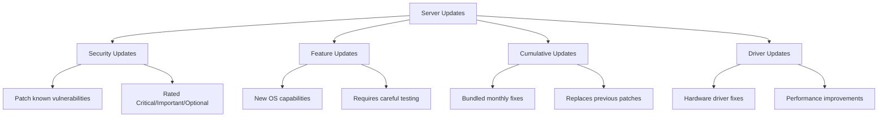

### Update Classification

Microsoft classifies updates into categories based on urgency and impact:

| Classification | Description | Action Required |
|---|---|---|
| **Critical** | Vulnerabilities exploitable without user interaction | Install immediately |
| **Important** | Security vulnerabilities requiring user action | Install within 30 days |
| **Moderate** | Exploitability is limited by conditions | Schedule for maintenance window |
| **Low** | Minor impact, difficult to exploit | Apply during routine maintenance |
| **Optional** | Non-security updates, enhancements | Evaluate before applying |

### Update Lifecycle

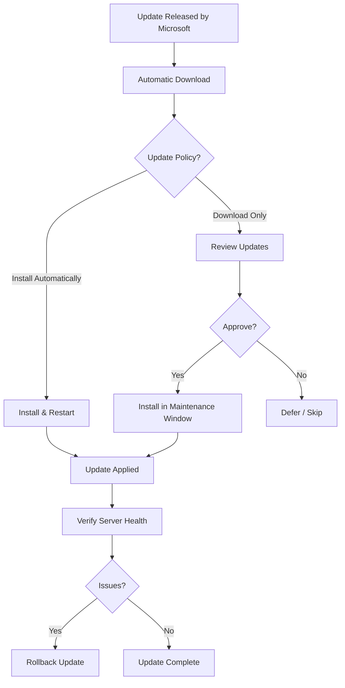

### Windows Update for Business

Windows Update for Business provides enterprise-grade update management:

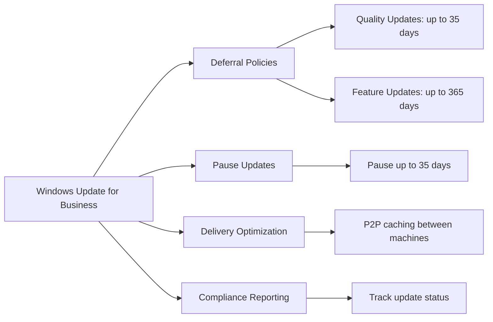

### Update Best Practices

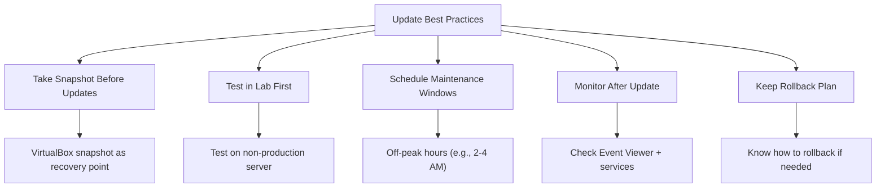

---

## Practical 1: Update and Maintain the Server {#practical-1-updates}

### Objective
Configure Windows Update policies, check for and manage updates, and establish a safe update workflow.

### Prerequisites
- Windows Server 2022 VM (from previous units)
- Administrative access
- Internet connectivity (NAT or Bridged mode)

---

### Part A: Access Windows Update Settings

**Step 1**: Open Windows Update via Server Manager
1. Open **Server Manager**
2. Click **Local Server** in the left pane
3. Find **Windows Update** in the properties list
4. Click the link next to it

**Step 2**: Alternative — Open via Settings
1. Click **Start**
2. Click **Settings** (gear icon)
3. Click **Windows Update**

**Step 3**: Review Current Status
- Note whether updates are available
- Note the last successful update date

---

### Part B: Check for Updates

**Step 1**: Scan for Updates
1. In Windows Update, click **Check for updates**
2. Wait for the scan to complete
3. Review any updates found:
   - **Security updates**: Install these
   - **Feature updates**: Review before installing
   - **Optional updates**: Review individually

**Step 2**: View Update History
1. Click **Update history**
2. Review previously installed updates
3. Note dates and update KB numbers

**Step 3**: Review Failed Updates (if any)
1. In Update history, look for status **Failed**
2. Click a failed update to see the error code
3. Note the error for troubleshooting

---

### Part C: Configure Update Settings

**Step 1**: Advanced Options
1. Click **Advanced options** in Windows Update
2. Review settings:
   - **Delivery Optimization**: Controls how updates are downloaded
   - **Pause updates**: Option to pause for up to 35 days
   - **Update history**: View installed/failed updates

**Step 2**: Delivery Optimization Settings
1. Click **Delivery Optimization**
2. Review: **Allow downloads from other PCs**
   - For lab: Can be left On or Off
   - In production: Enable for faster downloads across network

**Step 3**: View Active Update Policies
```powershell
# View current Windows Update policy settings
Get-CimInstance -ClassName Win32_OperatingSystem | Select-Object Caption, Version, BuildNumber

# Check Windows Update service status
Get-Service -Name "wuauserv" | Select-Object Name, Status, StartType

# View update history via PowerShell
Get-WinEvent -FilterHashtable @{LogName="System"; ProviderName="Microsoft-Windows-WindowsUpdateAgent"} -MaxEvents 10
```

---

### Part D: Install Updates (If Available)

> **Note**: In a lab VM without internet access, updates will not be available. Walk through the interface and understand the workflow. If internet is available, proceed with installation.

**Step 1**: Install Security Updates
1. If security updates are shown, click **Install all**
2. Server may restart automatically after installation
3. Wait for installation to complete

**Step 2**: Verify After Restart
1. After restart, open Windows Update again
2. Check: **"You're up to date"** confirms success
3. Open **Event Viewer** → System → filter for "Windows Update"
4. Verify updates applied successfully

**Step 3**: Restart Management
- Some updates require a restart
- Plan restarts during off-peak hours
- Use **Restart Required** flag in Server Manager to identify pending restarts

#### Using PowerShell to Check Update Status:
```powershell
# Check if restart is pending
$restartPending = Test-Path "HKLM:\SOFTWARE\Microsoft\Windows Mount Manager\MountedDevices"
# Or more reliably:
if ((Get-CimInstance -ClassName Win32_OperatingSystem).Status -eq "OK") {
    Write-Host "System Status: OK"
}

# List installed updates (last 30 days)
Get-HotFix | Sort-Object InstalledOn -Descending | Select-Object -First 10 HotFixID, InstalledOn, Caption

# Check for pending updates using Windows Update PowerShell module
# (requires internet connection)
```

---

### Part E: Create a Pre-Update Snapshot

Always take a snapshot before applying updates to a VM — this provides a safe rollback point.

**Step 1**: Power Off VM (Recommended)
1. In VirtualBox, shut down the VM gracefully
2. Or save state

**Step 2**: Take Snapshot
1. Select the VM in VirtualBox Manager
2. Click **Snapshots** tab
3. Click **Take** (camera icon)
4. Name: `Before-Updates-[DATE]`
   - Example: `Before-Updates-2026-02-01`
5. Description: `Pre-update snapshot — safe restore point`
6. Click **OK**

**Step 3**: Restore from Snapshot (Demo)
1. Click **Snapshots** tab
2. Right-click the snapshot
3. Select **Restore Snapshot**
4. Confirm restoration
5. VM reverts to the saved state

> After the demo, restore to the latest state or re-apply updates as needed.

---

## Theory: Server Administration Access and Control {#theory-access-control}

### Administration Methods Overview

Windows Server provides multiple methods for administrators to manage servers — locally and remotely.

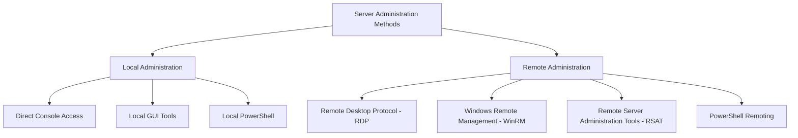

### Local vs Remote Administration

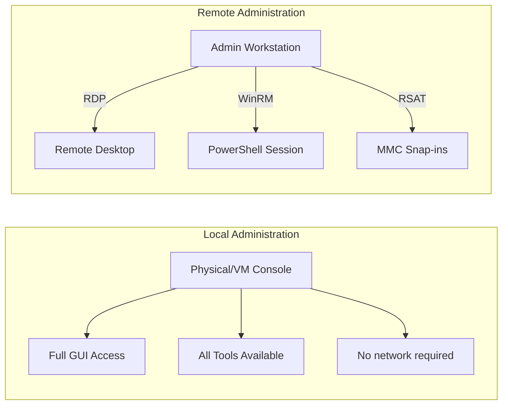

### Remote Desktop Protocol (RDP)

RDP provides a full graphical remote session to the server.

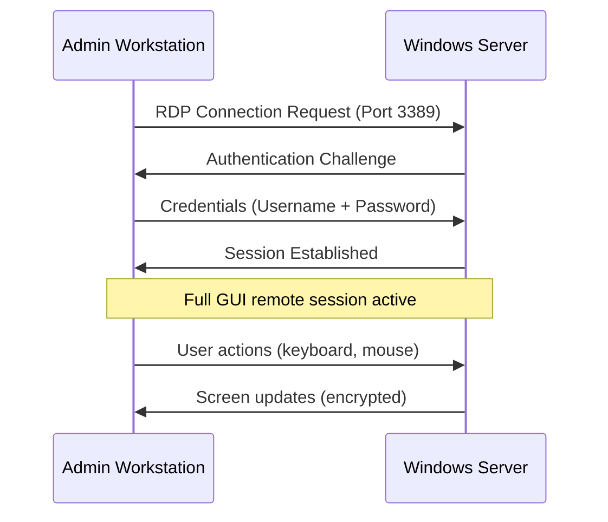

**Key Points:**
- Default port: **3389** (TCP)
- Encrypted by default (TLS)
- Supports multiple simultaneous sessions
- Can be configured for specific users only

### Windows Remote Management (WinRM)

WinRM is the Windows implementation of the WS-Management standard. It enables PowerShell remoting.

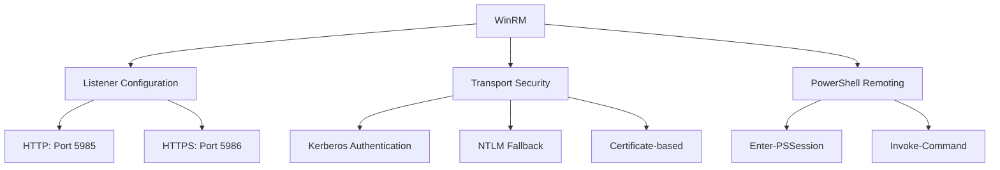

### Remote Server Administration Tools (RSAT)

RSAT allows an administrator to manage Windows Server from a Windows client machine using the same MMC snap-ins available locally on the server.

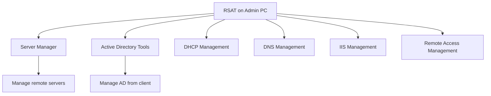

### Access Control Methods

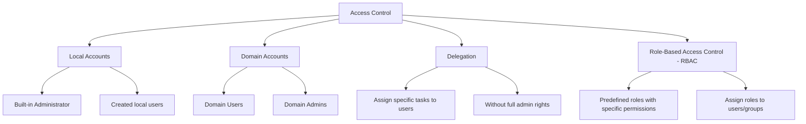

### Built-in Security Groups

Windows Server includes predefined security groups with specific permissions:

| Group | Members | Permissions |
|---|---|---|
| **Administrators** | Built-in Administrator | Full control over server |
| **Users** | All regular users | Basic read/execute permissions |
| **Backup Operators** | Backup service accounts | Backup/restore files regardless of permissions |
| **Remote Desktop Users** | RDP users | Connect via RDP |
| **Remote Management Users** | WinRM users | Manage via WinRM |
| **Performance Monitor Users** | Monitoring accounts | Read performance counters |
| **Performance Log Users** | Log collection accounts | Create performance logs |
| **Event Log Readers** | Log reading accounts | Read event logs |

### Principle of Least Privilege

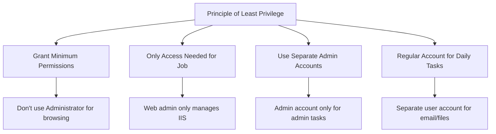

---

## Practical 2: Configure Administration Access Methods {#practical-2-access-methods}

### Objective
Configure RDP, WinRM, and PowerShell remoting. Create user accounts with delegated permissions. Set up RSAT on a client machine.

### Prerequisites
- Windows Server 2022 VM
- Windows 10/11 Client VM (from Unit 3)
- Both VMs on Host-Only network (192.168.56.0/24)
- Administrative access on both machines

---

### Part A: Configure Remote Desktop (RDP)

#### Step 1: Enable RDP on the Server

**Via Server Manager:**
1. Open **Server Manager** → **Local Server**
2. Find **Remote Desktop**: click **Disabled**
3. System Properties dialog opens → **Remote** tab
4. Select: **Allow connections from computers running any version of Remote Desktop**
5. Click **OK**

**Via PowerShell:**
```powershell
# Enable RDP
Set-ItemProperty -Path "HKLM:\SYSTEM\CurrentControlSet\Control\Terminal Services" `
    -Name "fDenyTSConnections" -Value 0

# Allow RDP through Windows Firewall
Enable-NetFirewallRule -DisplayName "Remote Desktop*"

# Verify RDP is enabled
Get-ItemProperty -Path "HKLM:\SYSTEM\CurrentControlSet\Control\Terminal Services" `
    | Select-Object fDenyTSConnections
# 0 = Enabled, 1 = Disabled
```

#### Step 2: Allow Specific Users for RDP

1. In System Properties → Remote tab
2. Click **Select Users...**
3. Click **Add**
4. Type the username to allow
5. Click **OK**

**Via PowerShell:**
```powershell
# Add a user to Remote Desktop Users group
Add-LocalGroupMember -Group "Remote Desktop Users" -Member "Username"

# View current RDP group members
Get-LocalGroupMember -Group "Remote Desktop Users"
```

#### Step 3: Connect via RDP from Client VM

**On the Windows Client VM:**
1. Press **Start** → type `mstsc` → press Enter
2. Remote Desktop Connection opens
3. In the **Computer** field, type: `192.168.56.101` (server's Host-Only IP)
4. Click **Connect**
5. Enter credentials:
   - Username: `Administrator`
   - Password: (your server password)
6. Click **OK** on any certificate warning
7. You now have a full remote GUI session

**Disconnect:**
1. Click the **X** at the top of the RDP window
2. Choose **Disconnect** (keeps session active) or **Log off**

---

### Part B: Configure Windows Remote Management (WinRM)

#### Step 1: Enable WinRM on the Server

```powershell
# Enable PowerShell remoting (enables WinRM automatically)
Enable-PSRemoting -Force

# Verify WinRM is running
Get-Service -Name WinRM

# View WinRM listeners
winrm enumerate winrm/config/Listener
```

#### Step 2: Configure WinRM Firewall Rules

```powershell
# Allow WinRM through firewall (HTTP - port 5985)
New-NetFirewallRule -DisplayName "WinRM HTTP" `
    -Direction Inbound -Protocol TCP -LocalPort 5985 `
    -Action Allow

# Allow WinRM HTTPS (port 5986) — for secure environments
New-NetFirewallRule -DisplayName "WinRM HTTPS" `
    -Direction Inbound -Protocol TCP -LocalPort 5986 `
    -Action Allow

# Verify firewall rules
Get-NetFirewallRule -DisplayName "WinRM*" | Select-Object DisplayName, Direction, LocalPort, Enabled
```

#### Step 3: Add Users to Remote Management Group

```powershell
# Add user to Remote Management Users group
Add-LocalGroupMember -Group "Remote Management Users" -Member "Username"

# Verify
Get-LocalGroupMember -Group "Remote Management Users"
```

#### Step 4: Test PowerShell Remoting from Client

**On the Windows Client VM:**

```powershell
# Test connectivity to the server
Test-NetConnection -ComputerName 192.168.56.101 -Port 5985

# Enter a remote PowerShell session
Enter-PSSession -ComputerName 192.168.56.101 -Credential (Get-Credential)
# Enter username and password when prompted

# Inside the remote session — verify you're on the server:
hostname
# Should display: WINSERVER2022

# Run a command remotely
Get-Process | Select-Object -First 5 Name, CPU

# Exit the remote session
exit
```

**Using Invoke-Command (without entering a session):**
```powershell
# Run a single command on the remote server
Invoke-Command -ComputerName 192.168.56.101 `
    -Credential (Get-Credential) `
    -ScriptBlock { Get-Service | Where-Object {$_.Status -eq "Running"} | Measure-Object }
```

---

### Part C: Create User Accounts with Delegated Permissions

#### Step 1: Create a Local User Account

**Via Computer Management:**
1. Right-click **Start** → **Computer Management**
2. Expand **Local Users and Groups** → **Users**
3. Right-click in right pane → **New User**
4. Fill in:
   ```
   User name:          webadmin
   Full name:          Web Administrator
   Description:        Manages IIS Web Server
   Password:           [strong password]
   ☐ User must change password at next logon
   ☑ Password never expires (for service accounts)
   ☐ Account is disabled
   ```
5. Click **Create**
6. Click **Close**

**Via PowerShell:**
```powershell
# Create a new local user
$password = ConvertTo-SecureString "Admin@12345" -AsPlainText -Force
New-LocalUser -Name "webadmin" -Password $password `
    -FullName "Web Administrator" `
    -Description "Manages IIS Web Server"

# Verify
Get-LocalUser -Name "webadmin"
```

#### Step 2: Create a Second User Account

```powershell
# Create a backup operator user
$password = ConvertTo-SecureString "Admin@12345" -AsPlainText -Force
New-LocalUser -Name "backupuser" -Password $password `
    -FullName "Backup Operator" `
    -Description "Performs server backups"
```

#### Step 3: Assign Users to Security Groups

**Via Computer Management:**
1. Expand **Local Users and Groups** → **Groups**
2. Double-click **Remote Desktop Users**
3. Click **Add**
4. Type: `webadmin`
5. Click **OK** → **OK**

**Assign backupuser to Backup Operators:**
1. Double-click **Backup Operators**
2. Click **Add** → type: `backupuser`
3. Click **OK** → **OK**

**Via PowerShell:**
```powershell
# Add webadmin to Remote Desktop Users
Add-LocalGroupMember -Group "Remote Desktop Users" -Member "webadmin"

# Add webadmin to Performance Monitor Users (can view performance)
Add-LocalGroupMember -Group "Performance Monitor Users" -Member "webadmin"

# Add backupuser to Backup Operators
Add-LocalGroupMember -Group "Backup Operators" -Member "backupuser"

# Add backupuser to Remote Management Users
Add-LocalGroupMember -Group "Remote Management Users" -Member "backupuser"

# View all group memberships for webadmin
Get-LocalGroup | ForEach-Object {
    $members = Get-LocalGroupMember -Group $_.Name -ErrorAction SilentlyContinue
    if ($members | Where-Object {$_.Name -like "*webadmin*"}) {
        Write-Host "$($_.Name): webadmin is a member"
    }
}
```

#### Step 4: Verify Delegated Access

**Test RDP with webadmin account:**
1. From the client VM, open Remote Desktop Connection
2. Connect to the server
3. Log in with: `webadmin` / password
4. Verify access is granted
5. Verify the user does NOT have full Administrator rights:
```powershell
# Inside the session as webadmin:
whoami
whoami /groups
# Should show: Remote Desktop Users, Performance Monitor Users
# Should NOT show: Administrators
```

---

### Part D: Install RSAT on Client Machine

RSAT lets you manage the server directly from a Windows client.

#### On Windows 10/11 Client VM:

**Step 1**: Install RSAT Tools
1. Click **Start** → **Settings** → **Apps**
2. Click **Optional features**
3. Click **Add feature**
4. Search for and install:
   - **Remote Server Administration Tools - Server Manager**
   - **Remote Server Administration Tools - DNS Server Tools**
   - **Remote Server Administration Tools - DHCP Server Tools**
5. Wait for installation to complete

**Via PowerShell (Windows 10/11):**
```powershell
# Install RSAT Server Manager
Add-WindowsCapability -Online -Name "Rsat.ServerManager.Tools~~~~0.0.1.0"

# Install RSAT DNS Tools
Add-WindowsCapability -Online -Name "Rsat.DNS.Tools~~~~0.0.1.0"

# Install RSAT DHCP Tools
Add-WindowsCapability -Online -Name "Rsat.DHCP.Tools~~~~0.0.1.0"

# List all installed RSAT tools
Get-WindowsCapability -Online | Where-Object {$_.Name -like "Rsat*" -and $_.State -eq "Installed"}
```

#### Step 2: Use Server Manager from Client

1. Open **Server Manager** on the client
2. Click **Manage** → **Add Servers**
3. Click **DNS** tab
4. Type the server IP: `192.168.56.101`
5. Click **Add**
6. The remote server now appears in Server Manager
7. You can manage roles and features remotely

---

## Theory: Service Level Agreements {#theory-sla}

### What is an SLA?

A Service Level Agreement (SLA) is a formal, written agreement between a service provider (the IT/server administration team) and the service consumer (business departments or end users) that defines the expected level of service.

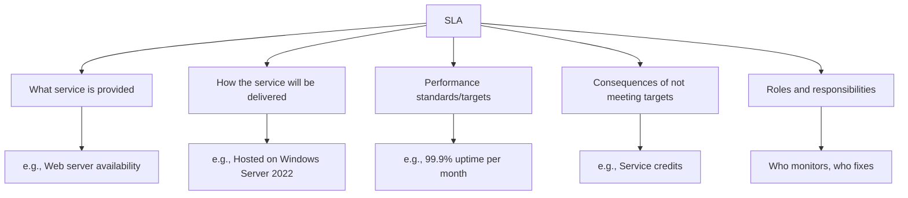

### Key SLA Components

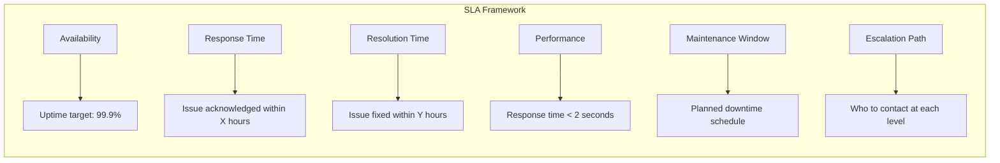

### Availability Calculations

Availability is typically expressed as a percentage (the "nines"):

| SLA Level | Downtime per Year | Downtime per Month | Downtime per Day |
|---|---|---|---|
| 90% (1 nine) | 36.5 days | ~3 days | 2.4 hours |
| 95% | 18.25 days | ~1.5 days | 1.2 hours |
| 99% (2 nines) | 3.65 days | ~7.2 hours | 14.4 minutes |
| 99.5% | 1.8 days | ~3.6 hours | 7.2 minutes |
| 99.9% (3 nines) | 8.76 hours | ~43.8 minutes | 1.44 minutes |
| 99.95% | 4.38 hours | ~21.9 minutes | 43.8 seconds |
| 99.99% (4 nines) | 52.6 minutes | ~4.4 minutes | 8.76 seconds |
| 99.999% (5 nines) | 5.26 minutes | ~26.3 seconds | 0.86 seconds |

**Availability Formula:**
```
Availability (%) = (Total Time - Downtime) / Total Time × 100

Example for 99.9%:
Hours in a year = 8,760
Allowed downtime = 8,760 × 0.001 = 8.76 hours per year
```

### Types of Downtime

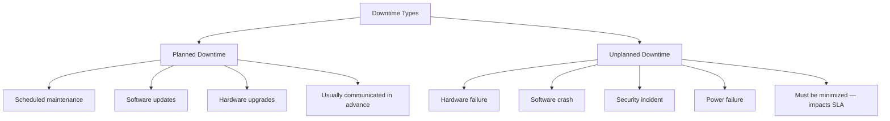

### SLA Metrics and KPIs

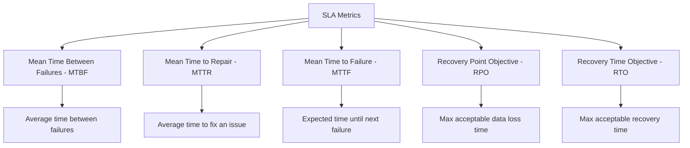

**Key Formulas:**

```
MTBF = Total Operating Time / Number of Failures

MTTR = Total Repair Time / Number of Repairs

Availability = MTBF / (MTBF + MTTR) × 100
```

### Escalation Levels

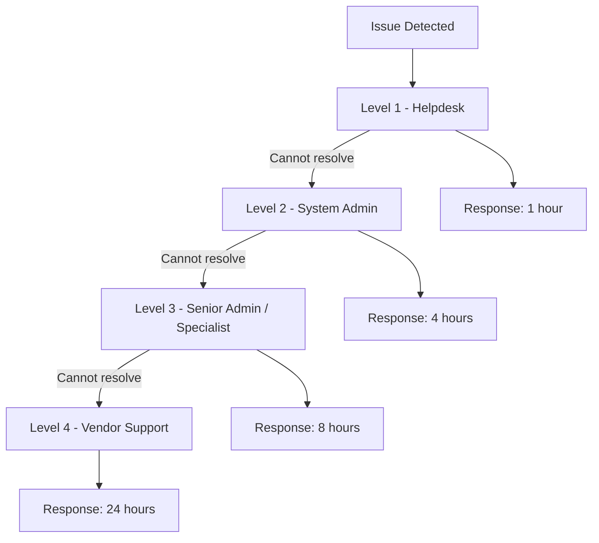

---

## Practical 3: Create and Document SLAs {#practical-3-sla}

### Objective
Create SLA documents for the services running on the Windows Server 2022 lab environment.

### Prerequisites
- Windows Server 2022 VM with roles installed (IIS, DHCP, DNS)
- Text editor or word processor
- Understanding of server services from previous units

---

### Part A: Identify Services Requiring SLAs

**Step 1**: List All Running Services
```powershell
# List critical services on the server
Get-Service | Where-Object {$_.Status -eq "Running"} |
    Select-Object DisplayName, Name, Status |
    Sort-Object DisplayName
```

**Step 2**: Identify Business-Critical Services
Based on installed roles, the following services require SLAs:

| Service | Role | Business Impact |
|---|---|---|
| Web Server (IIS) | Web Server | Users cannot access web applications |
| DHCP Server | DHCP | New devices cannot join the network |
| DNS Server | DNS | Name resolution fails network-wide |
| Windows Firewall | Security | Network security compromised |
| Remote Desktop | RDP | Administrators lose remote access |

---

### Part B: Create an SLA for the Web Server (IIS)

Create the following SLA document:

```
============================================================
SERVICE LEVEL AGREEMENT (SLA)
============================================================
Service Name:        Web Server (IIS)
Server:              WINSERVER2022
Service Owner:       System Administrator
Date Created:        [Today's Date]
Version:             1.0
============================================================

1. SERVICE DESCRIPTION
   The Web Server (IIS) role hosts web applications and
   websites accessible to users within the lab network.
   
   URL:               http://192.168.1.10
   Protocol:          HTTP (Port 80), HTTPS (Port 443)
   
2. AVAILABILITY TARGET
   - Uptime SLA:      99.5% per calendar month
   - Allowed downtime: ~3.6 hours per month
   - Planned maintenance window: Saturday 2:00 AM - 4:00 AM

3. PERFORMANCE TARGETS
   - Page response time:    < 3 seconds (average)
   - Maximum response time: < 10 seconds (peak)
   - Concurrent users:      Up to 50 users

4. RESPONSE AND RESOLUTION TIMES
   - Critical issue (site down):
     Response: 30 minutes | Resolution: 2 hours
   - Major issue (slow performance):
     Response: 1 hour     | Resolution: 4 hours
   - Minor issue (cosmetic/non-blocking):
     Response: 4 hours    | Resolution: 24 hours

5. MONITORING
   - Service monitored every 5 minutes
   - Alerts sent to: System Administrator
   - Performance logged via Windows Performance Monitor

6. ESCALATION PATH
   Level 1: System Administrator (first response)
   Level 2: Senior Administrator (if unresolved in 2 hours)
   Level 3: Vendor Support (if hardware/software failure)

7. MAINTENANCE PROCEDURES
   - All planned maintenance communicated 24 hours in advance
   - Snapshot taken before any changes
   - Rollback plan documented before maintenance begins

8. RESPONSIBILITIES
   Service Provider: IT Administration Team
   - Maintain server hardware and software
   - Apply security updates within 72 hours
   - Monitor service availability 24/7
   
   Service Consumer: Lab Users
   - Report issues within 1 hour of occurrence
   - Provide details of the issue when reporting
============================================================
```

**Step 3**: Save the SLA Document
1. Open **Notepad** (or any text editor)
2. Type or paste the SLA above
3. Save as: `SLA_WebServer_IIS.txt`
4. Save location: `C:\SLAs\`

---

### Part C: Create an SLA for DHCP and DNS Services

```powershell
# Create the SLA directory
New-Item -Path "C:\SLAs" -ItemType Directory -Force

# Create DHCP SLA document
@"
============================================================
SERVICE LEVEL AGREEMENT (SLA)
============================================================
Service Name:        DHCP Server
Server:              WINSERVER2022
Service Owner:       Network Administrator
Date Created:        $(Get-Date -Format 'yyyy-MM-dd')
Version:             1.0
============================================================

1. SERVICE DESCRIPTION
   DHCP Server automatically assigns IP addresses to
   network devices joining the lab network.

   Scope:             192.168.1.100 - 192.168.1.200
   Lease Duration:    1 day
   Gateway Provided:  192.168.1.1
   DNS Provided:      192.168.1.10

2. AVAILABILITY TARGET
   - Uptime SLA:      99.9% per calendar month
   - Allowed downtime: ~43.8 minutes per month
   - DHCP is critical - network devices cannot function without it

3. PERFORMANCE TARGETS
   - IP assignment time:   < 5 seconds
   - Lease renewal time:   < 10 seconds

4. RESPONSE AND RESOLUTION TIMES
   - DHCP service down:
     Response: 15 minutes  | Resolution: 1 hour
   - Slow IP assignment:
     Response: 30 minutes  | Resolution: 2 hours

5. MONITORING
   - Service status checked every 2 minutes
   - Scope utilization monitored daily
   - Alert when scope reaches 80% utilization

6. ESCALATION PATH
   Level 1: Network Administrator
   Level 2: Senior System Administrator
   Level 3: Vendor Support (hardware failure)
============================================================
"@ | Out-File -FilePath "C:\SLAs\SLA_DHCP_Server.txt"

# Verify file created
Get-Content "C:\SLAs\SLA_DHCP_Server.txt"
```

---

### Part D: Create an SLA Monitoring Dashboard

Create a simple script that checks SLA compliance:

```powershell
# SLA Monitoring Script — save as C:\Scripts\SLA_Monitor.ps1

function Check-SLA {
    Write-Host "============================================="
    Write-Host "  SLA MONITORING REPORT"
    Write-Host "  Generated: $(Get-Date)"
    Write-Host "============================================="
    Write-Host ""

    # Check IIS Service
    $iis = Get-Service -Name "W3SVC"
    $iisStatus = if ($iis.Status -eq "Running") { "PASS" } else { "FAIL" }
    Write-Host "[IIS Web Server]      Status: $($iis.Status)  | SLA: $iisStatus"

    # Check DHCP Service
    $dhcp = Get-Service -Name "DHCPServer"
    $dhcpStatus = if ($dhcp.Status -eq "Running") { "PASS" } else { "FAIL" }
    Write-Host "[DHCP Server]         Status: $($dhcp.Status)  | SLA: $dhcpStatus"

    # Check DNS Service
    $dns = Get-Service -Name "DNS"
    $dnsStatus = if ($dns.Status -eq "Running") { "PASS" } else { "FAIL" }
    Write-Host "[DNS Server]          Status: $($dns.Status)   | SLA: $dnsStatus"

    # Check RDP Service
    $rdp = Get-Service -Name "TermService"
    $rdpStatus = if ($rdp.Status -eq "Running") { "PASS" } else { "FAIL" }
    Write-Host "[Remote Desktop]      Status: $($rdp.Status)  | SLA: $rdpStatus"

    # Check CPU Usage
    $cpu = (Get-CimInstance -ClassName Win32_Processor).LoadPercentage
    $cpuStatus = if ($cpu -lt 80) { "PASS" } else { "WARNING" }
    Write-Host "[CPU Usage]           Load: ${cpu}%           | SLA: $cpuStatus"

    # Check Free Disk Space
    $disk = Get-CimInstance -ClassName Win32_LogicalDisk -Filter "DeviceID='C:'"
    $freePct = [math]::Round(($disk.FreeSpace / $disk.Size) * 100, 1)
    $diskStatus = if ($freePct -gt 10) { "PASS" } else { "WARNING" }
    Write-Host "[Disk C: Free Space]  Free: ${freePct}%        | SLA: $diskStatus"

    # Check Memory
    $os = Get-CimInstance -ClassName Win32_OperatingSystem
    $freeRAM = [math]::Round($os.FreePhysicalMemory / 1MB, 1)
    $memStatus = if ($freeRAM -gt 0.5) { "PASS" } else { "WARNING" }
    Write-Host "[Free Memory]         Free: ${freeRAM} GB      | SLA: $memStatus"

    Write-Host ""
    Write-Host "============================================="
}

# Run the check
Check-SLA
```

**Step 1**: Save and Run the Script
1. Open PowerShell as Administrator
2. Create directory:
   ```powershell
   New-Item -Path "C:\Scripts" -ItemType Directory -Force
   ```
3. Save the script above as `C:\Scripts\SLA_Monitor.ps1`
4. Run it:
   ```powershell
   .\SLA_Monitor.ps1
   # Or if execution policy blocks:
   powershell -ExecutionPolicy Bypass -File "C:\Scripts\SLA_Monitor.ps1"
   ```

**Step 2**: Review Output
- All services should show **Running** and **PASS**
- CPU should be below 80%
- Disk should have more than 10% free
- Memory should have more than 500 MB free

---

## Theory: Monitoring Server Performance {#theory-performance}

### Why Monitor Performance?

Performance monitoring is essential for:
- Detecting problems **before** they affect users
- Establishing **baselines** (what is normal)
- Capacity planning (when to add resources)
- Troubleshooting issues when they occur
- Meeting SLA targets

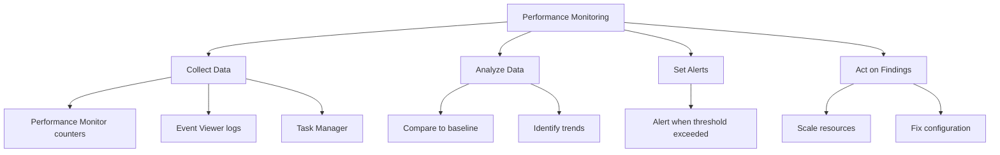

### Key Performance Counters

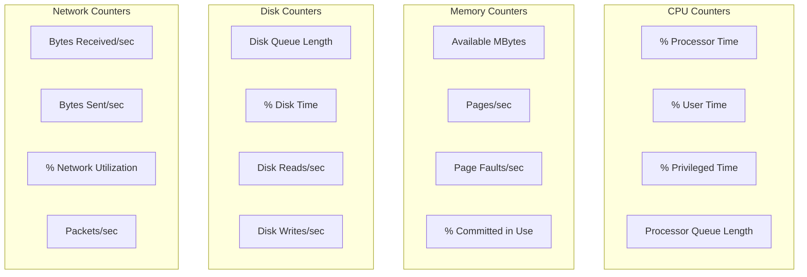

### Performance Thresholds (Guidelines)

| Counter | Good | Warning | Critical |
|---|---|---|---|
| % Processor Time | < 50% | 50-80% | > 80% |
| Processor Queue Length | 0-1 | 2-4 | > 4 |
| Available MBytes | > 500 MB | 200-500 MB | < 200 MB |
| Pages/sec | < 20 | 20-50 | > 50 |
| Disk Queue Length | 0 | 1-2 | > 2 |
| % Disk Time | < 50% | 50-80% | > 80% |
| % Network Utilization | < 30% | 30-70% | > 70% |

### Baseline Concept

A **baseline** is a recorded snapshot of normal server performance over a period of time. Baselines are used to detect anomalies.

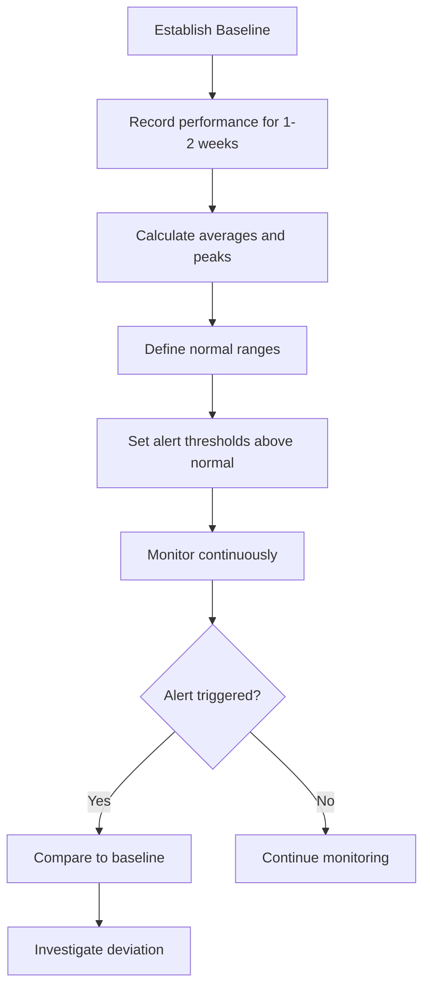

### Task Manager vs Performance Monitor

| Feature | Task Manager | Performance Monitor |
|---|---|---|
| **Purpose** | Quick real-time overview | Detailed long-term monitoring |
| **Data Retention** | None (real-time only) | Can log to file |
| **Counters** | Limited (CPU, Memory, Disk, Network) | Hundreds of counters |
| **Alerts** | No | Yes (via data collector sets) |
| **Baselines** | No | Yes |
| **Access** | Ctrl+Shift+Esc | perfmon.msc |

### Windows Event Logs for Performance

Event logs record significant system events that affect performance and stability:

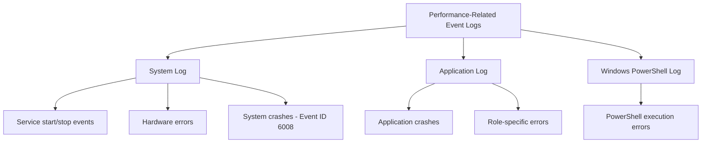

---

## Practical 4: Monitor and Baseline Server Performance {#practical-4-performance}

### Objective
Use Task Manager, Performance Monitor, and Event Viewer to monitor server performance, create a baseline, and set up alerts.

### Prerequisites
- Windows Server 2022 VM with roles installed
- Administrative access

---

### Part A: Task Manager — Quick Performance Overview

**Step 1**: Open Task Manager
1. Press **Ctrl + Shift + Esc**
2. Or right-click taskbar → **Task Manager**

**Step 2**: Review Performance Tab
1. Click **Performance** tab
2. Review each resource:
   - **CPU**: Current and average usage graph
   - **Memory**: Total, in use, available
   - **Disk**: Read/Write speeds
   - **Ethernet**: Send/Receive speeds

**Step 3**: Note Current Values
Record the following:
```
CPU Usage:        ____%
Memory In Use:    ____ MB / ____ MB total
Memory Available: ____ MB
Disk Read:        ____ MB/s
Disk Write:       ____ MB/s
Network Send:     ____ Kbps
Network Receive:  ____ Kbps
```

**Step 4**: Review Processes Tab
1. Click **Processes** tab
2. Sort by **CPU** (click column header)
3. Identify the top 3 processes using CPU
4. Sort by **Memory**
5. Identify the top 3 processes using memory

**Step 5**: Review Details Tab
1. Click **Details** tab
2. View all processes with PID, Status, CPU%, Memory
3. This is useful for troubleshooting specific processes

---

### Part B: Performance Monitor — Detailed Monitoring

**Step 1**: Open Performance Monitor
1. Server Manager → **Tools** → **Performance Monitor**
2. Or Run: `perfmon.msc`

**Step 2**: Add Key Counters
1. Click **Performance Monitor** in left pane
2. Click **+** (green plus) to add counters
3. Add the following counters:

   **CPU:**
   - Processor → % Processor Time (All Instances)
   - Processor → Processor Queue Length (from System)

   **Memory:**
   - Memory → Available MBytes
   - Memory → Pages/sec

   **Disk:**
   - LogicalDisk (C:) → % Disk Time
   - LogicalDisk (C:) → Disk Queue Length

   **Network:**
   - Network Interface → Bytes Received/sec
   - Network Interface → Bytes Sent/sec

4. Click **OK** after adding each group

**Step 3**: Observe Real-Time Data
1. Watch the graph for 1-2 minutes
2. Note the baseline values (when server is idle)
3. Generate some activity:
   ```powershell
   # Open PowerShell and run this to generate CPU activity:
   $result = 1..1000000 | ForEach-Object { $_ * $_ }
   Write-Host "Computation complete"
   ```
4. Watch how CPU counter reacts
5. After the computation finishes, observe return to baseline

**Step 4**: Change Graph View
1. Right-click the graph area
2. Try different views:
   - **Line** (default)
   - **Report** (numerical values)
   - **Histogram Bar**
3. **Report view** is best for recording baseline values

---

### Part C: Create a Data Collector Set (Baseline Recording)

**Step 1**: Create New Data Collector Set
1. In Performance Monitor, expand **Data Collector Sets**
2. Right-click **User Defined**
3. Select **New** → **Manually (create from template)**
4. Name: `Server Baseline`
5. Click **Next**

**Step 2**: Add Counters
1. Click **Add...** button
2. Add these counters:
   - Processor → % Processor Time
   - Memory → Available MBytes
   - Memory → Pages/sec
   - LogicalDisk (C:) → % Disk Time
   - LogicalDisk (C:) → Disk Queue Length
   - Network Interface → Bytes Received/sec
   - Network Interface → Bytes Sent/sec
3. Click **OK**

**Step 3**: Configure Schedule
1. Click **Next**
2. Log Format: **CSV** (for easy analysis)
3. Save the data to: `C:\PerfLogs\Server_Baseline`
4. Click **Next**

**Step 4**: Set Run Schedule
1. Click **Next**
2. Run As: Administrator
3. Click **Finish**

**Step 5**: Start the Data Collector Set
1. Right-click **Server Baseline**
2. Click **Start**
3. Let it run for **5-10 minutes** (ideally 1-2 weeks for a real baseline)
4. After collection period, right-click → **Stop**

**Step 6**: View Collected Data
1. Expand **Reports** → **User Defined** → **Server Baseline**
2. Select a report timestamp
3. Review the collected performance data

---

### Part D: Set Up Performance Alerts

**Step 1**: Create an Alert Using Performance Monitor
1. In left pane, expand **Data Collector Sets**
2. Right-click **User Defined** → **New** → **Manually (create from template)**
3. Name: `CPU High Alert`

**Step 2**: Configure Alert Counter
1. Select: **Performance Counter Alert**
2. Click **Add...**
3. Add counter: **Processor → % Processor Time**
4. Click **OK**

**Step 3**: Set Alert Threshold
1. Alert condition: **Greater than**
2. Value: **80**
3. Sample interval: **10 seconds**
4. Click **Next**

**Step 4**: Alert Action
1. Select: **Log an entry in the event log**
2. Event log: **System**
3. Event type: **Error**
4. Click **Next**

**Step 5**: Finish
1. Click **Finish**
2. Right-click **CPU High Alert** → **Start**

**Step 6**: Test the Alert
```powershell
# Generate high CPU load to trigger alert
$jobs = 1..4 | ForEach-Object {
    Start-Job -ScriptBlock {
        $sum = 0
        for ($i = 0; $i -lt 10000000; $i++) { $sum += $i }
    }
}
Wait-Job $jobs
Remove-Job $jobs

# Check Event Viewer for the alert
# Event Viewer > Windows Logs > System
# Look for source: "Performance" with the alert message
```

---

### Part E: PowerShell Performance Monitoring Script

Create a comprehensive monitoring script:

```powershell
# Save as: C:\Scripts\Perf_Monitor.ps1

function Get-ServerPerformance {
    param(
        [int]$SampleCount = 5,
        [int]$SampleInterval = 2  # seconds
    )

    Write-Host "================================================="
    Write-Host "  SERVER PERFORMANCE MONITOR"
    Write-Host "  Server: $(hostname)"
    Write-Host "  Started: $(Get-Date)"
    Write-Host "  Samples: $SampleCount  |  Interval: ${SampleInterval}s"
    Write-Host "================================================="
    Write-Host ""

    $results = @()

    for ($i = 1; $i -le $SampleCount; $i++) {
        Write-Host "--- Sample $i of $SampleCount ---"

        # CPU
        $cpu = (Get-CimInstance -ClassName Win32_Processor).LoadPercentage
        Write-Host "  CPU Usage:          ${cpu}%"

        # Memory
        $os = Get-CimInstance -ClassName Win32_OperatingSystem
        $totalRAM = [math]::Round($os.TotalVisibleMemorySize / 1MB, 2)
        $freeRAM = [math]::Round($os.FreePhysicalMemory / 1MB, 2)
        $usedRAM = [math]::Round($totalRAM - $freeRAM, 2)
        Write-Host "  Memory Used:        ${usedRAM} GB / ${totalRAM} GB"
        Write-Host "  Memory Free:        ${freeRAM} GB"

        # Disk
        $disk = Get-CimInstance -ClassName Win32_LogicalDisk -Filter "DeviceID='C:'"
        $diskFree = [math]::Round($disk.FreeSpace / 1GB, 2)
        $diskTotal = [math]::Round($disk.Size / 1GB, 2)
        $diskFreePct = [math]::Round(($disk.FreeSpace / $disk.Size) * 100, 1)
        Write-Host "  Disk C: Free:       ${diskFree} GB / ${diskTotal} GB (${diskFreePct}%)"

        # Network
        $nic = Get-NetAdapterStatistics -Name "Ethernet" -ErrorAction SilentlyContinue
        if ($nic) {
            Write-Host "  Net Received:       $($nic.ReceivedBytes) bytes"
            Write-Host "  Net Sent:           $($nic.SentBytes) bytes"
        }

        # Processes
        $topProc = Get-Process | Sort-Object CPU -Descending | Select-Object -First 3 Name, CPU
        Write-Host "  Top Processes:"
        $topProc | ForEach-Object { Write-Host "    - $($_.Name): CPU $($_.CPU)" }

        $results += [PSCustomObject]@{
            Timestamp = Get-Date
            CPU = $cpu
            MemFreeGB = $freeRAM
            DiskFreeGB = $diskFree
        }

        Write-Host ""
        if ($i -lt $SampleCount) { Start-Sleep -Seconds $SampleInterval }
    }

    # Summary
    Write-Host "================================================="
    Write-Host "  SUMMARY"
    Write-Host "================================================="
    $avgCPU = ($results | Measure-Object -Property CPU -Average).Average
    $minFreeRAM = ($results | Measure-Object -Property MemFreeGB -Minimum).Minimum
    Write-Host "  Average CPU:        $([math]::Round($avgCPU, 1))%"
    Write-Host "  Minimum Free RAM:   ${minFreeRAM} GB"
    Write-Host "================================================="
}

# Run the monitor
Get-ServerPerformance -SampleCount 5 -SampleInterval 3
```

**Run the script:**
```powershell
powershell -ExecutionPolicy Bypass -File "C:\Scripts\Perf_Monitor.ps1"
```

---

## Troubleshooting Scenarios

### Scenario 1: Cannot Connect via RDP

**Symptoms**: RDP connection refused or times out

**Diagnostic Steps:**
```powershell
# On the server — check if RDP is enabled
Get-ItemProperty -Path "HKLM:\SYSTEM\CurrentControlSet\Control\Terminal Services" `
    | Select-Object fDenyTSConnections
# 0 = Enabled, 1 = Disabled

# Check if TermService is running
Get-Service -Name "TermService"

# Check firewall rule
Get-NetFirewallRule -DisplayName "*Remote Desktop*" | Select-Object DisplayName, Enabled, Direction
```

**Checklist:**
- Is RDP enabled on the server?
- Is the TermService running?
- Is the firewall allowing port 3389?
- Is the user in the Remote Desktop Users group?
- Are both machines on the same network?

**Solutions:**
```powershell
# Enable RDP
Set-ItemProperty -Path "HKLM:\SYSTEM\CurrentControlSet\Control\Terminal Services" `
    -Name "fDenyTSConnections" -Value 0

# Start TermService
Start-Service -Name "TermService"

# Enable firewall rule
Enable-NetFirewallRule -DisplayName "Remote Desktop*"

# Add user to RDP group
Add-LocalGroupMember -Group "Remote Desktop Users" -Member "Username"
```

### Scenario 2: PowerShell Remoting Fails

**Symptoms**: `Enter-PSSession` fails with connection error

**Diagnostic Steps:**
```powershell
# Test network connectivity on port 5985
Test-NetConnection -ComputerName 192.168.56.101 -Port 5985

# On the server — check WinRM status
Get-Service -Name "WinRM"

# Check if PowerShell remoting is enabled
Get-WinRMConfig
```

**Solutions:**
```powershell
# On the server — re-enable PowerShell remoting
Enable-PSRemoting -Force

# Start WinRM service
Start-Service -Name "WinRM"

# Allow WinRM in firewall
Enable-NetFirewallRule -DisplayName "Windows Remote Management*"

# On the client — add trusted hosts (if not domain-joined)
Set-Item -Path WSMan:\localhost\Client\TrustedHosts -Value "192.168.56.101"
```

### Scenario 3: Server Performance Degradation After Updates

**Symptoms**: Server became slow after installing updates

**Diagnostic Steps:**
```powershell
# Check if updates are still installing
Get-Service -Name "wuauserv"

# Check for pending restarts
# Look in Event Viewer for recent update events
Get-WinEvent -FilterHashtable @{
    LogName="System";
    ProviderName="Microsoft-Windows-WindowsUpdateAgent"
} -MaxEvents 5

# Check resource usage
Get-CimInstance Win32_Processor | Select-Object LoadPercentage
Get-CimInstance Win32_OperatingSystem | Select-Object @{N="FreeRAM(MB)"; E={[math]::Round($_.FreePhysicalMemory/1024,0)}}
```

**Solutions:**
- If restart is pending: Restart the server
- If high CPU after restart: Wait 15-30 minutes (indexing/compilation runs after updates)
- If issue persists: Check for failed updates in Update history
- If critical: Roll back to pre-update snapshot

### Scenario 4: SLA Breach — Service Availability Below Target

**Symptoms**: A service has been down longer than the SLA allows

**Response Steps:**
1. **Acknowledge** the breach immediately
2. **Diagnose** the root cause:
   ```powershell
   # Check service status
   Get-Service -Name "W3SVC","DHCPServer","DNS"

   # Check Event Viewer for the cause
   Get-WinEvent -FilterHashtable @{LogName="System"; Level=1,2} -MaxEvents 10
   ```
3. **Resolve** the issue (restart service, fix configuration)
4. **Document** the incident:
   - When it started
   - What caused it
   - How long it lasted
   - What was done to fix it
5. **Update the SLA** if the target is unrealistic

---

## Review Questions

### Conceptual Questions

1. Why is keeping a server updated important? Name three categories of updates and explain each.

2. Explain the difference between RDP, WinRM, and RSAT. When would you use each method?

3. What is the Principle of Least Privilege? Why is it important in server administration?

4. What is an SLA? Name five key components of an SLA document.

5. Explain the difference between planned and unplanned downtime. How does each affect SLA compliance?

6. What does "99.9% availability" mean in terms of allowed downtime per year?

7. What is a performance baseline and why is it important for server monitoring?

8. Explain the difference between MTBF and MTTR. How are they used to calculate availability?

9. What is the purpose of the Remote Desktop Users security group?

10. Why should administrators use a separate non-privileged account for daily tasks instead of the Administrator account?

### Practical Questions

1. Write the PowerShell commands to:
   - Enable RDP on a server
   - Add a user called "ITSupport" to the Remote Desktop Users group
   - Verify RDP is enabled

2. Calculate: If a server has an MTBF of 2,000 hours and MTTR of 2 hours, what is the availability percentage?

3. You need to monitor a remote server's CPU usage without logging into it. Write the PowerShell command to do this.

4. A web server's SLA requires 99.9% uptime. The server was down for 2 hours last month. Was the SLA breached? Show your calculation.

5. Write a PowerShell script that checks whether the DNS, DHCP, and IIS services are running and outputs PASS or FAIL for each.

6. Explain what each of these performance counter values indicates:
   - CPU at 95% sustained
   - Available MBytes at 150 MB
   - Disk Queue Length at 5
   - Pages/sec at 80

7. You notice the server is slow after a Windows Update. List the steps you would take to diagnose and resolve the issue.

8. What event log would you check to find out why a service stopped unexpectedly? What event IDs are relevant?

---

## Lab Exercises

### Exercise 1: Update and Access Configuration
**Time: 1.5 hours**

Tasks:
1. Open Windows Update — check for updates and review update history
2. Take a pre-update snapshot of the VM
3. Enable RDP on the server
4. Create two user accounts: `webadmin` and `backupuser`
5. Assign `webadmin` to Remote Desktop Users and Performance Monitor Users groups
6. Assign `backupuser` to Backup Operators and Remote Management Users groups
7. Enable WinRM and PowerShell remoting
8. Connect to the server via RDP from the client VM using `webadmin` credentials
9. Document all configurations

### Exercise 2: Remote Administration Lab
**Time: 1.5 hours**

Tasks:
1. Ensure both server and client VMs are on the Host-Only network
2. Enable PowerShell remoting on the server
3. From the client VM, connect via `Enter-PSSession`
4. Run the following commands remotely and record output:
   - `Get-Service` (list all services)
   - `Get-Process | Sort-Object CPU -Descending | Select-Object -First 5`
   - `Get-CimInstance Win32_OperatingSystem | Select-Object Caption, TotalVisibleMemorySize`
5. Install RSAT on the client VM
6. Add the server to Server Manager on the client
7. Manage a role remotely via RSAT
8. Document all steps and outputs

### Exercise 3: SLA Creation and Monitoring
**Time: 2 hours**

Tasks:
1. Identify all critical services running on the server
2. Create an SLA document for the Web Server (IIS) role
3. Create an SLA document for the DHCP Server role
4. Create an SLA document for the DNS Server role
5. Save all SLA documents to `C:\SLAs\`
6. Create and run the SLA monitoring PowerShell script
7. Verify all services are PASS
8. Deliberately stop one service and re-run the script to confirm it shows FAIL
9. Restart the service and verify it shows PASS again
10. Document the SLA compliance results

### Exercise 4: Performance Monitoring and Baselining
**Time: 2 hours**

Tasks:
1. Open Task Manager — record current CPU, Memory, Disk, and Network values
2. Open Performance Monitor — add CPU, Memory, Disk, and Network counters
3. Create a Data Collector Set called "Lab Baseline"
4. Run the collector for 10 minutes while the server is idle
5. Generate CPU load using a PowerShell computation and observe the counters
6. Stop the collector and review the collected data
7. Create a CPU High Alert (threshold: 80%)
8. Trigger the alert by generating CPU load
9. Verify the alert appears in Event Viewer
10. Create and run the comprehensive PowerShell performance monitoring script
11. Document all baseline values and alert configurations

---

## Key Takeaways

1. ✅ Server updates are critical for security — always apply Critical and Important updates promptly
2. ✅ Take snapshots before applying updates as a safe rollback point
3. ✅ RDP provides full GUI remote access; WinRM enables PowerShell remoting
4. ✅ RSAT allows server management from a Windows client machine
5. ✅ Apply the Principle of Least Privilege — use separate accounts for admin and daily tasks
6. ✅ Security groups control access — use them to delegate specific permissions
7. ✅ SLAs define service expectations including availability, response times, and escalation paths
8. ✅ 99.9% availability allows only ~8.76 hours of downtime per year
9. ✅ Performance baselines define "normal" — deviations indicate problems
10. ✅ Use Performance Monitor for detailed long-term monitoring; Task Manager for quick checks
11. ✅ Set up alerts to be notified proactively when performance thresholds are exceeded
12. ✅ Document everything — incidents, SLAs, configurations, and baselines

---

## Next Unit Preview

In **Unit 6: Implementing Storage Solutions**, we will cover:
- Performing capacity planning
- Deploying primary storage devices
- Understanding storage technologies (RAID, SAN, NAS)
- Configuring RAID arrays

---

*End of Unit 5*
