# Unit 6: Implementing Storage Solutions

## Learning Objectives

After completing this unit, you will be able to:
- Perform storage capacity planning for a server environment
- Deploy and configure primary storage devices in Windows Server
- Understand and compare storage technologies (local, NAS, SAN, iSCSI)
- Configure RAID arrays for redundancy and performance
- Manage storage using Disk Management and Storage Spaces
- Monitor storage health and troubleshoot common storage issues

---

## Table of Contents
1. [Theory: Capacity Planning](#theory-capacity-planning)
2. [Practical 1: Perform Capacity Planning](#practical-1-capacity-planning)
3. [Theory: Primary Storage Devices](#theory-storage-devices)
4. [Practical 2: Deploy and Manage Storage Devices](#practical-2-deploy-storage)
5. [Theory: Storage Technologies](#theory-storage-tech)
6. [Practical 3: Configure Storage Technologies](#practical-3-storage-tech)
7. [Theory: RAID Configuration](#theory-raid)
8. [Practical 4: Configure RAID](#practical-4-raid)
9. [Review Questions](#review-questions)

---

## Theory: Capacity Planning {#theory-capacity-planning}

### What is Capacity Planning?

Capacity planning is the process of determining the storage resources a server will need — now and in the future — to meet business requirements. It prevents running out of space, which can crash services and cause data loss.


### Capacity Planning Workflow


### Key Capacity Planning Metrics

| Metric | Description | Example |
|---|---|---|
| **Total Capacity** | Total raw storage available | 500 GB |
| **Used Space** | Currently occupied storage | 320 GB |
| **Free Space** | Currently available storage | 180 GB |
| **Utilization %** | (Used / Total) × 100 | 64% |
| **Growth Rate** | Average increase per time period | 20 GB/month |
| **Time to Full** | Months until storage is full | ~9 months |
| **Overhead** | Space reserved by filesystem | ~5-10% |

### Growth Rate Calculation


**Formulas:**
```
Growth Rate     = (Current Usage - Previous Usage) / Time Period
Time to Full    = Free Space / Growth Rate
Projected Usage = Current Usage + (Growth Rate × Future Months)
```

### The 80% Rule

Never allow disk utilization to exceed 80%. Beyond this threshold, performance degrades significantly due to filesystem fragmentation and reduced caching efficiency.


### Capacity Planning Best Practices


---

## Practical 1: Perform Capacity Planning {#practical-1-capacity-planning}

### Objective
Analyze current storage usage, calculate growth rates, and project future storage needs on the Windows Server 2022 VM.

### Prerequisites
- Windows Server 2022 VM (from previous units)
- Administrative access
- PowerShell knowledge

---

### Part A: Analyze Current Storage Using Disk Management

**Step 1**: Open Disk Management
1. Right-click **Start** → **Disk Management**
2. Or: Server Manager → **Tools** → **Disk Management**
3. Or Run: `diskmgmt.msc`

**Step 2**: Review Current Disks
1. In the **Graphical view** (bottom pane):
   - Each row = one physical disk
   - Each colored block = one partition/volume
   - Black area = unallocated space
2. In the **Volume list view** (top pane):
   - Columns: Volume, Status, Capacity, Free Space, % Free

**Step 3**: Record Current Values
Note the following for each volume:
```
Volume C:
  Total Capacity:   ____ GB
  Free Space:       ____ GB
  Used Space:       ____ GB
  % Free:           ____%
```

---

### Part B: Analyze Storage Using PowerShell

**Step 1**: Get Detailed Disk Information
```powershell
# Get all logical disk information
Get-CimInstance -ClassName Win32_LogicalDisk | Select-Object `
    DeviceID,
    @{N="Size(GB)";      E={[math]::Round($_.Size/1GB, 2)}},
    @{N="FreeSpace(GB)"; E={[math]::Round($_.FreeSpace/1GB, 2)}},
    @{N="UsedSpace(GB)"; E={[math]::Round(($_.Size - $_.FreeSpace)/1GB, 2)}},
    @{N="Free%";         E={[math]::Round(($_.FreeSpace/$_.Size)*100, 1)}},
    FileSystemType
```

**Step 2**: Get Physical Disk Information
```powershell
# Get physical disk details
Get-PhysicalDisk | Select-Object `
    FriendlyName,
    @{N="Size(GB)"; E={[math]::Round($_.Size/1GB, 2)}},
    MediaType,
    OperationalStatus,
    HealthStatus
```

**Step 3**: Find the Largest Folders (Identify Space Consumers)
```powershell
# Find top 10 largest folders on C: drive
Get-ChildItem -Path "C:\" -Recurse -ErrorAction SilentlyContinue |
    Where-Object { !$_.PSIsDirectory } |
    Group-Object { $_.DirectoryName } |
    Select-Object `
        @{N="Folder"; E={$_.Name}},
        @{N="Size(MB)"; E={[math]::Round(($_.Group | Measure-Object Length -Sum).Sum / 1MB, 2)}} |
    Sort-Object "Size(MB)" -Descending |
    Select-Object -First 10
```

**Step 4**: Check Windows Event Log Sizes
```powershell
# View event log sizes — logs consume disk space over time
Get-WinEvent -ListLog * -ErrorAction SilentlyContinue |
    Where-Object { $_.RecordCount -gt 0 } |
    Select-Object LogName,
        @{N="Records"; E={$_.RecordCount}},
        @{N="MaxSize(MB)"; E={[math]::Round($_.MaximumSizeInBytes/1MB, 1)}} |
    Sort-Object "MaxSize(MB)" -Descending |
    Select-Object -First 10
```

---

### Part C: Create a Capacity Planning Report Script

```powershell
# Save as: C:\Scripts\Capacity_Report.ps1

function Generate-CapacityReport {
    $report = @()
    $disks = Get-CimInstance -ClassName Win32_LogicalDisk -Filter "DriveType=3"

    foreach ($disk in $disks) {
        $totalGB  = [math]::Round($disk.Size / 1GB, 2)
        $freeGB   = [math]::Round($disk.FreeSpace / 1GB, 2)
        $usedGB   = [math]::Round(($disk.Size - $disk.FreeSpace) / 1GB, 2)
        $freePct  = [math]::Round(($disk.FreeSpace / $disk.Size) * 100, 1)

        $status = if    ($freePct -gt 25) { "OK" }
                  elseif ($freePct -gt 10) { "WARNING" }
                  else                     { "CRITICAL" }

        $report += [PSCustomObject]@{
            Drive    = $disk.DeviceID
            TotalGB  = $totalGB
            UsedGB   = $usedGB
            FreeGB   = $freeGB
            FreePct  = $freePct
            Status   = $status
        }
    }

    Write-Host "============================================================"
    Write-Host "  STORAGE CAPACITY REPORT"
    Write-Host "  Server:  $(hostname)"
    Write-Host "  Date:    $(Get-Date -Format 'yyyy-MM-dd HH:mm')"
    Write-Host "============================================================"
    Write-Host ""
    $report | Format-Table -AutoSize
    Write-Host ""

    $warnings = $report | Where-Object { $_.Status -ne "OK" }
    if ($warnings) {
        Write-Host "ALERTS:"
        $warnings | ForEach-Object {
            Write-Host "  - Drive $($_.Drive): $($_.FreePct)% free  [Status: $($_.Status)]"
        }
    } else {
        Write-Host "All drives within healthy limits."
    }

    Write-Host ""
    Write-Host "============================================================"

    # Save CSV
    New-Item -Path "C:\Reports" -ItemType Directory -Force -ErrorAction SilentlyContinue
    $report | Export-Csv -Path "C:\Reports\Capacity_$(Get-Date -Format 'yyyyMMdd').csv" -NoTypeInformation
    Write-Host "Report saved to: C:\Reports\"
}

Generate-CapacityReport
```

**Run the script:**
```powershell
New-Item -Path "C:\Scripts" -ItemType Directory -Force -ErrorAction SilentlyContinue
# Save the script above to C:\Scripts\Capacity_Report.ps1
powershell -ExecutionPolicy Bypass -File "C:\Scripts\Capacity_Report.ps1"
```

---

### Part D: Set Up a Disk Space Alert (Scheduled Task)

```powershell
# --- Monitoring script (checks every hour, logs warning if < 15% free) ---
$monitorScript = @'
$disks = Get-CimInstance -ClassName Win32_LogicalDisk -Filter "DriveType=3"
foreach ($disk in $disks) {
    $freePct = [math]::Round(($disk.FreeSpace / $disk.Size) * 100, 1)
    if ($freePct -lt 15) {
        $msg = "LOW DISK SPACE: Drive $($disk.DeviceID) — only ${freePct}% free"
        Write-EventLog -LogName "Application" -Source "DiskSpaceMonitor" -EventId 1001 -EntryType Warning -Message $msg
    }
}
'@
$monitorScript | Out-File -FilePath "C:\Scripts\DiskSpace_Check.ps1"

# Register custom event source
if (-not [System.Diagnostics.EventLog]::SourceExists("DiskSpaceMonitor")) {
    [System.Diagnostics.EventLog]::CreateEventSource("DiskSpaceMonitor", "Application")
}

# Create Scheduled Task — runs every 1 hour
$action  = New-ScheduledTaskAction -Execute "powershell.exe" `
               -Argument "-ExecutionPolicy Bypass -File C:\Scripts\DiskSpace_Check.ps1"
$trigger = New-ScheduledTaskTrigger -RepetitionInterval (New-TimeSpan -Hours 1) -Once -At (Get-Date)

Register-ScheduledTask -TaskName "Disk Space Monitor" `
    -Action $action -Trigger $trigger -RunLevel Highest -User "SYSTEM"

# Verify
Get-ScheduledTask -TaskName "Disk Space Monitor" | Select-Object TaskName, State
```

---

## Theory: Primary Storage Devices {#theory-storage-devices}

### Types of Storage Devices


### HDD vs SSD — Detailed Comparison


| Feature | HDD | SSD |
|---|---|---|
| **Technology** | Magnetic platters + mechanical arm | NAND Flash memory |
| **Sequential Read** | 100-200 MB/s | 500-7,000 MB/s |
| **Random Read (IOPS)** | 100-150 | 10,000-100,000+ |
| **Access Time** | 8-12 ms | 0.05-0.1 ms |
| **Cost per TB** | $15-25 | $80-120 |
| **Max Capacity** | 20+ TB | 8 TB (consumer) |
| **Power Use** | Higher | Lower |
| **Noise** | Yes (spinning) | None |
| **Failure Mode** | Mechanical failure | Write-cycle exhaustion |
| **Best For** | Bulk/archive storage | OS drives, databases |

### Storage Interfaces

```mermaid
graph TB
    A[Storage Interfaces] --> B[Internal]
    A --> C[External]
    B --> D["SATA III — 6 Gbps"]
    B --> E["NVMe Gen4 (PCIe) — 64 Gbps"]
    B --> F["SAS — 22.5 Gbps"]
    C --> G["USB 3.2 — 20 Gbps"]
    C --> H["Thunderbolt 4 — 40 Gbps"]
```



| Interface | Max Speed | Typical Use |
|---|---|---|
| **SATA III** | 6 Gbps (600 MB/s) | Consumer HDDs and SATA SSDs |
| **NVMe Gen3** | 32 Gbps (3,500 MB/s) | High-performance SSDs |
| **NVMe Gen4** | 64 Gbps (7,000 MB/s) | Latest high-speed SSDs |
| **SAS** | 22.5 Gbps | Enterprise / server drives |
| **USB 3.2** | 20 Gbps | External portable storage |

### Storage Capacity Units


> **Manufacturer vs OS Discrepancy**: Drive makers use decimal units (1 TB = 1,000 GB). Windows uses binary units (1 TiB = 1,024 GiB). A "1 TB" drive therefore shows ~931 GB in Windows — this is normal.

---

## Practical 2: Deploy and Manage Storage Devices {#practical-2-deploy-storage}

### Objective
Add virtual disks to the VM, initialize and format them, create volumes, and manage storage using Disk Management and PowerShell.

### Prerequisites
- Windows Server 2022 VM
- VirtualBox installed on the host
- Administrative access

---

### Part A: Add Virtual Disks in VirtualBox

#### On Windows Host:
1. Open **VirtualBox Manager**
2. Select the Windows Server VM → Click **Settings**
3. Click **Storage** (left pane)
4. Under **Controller: SATA**, click the disk icon with **+** → **Create new disk**

**Disk 1 — Data Drive:**
1. Hard Disk File Type: **VDI (VirtualBox Disk Image)** → Next
2. Storage on physical hard disk: **Dynamically allocated** → Next
3. File name: `WINSERVER2022_Data`
4. Size: **50 GB**
5. Click **Create**

**Disk 2 — Backup Drive** (repeat):
1. Click **+** again → **Create new disk**
2. File name: `WINSERVER2022_Backup`
3. Size: **30 GB**
4. Click **Create**

**Step 5**: Verify both disks appear under Controller: SATA
1. Click **OK** to save settings

#### On macOS Host:
- The VirtualBox interface is identical — follow the same steps above.

---

### Part B: Initialize and Format the New Disks

**Step 1**: Start the VM and log in as Administrator

**Step 2**: Open Disk Management
1. Right-click **Start** → **Disk Management**
2. New disks appear as **Disk 1** and **Disk 2** with status **Not Initialized**

**Step 3**: Initialize Both Disks
1. Right-click **Disk 1** (the label area on the left)
2. Select **Initialize Disk**
3. Both disks appear in the dialog — ensure both are checked
4. Partition style: **GPT** ← always use GPT on modern servers
5. Click **OK**

> **MBR vs GPT:**
> - **MBR**: Legacy, max 2 TB per partition, max 4 primary partitions
> - **GPT**: Modern, no practical size limit, up to 128 partitions — **recommended**

**Step 4**: Create Volume on Disk 1 (Data Drive — D:)
1. Right-click the **Unallocated** (black) space on Disk 1
2. Select **New Simple Volume** → Click **Next**
3. Volume size: Use maximum size → Click **Next**
4. Assign drive letter: **D** → Click **Next**
5. Format: File system **NTFS**, Volume label: `Data`, Quick format ☑
6. Click **Next** → **Finish**

**Step 5**: Create Volume on Disk 2 (Backup Drive — E:)
1. Repeat the same process on Disk 2
2. Drive letter: **E**
3. Volume label: `Backup`

#### Using PowerShell:
```powershell
# List all disks — confirm new disks are visible
Get-Disk | Select-Object Number, FriendlyName, @{N="Size(GB)"; E={[math]::Round($_.Size/1GB,2)}}, OperationalStatus

# Initialize both new disks with GPT
Initialize-Disk -Number 1 -PartitionStyle GPT
Initialize-Disk -Number 2 -PartitionStyle GPT

# Create partitions and assign drive letters
New-Partition -DiskNumber 1 -UseMaximumSize -DriveLetter D
New-Partition -DiskNumber 2 -UseMaximumSize -DriveLetter E

# Format both volumes as NTFS
Format-Volume -DriveLetter D -FileSystem NTFS -FriendlyName "Data"   -Force
Format-Volume -DriveLetter E -FileSystem NTFS -FriendlyName "Backup" -Force

# Verify
Get-Volume | Where-Object { $_.DriveLetter } |
    Select-Object DriveLetter, FriendlyName,
        @{N="Size(GB)"; E={[math]::Round($_.Size/1GB,2)}},
        @{N="Free(GB)"; E={[math]::Round($_.SizeRemaining/1GB,2)}},
        FileSystem
```

---

### Part C: Shrink, Extend, and Rename Volumes

#### Shrink a Volume (GUI):
1. Right-click **D:** in Disk Management → **Shrink Volume**
2. Enter amount to shrink in MB: `10240` (= 10 GB)
3. Click **Shrink**
4. Verify: black unallocated space now appears next to D:

#### Extend a Volume (GUI):
1. Right-click **D:** → **Extend Volume**
2. Use all available unallocated space → Click **Next** → **Finish**
3. D: is back to full size

#### Shrink and Extend via PowerShell:
```powershell
# Shrink D: by 10 GB
$partition = Get-Partition -DriveLetter D
$maxShrink = (Get-PossibleShrinkVolume -DiskNumber $partition.DiskNumber -PartitionNumber $partition.PartitionNumber).MaximumShrinkSize
$shrinkBy  = [math]::Min(10GB, $maxShrink)
Resize-Partition -DiskNumber $partition.DiskNumber -PartitionNumber $partition.PartitionNumber `
    -Size ($partition.Size - $shrinkBy)

# Extend D: back to max
$disk = Get-Disk -Number $partition.DiskNumber
Resize-Partition -DiskNumber $partition.DiskNumber -PartitionNumber $partition.PartitionNumber -Size $disk.Size
```

#### Rename a Volume:
```powershell
# Rename volume label
Set-Volume -DriveLetter D -NewFriendlyName "ApplicationData"

# Verify
Get-Volume -DriveLetter D | Select-Object DriveLetter, FriendlyName
```

#### Change Drive Letter:
```powershell
# Change D: to F:
$partition = Get-Partition -DriveLetter D
Set-Partition -DiskNumber $partition.DiskNumber -PartitionNumber $partition.PartitionNumber -NewDriveLetter F

# Verify
Get-Partition | Where-Object { $_.DriveLetter } | Select-Object DriveLetter, DiskNumber, @{N="Size(GB)"; E={[math]::Round($_.Size/1GB,2)}}
```

> **Note**: Change the drive letter back to D: before continuing the remaining exercises.

---

### Part D: Storage Health Monitoring

```powershell
# Full storage health report
Write-Host "============================================="
Write-Host "  STORAGE HEALTH REPORT — $(hostname)"
Write-Host "  $(Get-Date -Format 'yyyy-MM-dd HH:mm')"
Write-Host "============================================="

Write-Host ""
Write-Host "--- Physical Disks ---"
Get-PhysicalDisk | Select-Object FriendlyName, OperationalStatus, HealthStatus,
    @{N="Size(GB)"; E={[math]::Round($_.Size/1GB,2)}}, MediaType | Format-Table -AutoSize

Write-Host ""
Write-Host "--- Volumes ---"
Get-Volume | Where-Object { $_.DriveLetter } |
    Select-Object DriveLetter, FriendlyName,
        @{N="Size(GB)";  E={[math]::Round($_.Size/1GB,2)}},
        @{N="Free(GB)";  E={[math]::Round($_.SizeRemaining/1GB,2)}},
        @{N="Free%";     E={[math]::Round(($_.SizeRemaining/$_.Size)*100,1)}},
        HealthStatus |
    Format-Table -AutoSize

Write-Host ""
Write-Host "--- Partitions ---"
Get-Partition | Where-Object { $_.DriveLetter } |
    Select-Object DriveLetter, DiskNumber, PartitionNumber,
        @{N="Size(GB)"; E={[math]::Round($_.Size/1GB,2)}}, PartitionType |
    Format-Table -AutoSize
```

---

## Theory: Storage Technologies {#theory-storage-tech}

### Local Storage

Local storage refers to drives physically installed in or directly attached to the server — the simplest and most common form.

```mermaid
graph TB
    A[Local Storage] --> B[Internal Drives]
    A --> C[External Drives]
    B --> D["SATA HDD / SSD — in server bay"]
    B --> E["NVMe SSD — in M.2 slot"]
    B --> F["SAS — enterprise internal drives"]
    C --> G["USB Hard Drives"]
    C --> H["USB Flash Drives"]
```



**Advantages**: Simple setup, fast access, no network dependency
**Disadvantages**: Limited by physical slots, not shared, single point of failure

---

### NAS — Network Attached Storage

NAS is a dedicated file-serving appliance connected to the network, providing shared storage to multiple users at the **file level**.


**Key Points:**
- Operates at **file level** — shares entire folders
- Uses standard protocols: **SMB** (Windows), **NFS** (Linux), **FTP**
- Accessed as a network drive: `\\NAS-Server\SharedFolder`
- Good for: file sharing, backups, media libraries

**Popular brands**: Synology, QNAP, Netgear ReadyNAS

---

### SAN — Storage Area Network

SAN provides **block-level** storage access over a dedicated high-speed network. Remote disks appear as local disks to the connected servers.


**Key Points:**
- Operates at **block level** — raw disk access
- Dedicated network (Fibre Channel or iSCSI)
- Servers see SAN volumes as **local disks**
- Good for: databases, virtual machines, high-performance workloads

---

### NAS vs SAN — Side by Side

```mermaid
graph LR
    subgraph "NAS"
        A["Access: File Level"]
        A --> B["Protocol: SMB / NFS"]
        A --> C["Network: Standard LAN"]
        A --> D["Appears as: Network Share"]
        A --> E["Cost: Low–Medium"]
    end
    subgraph "SAN"
        F["Access: Block Level"]
        F --> G["Protocol: iSCSI / Fibre Channel"]
        F --> H["Network: Dedicated Fabric"]
        F --> I["Appears as: Local Disk"]
        F --> J["Cost: High"]
    end
```



| Feature | NAS | SAN |
|---|---|---|
| **Access Level** | File | Block |
| **Protocol** | SMB, NFS, FTP | iSCSI, Fibre Channel |
| **Network** | Standard LAN | Dedicated fabric |
| **Appears As** | Network share | Local disk |
| **Latency** | Higher | Lower |
| **Cost** | Low–Medium | High |
| **Best For** | File sharing, backups | Databases, VMs |
| **Scalability** | Moderate | High |

---

### iSCSI — Internet Small Computer System Interface

iSCSI transmits SCSI commands over TCP/IP, giving servers block-level access to remote storage over a **standard Ethernet** network — effectively delivering SAN capability without specialist hardware.


**Key Terms:**

| Term | Meaning |
|---|---|
| **Initiator** | The server that connects to storage (client side) |
| **Target** | The storage device that exports disks (server side) |
| **LUN** | Logical Unit Number — a virtual disk offered by the target |
| **Portal** | The IP address + port (default 3260) of the target |

---

### Cloud Storage (Overview)

```mermaid
graph TB
    A[Cloud Storage Models] --> B[Pure Cloud]
    A --> C[Hybrid Cloud]
    A --> D[Cloud Backup]
    B --> E["All data in cloud — AWS S3, Azure Blob"]
    C --> F["Local primary + cloud tier"]
    D --> G["On-prem primary, cloud DR backup"]
```



Cloud storage is increasingly used alongside on-premise storage for cost efficiency, geographic redundancy, and disaster recovery.

---

## Practical 3: Configure Storage Technologies {#practical-3-storage-tech}

### Objective
Create shared folders (simulating NAS-style file sharing), deploy an iSCSI target, and test cross-VM storage access.

### Prerequisites
- Windows Server 2022 VM with D: and E: volumes (from Practical 2)
- A second VM (Windows Client or Ubuntu) on the same Host-Only network
- Both VMs on Host-Only network (192.168.56.0/24)
- Administrative access on both machines

---

### Part A: Create Shared Folders (File-Level — NAS Simulation)

**Step 1**: Create a Folder Structure
```powershell
# Create shared folder hierarchy on D:
New-Item -Path "D:\Shared\Documents" -ItemType Directory -Force
New-Item -Path "D:\Shared\Photos"    -ItemType Directory -Force
New-Item -Path "D:\Shared\Projects"  -ItemType Directory -Force
New-Item -Path "D:\Shared\Public"    -ItemType Directory -Force

# Place test files
"Welcome to the shared Documents folder."  | Out-File "D:\Shared\Documents\readme.txt"
"Project Plan — Version 1.0"               | Out-File "D:\Shared\Projects\plan.txt"
"Public announcement — open to all users." | Out-File "D:\Shared\Public\notice.txt"

# Confirm structure
Get-ChildItem -Path "D:\Shared" -Recurse
```

**Step 2**: Share via File Explorer (GUI)
1. Open **File Explorer** → Navigate to **D:\Shared**
2. Right-click **Shared** → **Properties** → **Sharing** tab
3. Click **Share...**
4. Select users/group: **Everyone**
5. Permission level: **Read/Write**
6. Click **Share**
7. The share path is displayed: `\\WINSERVER2022\Shared`

**Step 3**: Share via PowerShell
```powershell
# Create an SMB share
New-SmbShare -Name "SharedData" -Path "D:\Shared" `
    -Description "Lab shared folder" -FullAccess "Everyone"

# List all active shares
Get-SmbShare | Select-Object Name, Path, Description

# View share permissions
Get-SmbShareAccess -Name "SharedData"
```

**Step 4**: Access the Share from the Client VM

**On the Windows Client VM:**
```powershell
# Test network reachability
Test-Connection -ComputerName 192.168.56.101 -Count 2

# List contents of the share
Get-ChildItem -Path "\\192.168.56.101\SharedData" -Recurse

# Map as a persistent network drive (GUI):
# 1. File Explorer → This PC → ribbon → Map network drive
# 2. Drive: Z:
# 3. Folder: \\192.168.56.101\SharedData
# 4. Click Finish — enter credentials if prompted
```

**On Ubuntu Client VM:**
```bash
# Install CIFS utilities (if not installed)
sudo apt install -y cifs-utils

# Create a mount point
sudo mkdir -p /mnt/shared

# Mount the Windows share
sudo mount -t cifs "//192.168.56.101/SharedData" /mnt/shared -o username=Administrator,password=<password>

# Verify
ls -la /mnt/shared
```

---

### Part B: Set NTFS Permissions on Subfolders

NTFS permissions control who can access files regardless of share permissions.

**Step 1**: Restrict the Projects Folder (GUI)
1. Open **File Explorer** → **D:\Shared\Projects**
2. Right-click **Projects** → **Properties** → **Security** tab
3. Click **Edit** → **Add**
4. Type: `webadmin` → Click **Check Names** → **OK**
5. Grant:
   - ☑ Read & Execute
   - ☑ Write
   - ☐ Full Control
6. Click **Apply** → **OK**

**Step 2**: Set Permissions via PowerShell
```powershell
# Grant Read+Write to 'webadmin' on the Projects folder
$acl  = Get-Acl "D:\Shared\Projects"
$rule = [System.Security.AccessControl.FileSystemAccessRule]::new(
    "webadmin",                                                          # Identity
    "Read, Write",                                                       # Rights
    "ContainerInherit, ObjectInherit",                                   # InheritanceFlags
    "None",                                                              # PropagationFlags
    "Allow"                                                              # AccessControlType
)
$acl.AddAccessRule($rule)
Set-Acl -Path "D:\Shared\Projects" -AclObject $acl

# Verify the ACL
Get-Acl "D:\Shared\Projects" | Format-List AccessControl
```

---

### Part C: Install and Configure iSCSI Target

The **iSCSI Target Server** role lets Windows Server export virtual disks that other servers mount as local drives.

#### Step 1: Install the Role

**Via Server Manager:**
1. Server Manager → **Manage** → **Add Roles and Features**
2. Role-based → Select your server
3. Expand **File and Storage Services** → check **iSCSI Target Server**
4. Click **Add Features** when prompted → proceed through wizard
5. Click **Install**

**Via PowerShell:**
```powershell
Install-WindowsFeature -Name "FS-iSCSITarget-Server" -IncludeManagementTools

# Verify
Get-WindowsFeature -Name "FS-iSCSITarget-Server"
```

#### Step 2: Create an iSCSI Target

1. Server Manager → **File and Storage Services** → **iSCSI Targets**
2. **Tasks** → **New Target**
3. Configure:
   ```
   Target name:   LabTarget
   Description:   Lab iSCSI target for storage practice
   ```
4. Initiator IDs: **Allow all initiators** (simplest for lab)
5. Click **Next** → **Create**

#### Step 3: Create a Virtual Disk for the Target

1. Click the **Virtual Disks** tab
2. **Tasks** → **New Virtual Disk**
3. Select target: **LabTarget**
4. Configure:
   ```
   Name:     LabDisk
   Size:     10 GB
   Dynamic:  Yes
   ```
5. Click **Create**

#### Using PowerShell:
```powershell
# Create virtual disk file on E: (Backup drive)
New-Item -Path "E:\iSCSI" -ItemType Directory -Force

$vdisk = New-WDDisk -Path "E:\iSCSI\LabDisk.vhd" -SizeBytes 10GB -VirtualDiskName "LabDisk"

# Create target and assign the disk
New-WDTarget -TargetName "LabTarget" -VirtualDisk $vdisk

# Verify
Get-WDTarget
Get-WDDisk
```

#### Step 4: Connect to the iSCSI Target from the Client VM

**On the Windows Client VM:**
1. Open **Start** → search **iSCSI Initiator** → open it
2. Click **Discovery** tab → **Discover Targets**
3. Target: type `192.168.56.101` → Click **OK**
4. Switch to the **Targets** tab
5. **LabTarget** should appear in the list
6. Select it → Click **Connect** → **OK**

**Step 5**: Initialize the iSCSI Disk
1. Open **Disk Management** on the client
2. A new uninitialized disk appears
3. Initialize (GPT) → Create volume → Format (NTFS, label: `iSCSI_Lab`)
4. The disk is now usable as a local drive — this is exactly how iSCSI works in production

---

## Theory: RAID Configuration {#theory-raid}

### What is RAID?

RAID (Redundant Array of Independent Disks) combines multiple physical disks into one logical unit to deliver **redundancy** (survive disk failure), **performance** (parallel I/O), or both.


---

### RAID 0 — Striping


| Property | Value |
|---|---|
| Redundancy | ❌ None |
| Performance | ✅ Fastest reads and writes |
| Usable Space | 100% |
| Min Disks | 2 |
| Survives Failure | ❌ All data lost if any disk fails |
| **Use Case** | Temporary / scratch / non-critical data |

---

### RAID 1 — Mirroring

```mermaid
graph LR
    A["Block 1"] --> D1["Disk 1"]
    A --> D2["Disk 2"]
    B["Block 2"] --> D1
    B --> D2
    C["Block 3"] --> D1
    C --> D2
    Note["Every block written to both disks — exact mirror"]
```



| Property | Value |
|---|---|
| Redundancy | ✅ Survives 1 disk failure |
| Performance | ✅ Fast reads (either disk), slower writes |
| Usable Space | 50% |
| Min Disks | 2 |
| Survives Failure | ✅ Other disk has full copy |
| **Use Case** | OS drives, critical small datasets |

---

### RAID 5 — Striping with Distributed Parity


| Property | Value |
|---|---|
| Redundancy | ✅ Survives 1 disk failure |
| Performance | ✅ Good reads; writes slightly slower (parity calc) |
| Usable Space | (N−1) / N — e.g., 3 × 1 TB = **2 TB usable** |
| Min Disks | 3 |
| Survives Failure | ✅ Data rebuilt from parity |
| **Use Case** | File servers, general-purpose storage |

---

### RAID 6 — Striping with Double Parity

Same as RAID 5, but two separate parity blocks are written per stripe.

| Property | Value |
|---|---|
| Redundancy | ✅ Survives **2** simultaneous disk failures |
| Usable Space | (N−2) / N — e.g., 4 × 1 TB = **2 TB usable** |
| Min Disks | 4 |
| **Use Case** | Large arrays where multi-disk failure risk is real |

---

### RAID 10 — Mirroring + Striping


| Property | Value |
|---|---|
| Redundancy | ✅ Survives 1 failure per mirror pair |
| Performance | ✅ Fastest of all redundant levels |
| Usable Space | 50% |
| Min Disks | 4 |
| **Use Case** | Databases, high-I/O applications |

---

### RAID Level Comparison at a Glance

```mermaid
graph TB
    subgraph "Quick Reference"
        A["RAID 0  — Stripe   — No protection  — 100% space — 2+ disks"]
        B["RAID 1  — Mirror   — 1 disk failure — 50% space  — 2+ disks"]
        C["RAID 5  — Parity   — 1 disk failure — (N-1) space— 3+ disks"]
        D["RAID 6  — Dbl Par  — 2 disk failures— (N-2) space— 4+ disks"]
        E["RAID 10 — Mir+Str  — 1 per pair     — 50% space  — 4+ disks"]
    end
```

| Level | Redundancy | Performance | Usable Space | Min Disks |
|---|---|---|---|---|
| **0** | None | Fastest | 100% | 2 |
| **1** | 1 failure | Good | 50% | 2 |
| **5** | 1 failure | Good | (N−1)/N | 3 |
| **6** | 2 failures | Good | (N−2)/N | 4 |
| **10** | 1 per pair | Excellent | 50% | 4 |

---

### Hardware RAID vs Software RAID

```mermaid
graph TD
    A[RAID Implementation] --> B[Hardware RAID]
    A --> C[Software RAID]
    A --> D[Firmware RAID]
    B --> E[Dedicated RAID controller card]
    B --> F["Transparent to the OS — best performance"]
    B --> G["Most expensive"]
    C --> H[OS manages the array]
    C --> I["Uses server CPU for parity — no special HW"]
    C --> J["Free — built into Windows (Storage Spaces)"]
    D --> K["Built into motherboard BIOS/UEFI"]
    D --> L["Compromise between HW and SW"]
```

**Windows Storage Spaces** is Microsoft's modern software RAID solution — it creates a **storage pool** from raw disks, then carves out protected **virtual disks** (spaces).

---

## Practical 4: Configure RAID {#practical-4-raid}

### Objective
Configure Software RAID using Windows Storage Spaces — create mirrored and parity spaces equivalent to RAID 1 and RAID 5.

### Prerequisites
- Windows Server 2022 VM
- At least **three additional uninitialized virtual disks** in VirtualBox
- If you only have D: and E: from Practical 2, add three more disks now (see Part A)

---

### Part A: Add Three New Virtual Disks for RAID

1. In VirtualBox, select the VM → **Settings** → **Storage**
2. Add three new disks under Controller: SATA:

| Disk Name | Size | Allocation |
|---|---|---|
| `RAID_Disk1.vdi` | 20 GB | Dynamically allocated |
| `RAID_Disk2.vdi` | 20 GB | Dynamically allocated |
| `RAID_Disk3.vdi` | 20 GB | Dynamically allocated |

3. Click **OK**

---

### Part B: Bring New Disks Online in Windows

```powershell
# List all disks — new ones may be Offline
Get-Disk | Select-Object Number, FriendlyName,
    @{N="Size(GB)"; E={[math]::Round($_.Size/1GB,2)}},
    OperationalStatus, IsOffline

# Bring any offline disks online
Get-Disk | Where-Object { $_.IsOffline -eq $true } | Set-Disk -IsOffline $false

# Confirm all disks are online
Get-Disk | Select-Object Number, FriendlyName, OperationalStatus, IsOffline
```

> The three new disks must remain **raw (uninitialized)** — do not partition or format them. Storage Spaces claims them as pool members.

---

### Part C: Create a Storage Pool

**Via Control Panel (GUI):**
1. **Start** → **Control Panel** → **Storage Spaces** → **Manage pools**
2. Click **Create pool**
3. Select all three RAID disks (check each one)
4. Pool name: `LabStoragePool`
5. Click **Create pool**

**Via PowerShell:**
```powershell
# Identify disks that can be pooled
$poolable = Get-PhysicalDisk -CanPool $true
Write-Host "Disks available for pooling:"
$poolable | Select-Object FriendlyName, @{N="Size(GB)"; E={[math]::Round($_.Size/1GB,2)}}

# Get the storage subsystem (required parameter)
$subsystem = Get-StorageSubSystem -FriendlyName "Windows Storage on *"

# Create the pool
New-StoragePool -FriendlyName "LabStoragePool" `
    -StorageSubSystem $subsystem `
    -PhysicalDisk $poolable

# Verify
Get-StoragePool -FriendlyName "LabStoragePool" |
    Select-Object FriendlyName, HealthStatus, OperationalStatus,
        @{N="Size(GB)"; E={[math]::Round($_.Size/1GB,2)}}
```

---

### Part D: Create a Mirrored Space (RAID 1 Equivalent)

**Via Storage Spaces (GUI):**
1. In **Storage Spaces**, click **Create a space**
2. Select pool: **LabStoragePool**
3. Configure:
   ```
   Name:       MirroredData
   Resiliency: Two-way mirror
   Size:       15 GB
   ```
4. Click **Create space**

> **Resiliency options explained:**
> - **Simple** → RAID 0 (no protection, maximum space)
> - **Two-way mirror** → RAID 1 (survives 1 failure)
> - **Three-way mirror** → survives 2 failures (needs 3+ disks with capacity)
> - **Parity** → RAID 5 equivalent (survives 1 failure, more space-efficient)

**Via PowerShell:**
```powershell
# Create a Two-way Mirror virtual disk (≈ RAID 1)
New-VirtualDisk -StoragePoolName "LabStoragePool" `
    -FriendlyName "MirroredData" `
    -ResiliencyDisplayName "Mirror" `
    -Size 15GB `
    -NumberOfDataCopies 2

# Verify
Get-VirtualDisk -FriendlyName "MirroredData" |
    Select-Object FriendlyName, ResiliencyDisplayName, Size, HealthStatus, OperationalStatus
```

#### Initialize and Format the Mirrored Space:
```powershell
# Get the virtual disk object and find its backing disk number
$vd   = Get-VirtualDisk -FriendlyName "MirroredData"
$disk = Get-Disk -UniqueId $vd.UniqueId

# Initialize, partition, format
Initialize-Disk -Number $disk.Number -PartitionStyle GPT
New-Partition  -DiskNumber $disk.Number -UseMaximumSize -DriveLetter F
Format-Volume  -DriveLetter F -FileSystem NTFS -FriendlyName "MirroredData" -Force

# Verify
Get-Volume -DriveLetter F | Select-Object DriveLetter, FriendlyName,
    @{N="Size(GB)"; E={[math]::Round($_.Size/1GB,2)}}, HealthStatus
```

---

### Part E: Create a Parity Space (RAID 5 Equivalent)

```powershell
# Create a Parity virtual disk (≈ RAID 5)
New-VirtualDisk -StoragePoolName "LabStoragePool" `
    -FriendlyName "ParityData" `
    -ResiliencyDisplayName "Parity" `
    -Size 10GB

# Initialize, partition, format
$vd2   = Get-VirtualDisk -FriendlyName "ParityData"
$disk2 = Get-Disk -UniqueId $vd2.UniqueId

Initialize-Disk -Number $disk2.Number -PartitionStyle GPT
New-Partition  -DiskNumber $disk2.Number -UseMaximumSize -DriveLetter G
Format-Volume  -DriveLetter G -FileSystem NTFS -FriendlyName "ParityData" -Force

# Verify
Get-Volume -DriveLetter G | Select-Object DriveLetter, FriendlyName,
    @{N="Size(GB)"; E={[math]::Round($_.Size/1GB,2)}}, HealthStatus
```

---

### Part F: Monitor Storage Pool and Virtual Disk Health

```powershell
Write-Host "============================================================"
Write-Host "  STORAGE SPACES HEALTH REPORT"
Write-Host "  Server: $(hostname)  |  $(Get-Date -Format 'yyyy-MM-dd HH:mm')"
Write-Host "============================================================"

Write-Host ""
Write-Host "--- Storage Pool ---"
Get-StoragePool -FriendlyName "LabStoragePool" |
    Format-List FriendlyName, HealthStatus, OperationalStatus,
        @{N="TotalSize(GB)";     E={[math]::Round($_.Size/1GB,2)}},
        @{N="AllocatedSize(GB)"; E={[math]::Round($_.AllocatedSize/1GB,2)}}

Write-Host ""
Write-Host "--- Virtual Disks (Spaces) ---"
Get-VirtualDisk | Format-Table FriendlyName, ResiliencyDisplayName, HealthStatus, OperationalStatus,
    @{N="Size(GB)"; E={[math]::Round($_.Size/1GB,2)}} -AutoSize

Write-Host ""
Write-Host "--- Physical Disks in Pool ---"
Get-PhysicalDisk -StoragePool "LabStoragePool" |
    Format-Table FriendlyName, HealthStatus, OperationalStatus,
        @{N="Size(GB)"; E={[math]::Round($_.Size/1GB,2)}} -AutoSize
```

---

### Part G: Write Test Data and Verify Redundancy Concept

```powershell
# Write test data to the mirrored space
$testData = "RAID Redundancy Test — $(Get-Date)" 
$testData | Out-File "F:\raid_test.txt"

# Write test data to the parity space
$testData | Out-File "G:\parity_test.txt"

# Verify files exist
Get-ChildItem -Path "F:\" -Recurse
Get-ChildItem -Path "G:\" -Recurse

# --- Understanding Recovery (conceptual walkthrough) ---
# If one of the three pool disks were to fail:
#   1. Windows detects the failure automatically
#   2. MirroredData status changes to "Degraded" (still readable from the other copy)
#   3. ParityData status changes to "Degraded" (still readable via parity reconstruction)
#   4. You replace the failed disk and add it to the pool:
#        Add-PhysicalDisk -StoragePoolName "LabStoragePool" -PhysicalDisk (Get-PhysicalDisk -FriendlyName "NewDisk")
#   5. Windows rebuilds the failed data automatically
#   6. Status returns to "Healthy"

Write-Host ""
Write-Host "Current health after test writes:"
Get-VirtualDisk | Select-Object FriendlyName, HealthStatus, OperationalStatus
```

---

## Troubleshooting Scenarios

### Scenario 1: New Disk Not Appearing in Disk Management

**Symptoms**: A disk was added in VirtualBox but does not show up inside Windows.

**Diagnostic Steps:**
```powershell
# List all disks Windows knows about
Get-Disk | Select-Object Number, FriendlyName,
    @{N="Size(GB)"; E={[math]::Round($_.Size/1GB,2)}}, OperationalStatus, IsOffline

# Check specifically for offline disks
Get-Disk | Where-Object { $_.IsOffline -eq $true }
```

**Solutions:**
```powershell
# Bring offline disk online
Get-Disk | Where-Object { $_.IsOffline -eq $true } | Set-Disk -IsOffline $false

# If still missing, force a rescan:
#   GUI: Disk Management → Action menu → Rescan Disks
# Or update the storage cache:
Update-StorageCache
```

---

### Scenario 2: Volume Running Out of Space

**Symptoms**: Applications fail with "insufficient disk space" errors.

**Diagnostic Steps:**
```powershell
# Show all volumes with free space
Get-Volume | Where-Object { $_.DriveLetter } |
    Select-Object DriveLetter, FriendlyName,
        @{N="Size(GB)";  E={[math]::Round($_.Size/1GB,2)}},
        @{N="Free(GB)";  E={[math]::Round($_.SizeRemaining/1GB,2)}},
        @{N="Free%";     E={[math]::Round(($_.SizeRemaining/$_.Size)*100,1)}}

# Identify the biggest space consumers
Get-ChildItem "C:\" -Recurse -ErrorAction SilentlyContinue |
    Where-Object { !$_.PSIsDirectory } |
    Group-Object { $_.DirectoryName } |
    Select-Object @{N="Folder"; E={$_.Name}},
        @{N="SizeMB"; E={[math]::Round(($_.Group | Measure-Object Length -Sum).Sum/1MB,1)}} |
    Sort-Object SizeMB -Descending | Select-Object -First 5
```

**Solutions:**
- Delete temporary files: `C:\Windows\Temp`, `%USERPROFILE%\AppData\Local\Temp`
- Clear Windows Update cache: `C:\Windows\SoftwareDistribution\Download`
- Move non-critical data to D: or E:
- Extend the volume if unallocated space exists on the same disk
- Add a new disk

---

### Scenario 3: Storage Pool Shows Warning / Unhealthy

**Symptoms**: Storage Pool or a Virtual Disk HealthStatus is not "Healthy".

**Diagnostic Steps:**
```powershell
# Pool health
Get-StoragePool | Select-Object FriendlyName, HealthStatus, OperationalStatus

# Virtual disk health
Get-VirtualDisk | Select-Object FriendlyName, HealthStatus, OperationalStatus

# Individual disk health inside the pool
Get-PhysicalDisk -StoragePool "LabStoragePool" |
    Select-Object FriendlyName, HealthStatus, OperationalStatus

# Check storage-related events
Get-WinEvent -FilterHashtable @{LogName="System"; ProviderName="*Storage*"} -MaxEvents 10 -ErrorAction SilentlyContinue
```

**Solutions:**
- If a physical disk is **Failed**: replace it physically, add the new disk to the pool
- If a virtual disk is **Degraded**: data is still accessible — wait for rebuild after the replacement disk is added
- Run: `Repair-VirtualDisk -FriendlyName "MirroredData"` to trigger rebuild if it stalled

---

### Scenario 4: iSCSI Target Not Reachable from Initiator

**Symptoms**: The initiator cannot discover or connect to the iSCSI target.

**Diagnostic Steps:**
```powershell
# On the target server — check the service
Get-Service -Name "WinTarget" | Select-Object Name, Status, StartType

# Check whether port 3260 is allowed in the firewall
Get-NetFirewallRule -DisplayName "*iSCSI*" | Select-Object DisplayName, Enabled, Direction

# From the initiator — test connectivity
Test-NetConnection -ComputerName 192.168.56.101 -Port 3260
```

**Solutions:**
```powershell
# Start the WinTarget service if stopped
Start-Service -Name "WinTarget"

# Open firewall for iSCSI (port 3260)
New-NetFirewallRule -DisplayName "iSCSI Target Inbound" `
    -Direction Inbound -Protocol TCP -LocalPort 3260 -Action Allow

# Verify the target is exported
Get-WDTarget | Select-Object TargetName, Status
```

---

## Review Questions

### Conceptual Questions

1. What is capacity planning and why is it critical for server administration?

2. Explain the "80% rule" for disk utilization. What happens to performance when this threshold is exceeded?

3. What are the main differences between an HDD and an SSD? When would you choose each for a server?

4. Explain the difference between NAS and SAN. What access level does each operate at, and what protocol does each use?

5. What is iSCSI? Explain the roles of an **initiator** and a **target**.

6. Describe RAID 0. What is its primary advantage and its critical weakness?

7. Explain how RAID 1 (mirroring) protects data. What is the trade-off in usable storage capacity?

8. What is the difference between RAID 5 and RAID 6? When would you choose RAID 6?

9. Why is RAID 10 considered the best combination of performance and redundancy? What are its requirements?

10. What is the difference between hardware RAID and software RAID? What is Storage Spaces in Windows Server?

### Practical Questions

1. A server has a 500 GB C: drive. Current usage is 400 GB. Last month usage was 370 GB. Calculate:
   - Monthly growth rate
   - Time until the disk is full
   - Is the administrator within the 80% rule? What action is needed?

2. Write PowerShell commands to:
   - Initialize Disk 3 with GPT
   - Create a partition using the full disk
   - Assign drive letter G
   - Format as NTFS with friendly name "Archive"

3. You have three 1 TB disks. Calculate the usable space under each RAID level:
   - RAID 0
   - RAID 1
   - RAID 5

4. Write the PowerShell commands to create a Storage Pool from three raw disks, then create a two-way mirror virtual disk of 15 GB.

5. A Storage Pool is healthy, but one physical disk inside it has failed. What steps do you take to restore full redundancy?

6. What is the difference between MBR and GPT partition styles? Which should you always use on a modern server, and why?

7. Write a PowerShell command to find the five largest folders on C:.

8. A server uses RAID 5 with three 2 TB disks. One disk fails. Is data still accessible? How much usable space did the array have before the failure? What must you do to restore full protection?

---

## Lab Exercises

### Exercise 1: Capacity Planning
**Time: 1.5 hours**

Tasks:
1. Open Disk Management — record the current layout of all disks and volumes
2. Run PowerShell commands to collect detailed disk, volume, and physical disk info
3. Find the top 10 largest folders on C:
4. Check Windows Event Log file sizes
5. Create and run the Capacity Report script
6. Set up the hourly Disk Space Monitor scheduled task
7. Verify the scheduled task runs and check the Application event log
8. Document current usage and project time to full for each volume

### Exercise 2: Deploy and Manage Storage
**Time: 2 hours**

Tasks:
1. Add two new virtual disks (50 GB and 30 GB) via VirtualBox
2. Initialize both with GPT partitioning
3. Create and format volume D: (Data) and E: (Backup) with NTFS
4. Shrink D: by 10 GB — verify unallocated space appears
5. Extend D: back to full size
6. Rename D: to "ApplicationData"
7. Run the full storage health report script
8. Create test files on D: and E:
9. Document all volume configurations

### Exercise 3: Storage Sharing and iSCSI
**Time: 2 hours**

Tasks:
1. Create the shared folder structure on D: (Documents, Photos, Projects, Public)
2. Share the folder via SMB using both GUI and PowerShell
3. Access the share from the client VM — list and read files
4. Set NTFS permissions on the Projects subfolder for a specific user
5. Install the iSCSI Target Server role
6. Create an iSCSI target and a 10 GB virtual disk
7. Connect to the target from the client VM using iSCSI Initiator
8. Initialize and format the iSCSI disk on the client
9. Write a test file to the iSCSI disk and verify it is accessible
10. Document the complete setup including a network topology diagram

### Exercise 4: RAID with Storage Spaces
**Time: 2 hours**

Tasks:
1. Add three new 20 GB virtual disks via VirtualBox
2. Bring all three disks online in Windows (set offline = false)
3. Create a Storage Pool using all three disks
4. Create a Two-way Mirror space (15 GB) — initialize, partition, format as F:
5. Create a Parity space (10 GB) — initialize, partition, format as G:
6. Write test data to both F: and G:
7. Run the Storage Spaces health report — confirm everything is Healthy
8. Document: usable capacity of each space, resiliency type, number of physical disks in the pool
9. Explain in writing what would happen if one disk in the pool failed, and the steps needed to restore full redundancy

---

## Key Takeaways

1. ✅ Capacity planning prevents storage shortages — monitor usage regularly and project growth
2. ✅ Never let disk utilization exceed 80% — performance degrades significantly beyond this point
3. ✅ SSDs are faster but costlier per GB; HDDs are cheaper for high-capacity bulk storage
4. ✅ NAS provides file-level sharing over standard LAN; SAN provides block-level access over dedicated networks
5. ✅ iSCSI delivers block-level storage over TCP/IP — a cost-effective alternative to Fibre Channel SAN
6. ✅ RAID 0 maximizes performance but offers zero redundancy — never use for critical data
7. ✅ RAID 1 mirrors data for full redundancy at 50% usable capacity — ideal for OS and critical volumes
8. ✅ RAID 5 uses distributed parity to balance redundancy and capacity (minimum 3 disks)
9. ✅ RAID 10 combines mirroring and striping — best performance + redundancy, requires 4 disks minimum
10. ✅ Storage Spaces is Windows Server's built-in software RAID — flexible, pool-based, no special hardware needed
11. ✅ Always use GPT partitioning — it supports larger disks and far more partitions than MBR
12. ✅ Monitor storage health proactively with scheduled alerts and regular health checks

---

*End of Unit 6*
